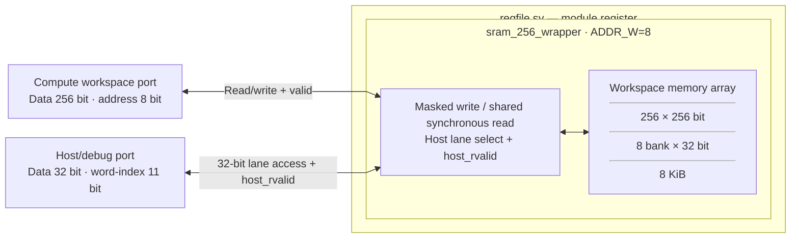

# regfile.sv — Wrapper SRAM 8 KiB

[Tài liệu](../../README.md) → [Hierarchy RTL](../README.md) → [Mục lục từng file](README.md)

**Trạng thái:** Đang dùng.

**Source:** [regfile.sv](<../../../Verilog%20Source%20code/regfile.sv>). **Số dòng:** 40. **SHA-256:** `8e27d7f11e1b78d712116908f6e8d82e89c0fd6f46cfa4f1efd232dbffa023ef`.

## Khối này làm gì?

File này giữ interface riêng cho workspace nhưng dùng chung `sram_256_wrapper` với ADDR_W=8. Module có tên `register`; register ở đây là workspace SRAM, không phải một bank 8 thanh ghi vector như tên lịch sử dễ gợi ra.

## Sơ đồ kiến trúc tổng quan



MUX dùng hình thang rộng ở phía nhiều ngõ vào và thu hẹp về ngõ ra; decoder/demux dùng hình thang ngược lại, mở rộng về phía nhiều ngõ ra. Hình chữ nhật có các vạch ngang biểu diễn bộ nhớ hoặc bank descriptor. Các hình chữ nhật thường là datapath, thanh ghi đơn hoặc giao diện. Nét liền là đường dữ liệu, nét đứt là điều khiển/cấu hình. Mũi tên hồi tiếp biểu diễn kết nối phần cứng. Sơ đồ không biểu diễn thứ tự chu kỳ, trạng thái FSM hoặc các tầng pipeline CPU.

## Cách hoạt động chi tiết

Compute đọc/ghi word 256; host chọn một slice32. Wrapper không thêm FSM hay đổi latency. Mỗi port được nối một-một vào implementation chung; xem sram_256_wrapper để hiểu timing và write mask.

1. Đây là wrapper workspace; tên module `register` được giữ để tương thích và không phải register file pipeline của thesis.
2. Compute address 8 bit chọn 256 word 256 bit. Host address thêm ba bit để chọn tám lane 32 bit.
3. Port được nối thẳng vào `sram_256_wrapper`; wrapper không thêm storage, latency hoặc arbitration.
4. Timing read, mask write và quy tắc không overlap do implementation chung quyết định.

**Quy ước RTL.** Wrapper nối `host_rvalid` từ SRAM lên top. Host giữ read/address đến ready sau hai cạnh lên; top dùng valid để tránh nhận data cũ. Memory có tám bank 32 bit, write-enable riêng từng lane. Wrapper chỉ nối cổng, không thêm register hoặc đổi latency. Simulation và synthesis dùng cùng hợp đồng memory. Xem [implementation và sơ đồ SRAM](sram_256_wrapper.sv.md).

## Các nhóm logic trong source

Source được chia theo chức năng. Mỗi nhóm giữ nguyên phạm vi dòng để đối chiếu, nhưng phần giải thích tập trung vào quan hệ giữa các câu lệnh thay vì lặp lại từng dấu ngoặc, khai báo hoặc phép gán.


### [Dòng 1–21: Hai giao diện](<../../../Verilog%20Source%20code/regfile.sv#L1>)

<!-- source-range:1:21 -->
```systemverilog
module register (
    input logic clk,
    input logic rst_n,

    // Compute-side 256-bit workspace SRAM port.
    input logic rd_en,
    input logic [7:0] rd_addr,
    output logic [255:0] rd_data,
    output logic rd_valid,
    input logic wr_en,
    input logic [7:0] wr_addr,
    input logic [255:0] wr_data,

    // 32-bit host/debug port. host_addr is a 32-bit-word index (0..2047).
    input logic host_en,
    input logic host_we,
    input logic [10:0] host_addr,
    input logic [31:0] host_wdata,
    output logic [31:0] host_rdata,
    output logic host_rvalid
);
```

**Mục đích.** Địa chỉ compute đếm word 256, host đếm word 32. Host address byte đã được top bỏ hai bit alignment.

**Cách phần code hoạt động.** Nhóm này định nghĩa giao diện, độ rộng, kiểu hoặc tín hiệu trung gian. Nó tạo cấu trúc để các nhóm xử lý sau sử dụng, chưa tự biểu diễn một bước runtime riêng.

**Tín hiệu và dữ liệu chính.** `rd_en`: request đọc của compute; `rd_addr`: địa chỉ word cần đọc; `rd_data`: word dữ liệu đọc ra; `rd_valid`: response đọc hợp lệ; `wr_en`: cho phép ghi compute; `wr_addr`: địa chỉ word cần ghi; và 6 tín hiệu phụ khác trong đoạn code.


### [Dòng 22–40: Instance SRAM](<../../../Verilog%20Source%20code/regfile.sv#L22>)

<!-- source-range:22:40 -->
```systemverilog
    // Shared implementation keeps host packing and read latency consistent.
    sram_256_wrapper #(.ADDR_W(8)) u_sram (
        .clk(clk),
        .rst_n(rst_n),
        .rd_en(rd_en),
        .rd_addr(rd_addr),
        .rd_data(rd_data),
        .rd_valid(rd_valid),
        .wr_en(wr_en),
        .wr_addr(wr_addr),
        .wr_data(wr_data),
        .host_en(host_en),
        .host_we(host_we),
        .host_addr(host_addr),
        .host_wdata(host_wdata),
        .host_rdata(host_rdata),
        .host_rvalid(host_rvalid)
    );
endmodule
```

**Mục đích.** Parameter ADDR_W quyết định depth; các named port nối trực tiếp cùng chức năng.

**Cách phần code hoạt động.** Có instance module con; named-port ở nhóm này xác định chính xác đường control/data giữa hai cấp hierarchy.

**Tín hiệu và dữ liệu chính.** `rd_en`: request đọc của compute; `rd_addr`: địa chỉ word cần đọc; `rd_data`: word dữ liệu đọc ra; `rd_valid`: response đọc hợp lệ; `wr_en`: cho phép ghi compute; `wr_addr`: địa chỉ word cần ghi; và 6 tín hiệu phụ khác trong đoạn code.

