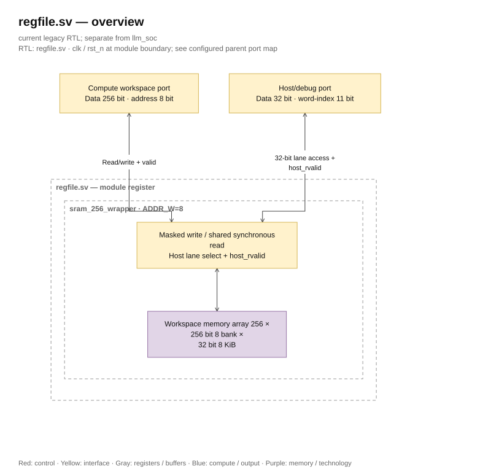

# regfile.sv — 8 KiB SRAM Wrapper

<!-- reading-navigation:start -->
[Documentation](../../README.md) → [Archive · Legacy](../../archive/README.md) → [Module catalog](README.md)

| Reading guide | Document |
|---|---|
| New to the subject | [NPU and RTL fundamentals](../../00-start-here/fundamentals.md) · [Glossary](../../00-start-here/glossary.md) |
| Read first | [Legacy architecture](../../design/legacy/architecture.md) |
| Related implementation | [sram_256_wrapper.sv](sram_256_wrapper.sv.md) |
<!-- reading-navigation:end -->

> **Category: GUIDE. Scope: LEGACY.** RTL is authoritative; diagrams use the [shared visual style](../../diagrams/diagram_style.md).

**Status:** In use.

**Source:** [regfile.sv](<../../../Verilog%20Source%20code/regfile.sv>).

## At a glance

| Item | Description |
|---|---|
| Responsibility | This file maintains the private interface for the workspace but shares `sram_256_wrapper` with ADDR_W=8. The module is named `register`; the registers here are workspace SRAM, not an 8-vector register bank as the historical name might suggest. |

## Overview Architecture Diagram

[Editable draw.io — regfile.sv — overview](../../diagrams/architecture.drawio) · Page `54_regfile.sv_1`.

## Main flow

Compute read/write 256-word; host selects a 32-bit slice. The wrapper does not add FSM or change latency. Each port is connected one-to-one to the common implementation; see sram_256_wrapper to understand timing and write mask.

1. This is a wrapper workspace; module name `register` is kept for compatibility and is not the thesis register file pipeline.
2. Compute 8-bit address to select 256 256-bit words. Host address adds three bits to select eight 32-bit lanes.
3. The port is directly connected to `sram_256_wrapper`; the wrapper does not add storage, latency, or arbitration.
4. Read timing, mask write, and no-overlap rules are determined by the common implementation.

**RTL conventions.** The wrapper connects `host_rvalid` from the SRAM to the top. The backend receives read/address from the frontend and returns host_rvalid after two rising edges. The frontend top latches request/response, so the external host holds read/address for four rising edges until host_ready. The memory has eight 32-bit banks, with separate write-enable for each lane. The wrapper only connects ports, does not add registers or change latency. Simulation and synthesis use the same memory contract. See [implementation and SRAM diagram](sram_256_wrapper.sv.md).

## Important state / datapath groups

### [Lines 1–21: Two interfaces](<../../../Verilog%20Source%20code/regfile.sv#L1>)

**Purpose.** Compute address counts 256 words, host counts 32 words. Host byte address has its two alignment bits removed by the top.

**How this code works.** This group defines interfaces, widths, types, or intermediate signals. It creates a structure for later processing groups to use and does not itself represent a separate runtime step.

**Main signals and data.** `rd_en`: compute read request; `rd_addr`: word address to read; `rd_data`: read data word; `rd_valid`: valid read response; `wr_en`: compute write enable; `wr_addr`: word address to write; and 6 other auxiliary signals in the code segment.

### [Lines 22–40: SRAM Instance](<../../../Verilog%20Source%20code/regfile.sv#L22>)

**Purpose.** The parameter ADDR_W determines the depth; named ports connect directly with the same function.

**How the code works.** There is an instance of a submodule; named ports in this group precisely define the control/data path between two hierarchy levels.

**Main signals and data.** `rd_en`: compute read request; `rd_addr`: word address to read; `rd_data`: read-out data word; `rd_valid`: valid read response; `wr_en`: compute write enable; `wr_addr`: word address to write; and 6 other auxiliary signals in the code segment.
