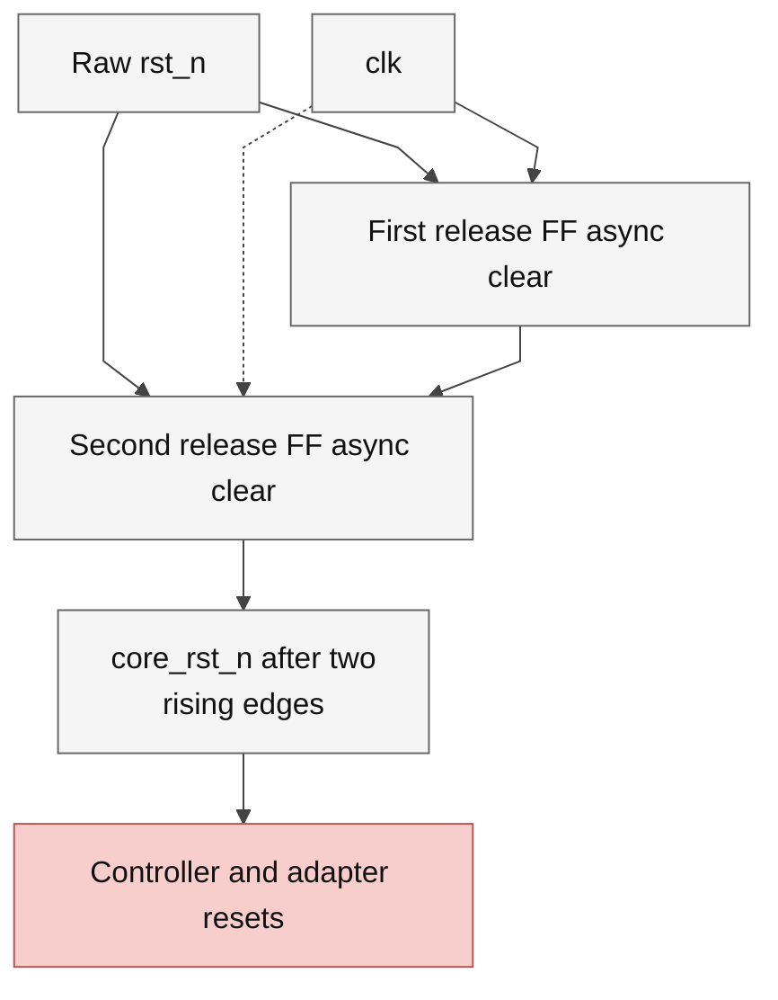

# reset_release.sv — Standard-FF reset release boundary

> **Category: GUIDE. Scope: CURRENT (may also have legacy callers).** RTL is authoritative; diagrams use the [shared visual style](../../diagrams/diagram_style.md).
[Tài liệu](../../README.md) → [Source guide](../README.md) → [Mục lục](README.md)

**Source:** [reset_release.sv](<../../../Verilog%20Source%20code/reset_release.sv>).

## At a glance

| Item | Description |
|---|---|
| Responsibility | Hai FF chuẩn dùng cùng clock: reset assert bất đồng bộ ngay, release core_rst_n sau hai cạnh lên. Không vendor IP, clock mới, timing exception hay nhánh synthesis. Raw reset chỉ tới hai FF; reset nội bộ tới controller, datapath validity và memory adapters. Storage SRAM không reset. |

## Sơ đồ kiến trúc

## Important state / datapath groups

### [Dòng 1–6: Reset contract and interface](<../../../Verilog%20Source%20code/reset_release.sv#L1>)

Assert ngay kể cả giữa clock; host phải giữ request đến ready. Reset release không tạo response hay write mới; transaction bắt đầu sau khi core_rst_n lên high.

### [Dòng 7–11: First release register](<../../../Verilog%20Source%20code/reset_release.sv#L7>)

Một always_ff sở hữu release_first_q. Cạnh lên đầu tiên sau rst_n high chỉ chốt one vào FF đầu.

### [Dòng 12–15: Final internal reset register](<../../../Verilog%20Source%20code/reset_release.sv#L12>)

Always_ff thứ hai sở hữu core_rst_n. Cạnh thứ hai chốt one từ FF đầu. Tất cả recovery/removal vẫn được STA; đây không phải ASIC signoff hay bằng chứng MTBF.
