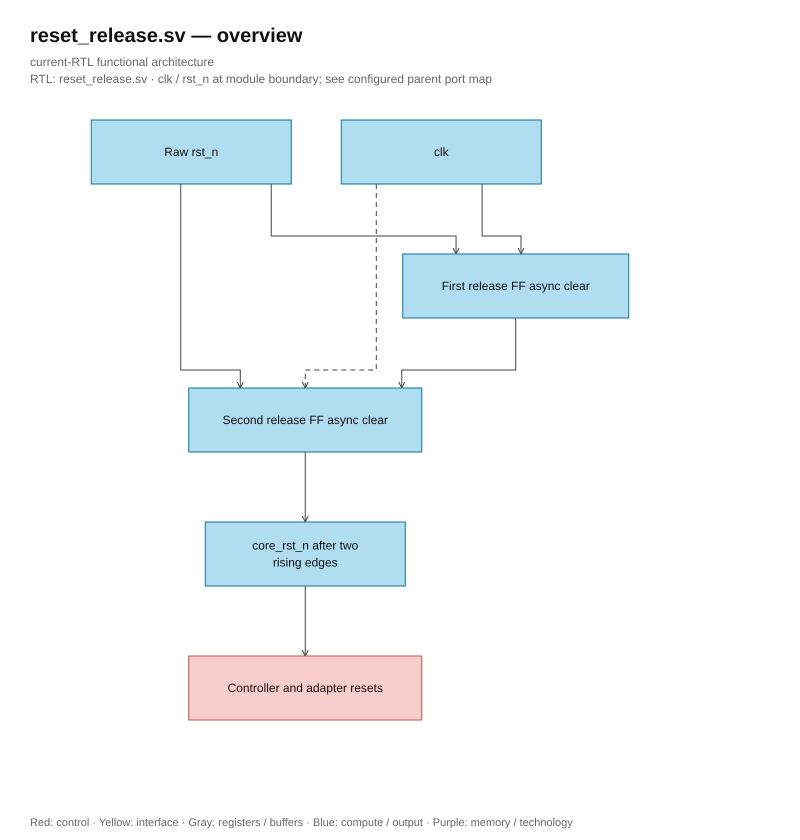

# reset_release.sv — Standard-FF reset release boundary

<!-- reading-navigation:start -->
[Documentation](../../README.md) → [02 · Architecture](../../02-architecture/README.md) → [Module catalog](README.md)

| Reading guide | Document |
|---|---|
| New to the subject | [NPU and RTL fundamentals](../../00-start-here/fundamentals.md) · [Glossary](../../00-start-here/glossary.md) |
| Learn the RTL syntax | [How to read the SystemVerilog](../../00-start-here/reading-systemverilog.md) |
| Read first | [Full RTL graph](../full_graph.md) |
| Related implementation | [llm_soc.sv](llm_soc.sv.md) |
<!-- reading-navigation:end -->

> **Category: GUIDE. Scope: CURRENT (may also have legacy callers).** RTL is authoritative; diagrams use the [shared visual style](../../diagrams/diagram_style.md).

**Source:** [reset_release.sv](<../../../Verilog%20Source%20code/reset_release.sv>).

## At a glance

| Item | Description |
|---|---|
| Responsibility | Two standard FFs using the same clock: reset asserts asynchronously immediately, core_rst_n releases after two rising edges. No vendor IP, new clock, timing exception, or synthesis branch. Raw reset only reaches two FFs; internal reset reaches controller, datapath validity, and memory adapters. Storage SRAM is not reset. |

## Architecture diagram

[Editable draw.io — reset_release.sv — overview](../../diagrams/architecture.drawio) · Page `55_reset_release.sv_1`.

## Important state / datapath groups

### [Lines 1–6: Reset contract and interface](<../../../Verilog%20Source%20code/reset_release.sv#L1>)

Assert immediately even between clocks; host must maintain request until ready. Reset release does not generate response or new write; transaction begins after core_rst_n goes high.

### [Lines 7–11: First release register](<../../../Verilog%20Source%20code/reset_release.sv#L7>)

An always_ff owns release_first_q. First rising edge after rst_n high only latches one into the first FF.

### [Lines 12–15: Final internal reset register](<../../../Verilog%20Source%20code/reset_release.sv#L12>)

The second always_ff owns core_rst_n. The second edge latches one from the first FF. All recovery/removal is still handled by STA; this is not ASIC signoff or MTBF proof.
