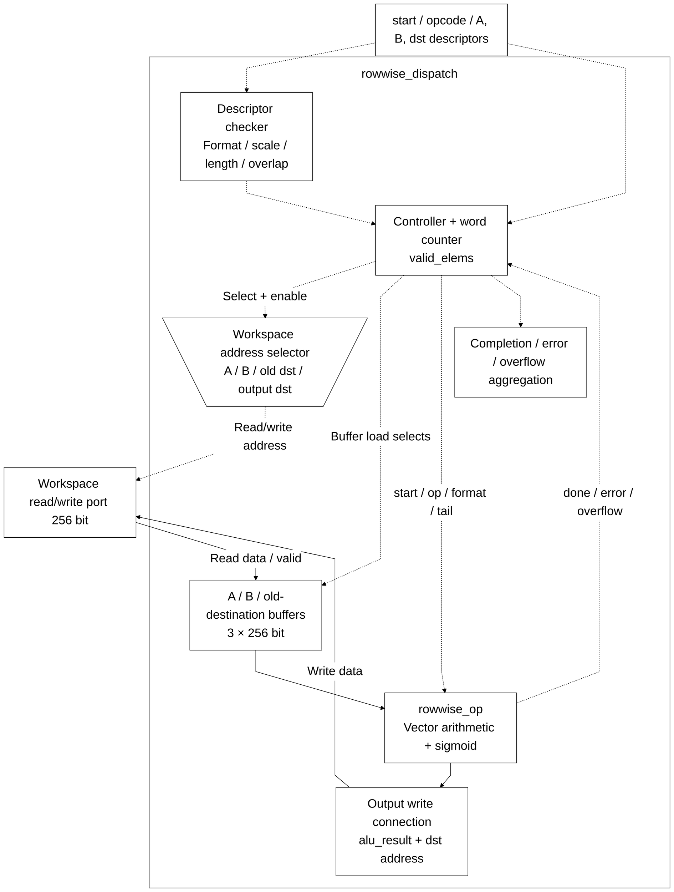
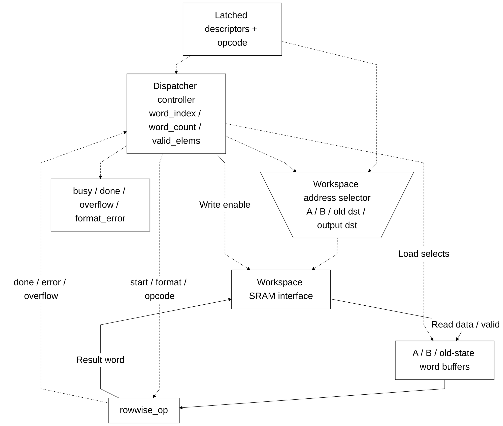

# rowwise_dispatch.sv — Đọc tensor, gọi ALU và ghi output

[Tài liệu](../../README.md) → [Hierarchy RTL](../README.md) → [Mục lục từng file](README.md)

**Trạng thái:** Đang dùng — điều phối rowwise.

**Source:** [rowwise_dispatch.sv](<../../../Verilog%20Source%20code/rowwise_dispatch.sv>). **Số dòng:** 166. **SHA-256:** `e0f7cb0088af29afe233478a72f4ef9aab0676f2a24d56903b7f35261a6b3543`.

## Khối này làm gì?

Dispatcher làm việc ở mức memory và descriptor, còn rowwise_op làm số học trên một word. A/B/destination phải có length phù hợp. ADD/SUB cần cùng scale nguồn; MUL cho phép scale nguồn khác; REC yêu cầu candidate và state có cùng scale, gate U16/F15.

## Sơ đồ kiến trúc tổng quan



MUX dùng hình thang rộng ở phía nhiều ngõ vào và thu hẹp về ngõ ra; decoder/demux dùng hình thang ngược lại, mở rộng về phía nhiều ngõ ra. Hình chữ nhật có các vạch ngang biểu diễn bộ nhớ hoặc bank descriptor. Các hình chữ nhật thường là datapath, thanh ghi đơn hoặc giao diện. Nét liền là đường dữ liệu, nét đứt là điều khiển/cấu hình. Mũi tên hồi tiếp biểu diễn kết nối phần cứng. Sơ đồ không biểu diễn thứ tự chu kỳ, trạng thái FSM hoặc các tầng pipeline CPU.

## Cách hoạt động chi tiết

Đọc A; nếu SIG/RELU thì gọi ALU ngay. Nếu phép hai nguồn thì đọc B; REC còn đọc destination cũ thành C-word. Sau ALU done, nếu không lỗi format thì WRITE. Lặp đến ceil(length/16) word. In-place cùng base được hỗ trợ ở các trường hợp đã kiểm tra; overlap lệch base bị từ chối.

1. Dispatcher validate descriptor trước lần đọc đầu: format, length, F15 của gate và overlap memory.
2. Mỗi word bắt đầu bằng REQ_A/WAIT_A. SIG và RELU dùng ngay A; phép hai nguồn tiếp tục đọc B.
3. REC đọc destination cũ thành H qua REQ_C/WAIT_C. Candidate nằm ở A, gate ở B.
4. START_ALU phát xung một chu kỳ; WAIT_ALU giữ input đến `alu_done`. Format error ngăn ghi word lỗi.
5. WRITE ghi một word 256 bit rồi tăng word index. `valid_elems` bảo đảm tail của word cuối không trở thành dữ liệu thật.

**Quy ước RTL.** Số phần tử hữu ích của word được cast 5 bit, word count cast 8 bit. Tail vẫn bị mask và output padding zero; không đổi descriptor/ALU contract.

## Các nhóm logic trong source

Source được chia theo chức năng. Mỗi nhóm giữ nguyên phạm vi dòng để đối chiếu, nhưng phần giải thích tập trung vào quan hệ giữa các câu lệnh thay vì lặp lại từng dấu ngoặc, khai báo hoặc phép gán.


### [Dòng 1–22: Giao diện và state](<../../../Verilog%20Source%20code/rowwise_dispatch.sv#L1>)

<!-- source-range:1:22 -->
```systemverilog
module rowwise_dispatch (
    input logic clk, rst_n, start,
    input logic [3:0] op,
    input npu_pkg::ws_desc_t a_desc, b_desc, dst_desc,
    output logic ws_rd_en,
    output logic [7:0] ws_rd_addr,
    input logic [255:0] ws_rd_data,
    input logic ws_rd_valid,
    output logic ws_wr_en,
    output logic [7:0] ws_wr_addr,
    output logic [255:0] ws_wr_data,
    output logic busy, done, overflow, format_error
);
    import npu_pkg::*;
    typedef enum logic [3:0] {IDLE, REQ_A, WAIT_A, REQ_B, WAIT_B, START_ALU, WAIT_ALU, WRITE, FINISH, REQ_C, WAIT_C} state_t;
    state_t state;
    ws_desc_t source_a_desc_q, source_b_desc_q, destination_desc_q;
    logic [3:0] operation_q;
    logic [7:0] word_index_q, word_count_q;
    logic [255:0] a_word, b_word, c_word, alu_result;
    logic alu_busy, alu_done, alu_ov, alu_error, invalid;
    logic [4:0] valid_elems;
```

**Mục đích.** Một request đọc tại một thời điểm, các word nguồn được giữ trong buffer.

**Cách phần code hoạt động.** Nhóm này định nghĩa giao diện, độ rộng, kiểu hoặc tín hiệu trung gian. Nó tạo cấu trúc để các nhóm xử lý sau sử dụng, chưa tự biểu diễn một bước runtime riêng.

**Tín hiệu và dữ liệu chính.** `start`: yêu cầu bắt đầu giao dịch; `op`: operand hoặc opcode, theo giao diện module; `a_desc`: metadata nguồn A; `b_desc`: metadata nguồn B; `dst_desc`: metadata tensor đích; `ws_rd_en`: request đọc workspace; và 23 tín hiệu phụ khác trong đoạn code.


### [Dòng 23–51: Validate và tail](<../../../Verilog%20Source%20code/rowwise_dispatch.sv#L23>)

<!-- source-range:23:51 -->
```systemverilog
    always_comb begin
        invalid = !ws_valid(a_desc) || !ws_valid(dst_desc) || a_desc.length != dst_desc.length;
        if (op == 6) begin
            invalid = invalid || a_desc.fmt != FMT_S16 || dst_desc.fmt != FMT_U16 || dst_desc.frac_bits != 15;
        end else if (op == 12) begin
            invalid = invalid || a_desc.fmt != FMT_S16 || dst_desc.fmt != FMT_S16;
        end else begin
            invalid = invalid || !ws_valid(b_desc) || a_desc.length != b_desc.length;
            case (op)
                1, 2 : invalid = invalid || a_desc.frac_bits != b_desc.frac_bits ||
                a_desc.fmt != b_desc.fmt || dst_desc.fmt != a_desc.fmt ||
                !(a_desc.fmt == FMT_S16 || a_desc.fmt == FMT_U16);
                3 : invalid = invalid || a_desc.fmt != FMT_S16 || dst_desc.fmt != FMT_S16 ||
                !(b_desc.fmt == FMT_S16 || b_desc.fmt == FMT_U16);
                11 : invalid = invalid || a_desc.fmt != FMT_S16 || dst_desc.fmt != FMT_S16 ||
                a_desc.frac_bits != dst_desc.frac_bits || b_desc.fmt != FMT_U16 || b_desc.frac_bits != 15 ||
                ranges_overlap(int'(b_desc.base_word), ws_words(b_desc), int'(dst_desc.base_word), ws_words(dst_desc));
                default : invalid = 1;
            endcase
            if (b_desc.fmt == FMT_U16 && b_desc.frac_bits != 15) invalid = 1;
            if (b_desc.base_word != dst_desc.base_word &&
                ranges_overlap(int'(b_desc.base_word), ws_words(b_desc), int'(dst_desc.base_word), ws_words(dst_desc))) invalid = 1;
        end
        if (a_desc.fmt == FMT_U16 && a_desc.frac_bits != 15) invalid = 1;
        if (dst_desc.fmt == FMT_U16 && dst_desc.frac_bits != 15) invalid = 1;
        if (a_desc.base_word != dst_desc.base_word &&
            ranges_overlap(int'(a_desc.base_word), ws_words(a_desc), int'(dst_desc.base_word), ws_words(dst_desc))) invalid = 1;
        valid_elems = (int'(source_a_desc_q.length) - (int'(word_index_q) << 4) >= 16) ? 5'd16 : 5'(int'(source_a_desc_q.length) - (int'(word_index_q) << 4));
    end
```

**Mục đích.** Kiểm tra format, scale, độ dài và overlap. valid_elems=min(16, số phần tử còn lại).

**Cách phần code hoạt động.** Có logic tổ hợp: output/intermediate được tính từ input hiện tại; các giá trị mặc định đầu khối giúp tránh suy ra latch.

**Tín hiệu và dữ liệu chính.** `invalid`: descriptor/operation bị từ chối; `a_desc`: metadata nguồn A; `dst_desc`: metadata tensor đích; `length`: số phần tử tensor; `op`: operand hoặc opcode, theo giao diện module; `frac_bits`: số bit phần lẻ của input; và 5 tín hiệu phụ khác trong đoạn code.


### [Dòng 52–71: Nối ALU](<../../../Verilog%20Source%20code/rowwise_dispatch.sv#L52>)

<!-- source-range:52:71 -->
```systemverilog
    rowwise_op u_alu(
        .clk(clk),
        .rst_n(rst_n),
        .start(state == START_ALU),
        .select(operation_q),
        .a_word(a_word),
        .b_word(b_word),
        .c_word(c_word),
        .a_frac_bits(source_a_desc_q.frac_bits),
        .b_frac_bits(source_b_desc_q.frac_bits),
        .dst_frac_bits(destination_desc_q.frac_bits),
        .valid_elems(valid_elems),
        .a_unsigned(source_a_desc_q.fmt == FMT_U16),
        .b_unsigned(source_b_desc_q.fmt == FMT_U16),
        .dst_unsigned(destination_desc_q.fmt == FMT_U16),
        .result_word(alu_result),
        .busy(alu_busy),
        .done(alu_done),
        .overflow(alu_ov),
        .format_error(alu_error));
```

**Mục đích.** F_t, unsigned flag và số lane hữu ích đi kèm từng giao dịch.

**Cách phần code hoạt động.** Có instance module con; named-port ở nhóm này xác định chính xác đường control/data giữa hai cấp hierarchy.

**Tín hiệu và dữ liệu chính.** `start`: yêu cầu bắt đầu giao dịch; `state`: trạng thái FSM của khối; `select`: opcode chọn phép rowwise; `operation_q`: opcode đã chốt; `a_word`: word A; `b_word`: word B; và 15 tín hiệu phụ khác trong đoạn code.


### [Dòng 72–94: Request memory](<../../../Verilog%20Source%20code/rowwise_dispatch.sv#L72>)

<!-- source-range:72:94 -->
```systemverilog
    always_comb begin
        ws_rd_en = 0;
        ws_rd_addr = 0;
        ws_wr_en = 0;
        ws_wr_addr = destination_desc_q.base_word + word_index_q;
        ws_wr_data = alu_result;
        case (state)
            REQ_A : begin
                ws_rd_en = 1;
                ws_rd_addr = source_a_desc_q.base_word + word_index_q;
            end
            REQ_B : begin
                ws_rd_en = 1;
                ws_rd_addr = source_b_desc_q.base_word + word_index_q;
            end
            REQ_C : begin
                ws_rd_en = 1;
                ws_rd_addr = destination_desc_q.base_word + word_index_q;
            end
            WRITE : ws_wr_en = 1;
            default : ;
        endcase
    end
```

**Mục đích.** REQ_A/B/C chọn base tương ứng; WRITE dùng alu_result.

**Cách phần code hoạt động.** Có logic tổ hợp: output/intermediate được tính từ input hiện tại; các giá trị mặc định đầu khối giúp tránh suy ra latch.

**Tín hiệu và dữ liệu chính.** `ws_rd_en`: request đọc workspace; `ws_rd_addr`: địa chỉ đọc workspace; `ws_wr_en`: cho phép ghi workspace; `ws_wr_addr`: địa chỉ ghi workspace; `destination_desc_q`: descriptor đích đã chốt; `base_word`: địa chỉ word 256 đầu tensor; và 6 tín hiệu phụ khác trong đoạn code.


### [Dòng 95–113: Reset](<../../../Verilog%20Source%20code/rowwise_dispatch.sv#L95>)

<!-- source-range:95:113 -->
```systemverilog
    always_ff @(posedge clk or negedge rst_n) begin
        if (!rst_n) begin
            state <= IDLE;
            busy <= 0;
            done <= 0;
            overflow <= 0;
            format_error <= 0;
            source_a_desc_q <= '0;
            source_b_desc_q <= '0;
            destination_desc_q <= '0;
            operation_q <= 0;
            word_index_q <= 0;
            word_count_q <= 0;
            a_word <= 0;
            b_word <= 0;
            c_word <= 0;
        end else begin
            done <= 0;
            case (state)
```

**Mục đích.** Xóa control, descriptor đã chốt và word buffer.

**Cách phần code hoạt động.** Có logic tuần tự: register/FSM chỉ cập nhật tại cạnh clock; nonblocking assignment đọc giá trị cũ ở vế phải rồi chốt đồng thời.

**Tín hiệu và dữ liệu chính.** `state`: trạng thái FSM của khối; `busy`: khối đang xử lý; `done`: xung báo hoàn tất; `overflow`: cờ kết quả vượt miền số; `format_error`: cờ format/metadata không hợp lệ; `source_a_desc_q`: descriptor nguồn A đã chốt; và 8 tín hiệu phụ khác trong đoạn code.


### [Dòng 114–135: Nhận lệnh và đọc A](<../../../Verilog%20Source%20code/rowwise_dispatch.sv#L114>)

<!-- source-range:114:135 -->
```systemverilog
                IDLE : if (start) begin
                    source_a_desc_q <= a_desc;
                    source_b_desc_q <= b_desc;
                    destination_desc_q <= dst_desc;
                    operation_q <= op;
                    word_index_q <= 0;
                    word_count_q <= 8'(((int'(a_desc.length) + 15) >> 4));
                    busy <= 1;
                    overflow <= 0;
                    format_error <= invalid;
                    if (invalid) state <= FINISH;
                    else state <= REQ_A;
                end
                REQ_A : state <= WAIT_A;
                WAIT_A : if (ws_rd_valid) begin
                    a_word <= ws_rd_data;
                    if (operation_q == 6 || operation_q == 12) begin
                        source_b_desc_q <= '0;
                        b_word <= 0;
                        state <= START_ALU;
                    end else state <= REQ_B;
                end
```

**Mục đích.** Chốt descriptor một lần. SIG/RELU xóa nguồn B không cần dùng.

**Cách phần code hoạt động.** Các câu lệnh thuộc cùng một nhánh/pha xử lý và phải được đọc liền nhau; tách riêng từng dòng sẽ làm mất quan hệ điều kiện và dữ liệu.

**Tín hiệu và dữ liệu chính.** `start`: yêu cầu bắt đầu giao dịch; `source_a_desc_q`: descriptor nguồn A đã chốt; `a_desc`: metadata nguồn A; `source_b_desc_q`: descriptor nguồn B đã chốt; `b_desc`: metadata nguồn B; `destination_desc_q`: descriptor đích đã chốt; và 15 tín hiệu phụ khác trong đoạn code.

#### Sơ đồ khối phần cứng của nhóm




### [Dòng 136–151: Đọc B/state và chờ ALU](<../../../Verilog%20Source%20code/rowwise_dispatch.sv#L136>)

<!-- source-range:136:151 -->
```systemverilog
                REQ_B : state <= WAIT_B;
                WAIT_B : if (ws_rd_valid) begin
                    b_word <= ws_rd_data;
                    state <= (operation_q == 11) ? REQ_C : START_ALU;
                end
                REQ_C : state <= WAIT_C;
                WAIT_C : if (ws_rd_valid) begin
                    c_word <= ws_rd_data;
                    state <= START_ALU;
                end
                START_ALU : state <= WAIT_ALU;
                WAIT_ALU : if (alu_done) begin
                    overflow <= overflow | alu_ov;
                    format_error <= format_error | alu_error;
                    state <= alu_error ? FINISH : WRITE;
                end
```

**Mục đích.** REC lấy state từ destination; lỗi format từ ALU ngăn write word đó.

**Cách phần code hoạt động.** Các câu lệnh thuộc cùng một nhánh/pha xử lý và phải được đọc liền nhau; tách riêng từng dòng sẽ làm mất quan hệ điều kiện và dữ liệu.

**Tín hiệu và dữ liệu chính.** `state`: trạng thái FSM của khối; `ws_rd_valid`: workspace trả dữ liệu hợp lệ; `b_word`: word B; `ws_rd_data`: word 256 trả từ workspace; `operation_q`: opcode đã chốt; `c_word`: word state cũ của REC; và 2 tín hiệu phụ khác trong đoạn code.


### [Dòng 152–166: Tiến word và kết thúc](<../../../Verilog%20Source%20code/rowwise_dispatch.sv#L152>)

<!-- source-range:152:166 -->
```systemverilog
                WRITE : if (word_index_q + 1 >= word_count_q) state <= FINISH;
                else begin
                    word_index_q <= word_index_q + 1'b1;
                    state <= REQ_A;
                end
                FINISH : begin
                    busy <= 0;
                    done <= 1;
                    state <= IDLE;
                end
                default : state <= IDLE;
            endcase
        end
    end
endmodule
```

**Mục đích.** Tăng word_index hoặc FINISH, phát done một chu kỳ.

**Cách phần code hoạt động.** Các câu lệnh thuộc cùng một nhánh/pha xử lý và phải được đọc liền nhau; tách riêng từng dòng sẽ làm mất quan hệ điều kiện và dữ liệu.

**Tín hiệu và dữ liệu chính.** `word_index_q`: chỉ số word tensor đang đọc; `word_count_q`: số word cần xử lý; `state`: trạng thái FSM của khối; `busy`: khối đang xử lý; `done`: xung báo hoàn tất.
