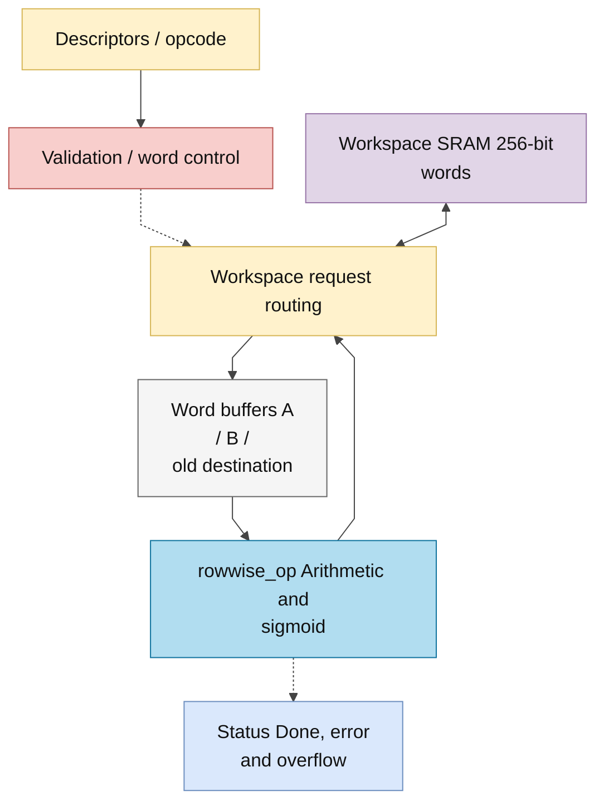
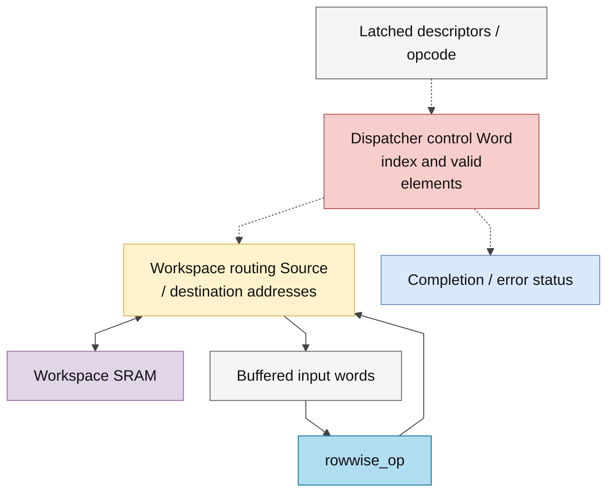

# rowwise_dispatch.sv — Đọc tensor, gọi ALU và ghi output

> **Category: GUIDE. Scope: LEGACY.** RTL is authoritative; diagrams use the [shared visual style](../../diagrams/diagram_style.md).
[Tài liệu](../../README.md) → [Hierarchy RTL](<../legacy/README.md>) → [Mục lục từng file](README.md)

**Trạng thái:** Đang dùng — điều phối rowwise.

**Source:** [rowwise_dispatch.sv](<../../../Verilog%20Source%20code/rowwise_dispatch.sv>).

## At a glance

| Item | Description |
|---|---|
| Responsibility | Dispatcher làm việc ở mức memory và descriptor, còn rowwise_op làm số học trên một word. A/B/destination phải có length phù hợp. ADD/SUB cần cùng scale nguồn; MUL cho phép scale nguồn khác; REC yêu cầu candidate và state có cùng scale, gate U16/F15. |

## Sơ đồ kiến trúc tổng quan

## Main flow

Đọc A; nếu SIG/RELU thì gọi ALU ngay. Nếu phép hai nguồn thì đọc B; REC còn đọc destination cũ thành C-word. Sau ALU done, nếu không lỗi format thì WRITE. Lặp đến ceil(length/16) word. In-place cùng base được hỗ trợ ở các trường hợp đã kiểm tra; overlap lệch base bị từ chối.

1. Dispatcher validate descriptor trước lần đọc đầu: format, length, F15 của gate và overlap memory.
2. Mỗi word bắt đầu bằng REQ_A/WAIT_A. SIG và RELU dùng ngay A; phép hai nguồn tiếp tục đọc B.
3. REC đọc destination cũ thành H qua REQ_C/WAIT_C. Candidate nằm ở A, gate ở B.
4. START_ALU phát xung một chu kỳ; WAIT_ALU giữ input đến `alu_done`. Format error ngăn ghi word lỗi.
5. WRITE ghi một word 256 bit rồi tăng word index. `valid_elems` bảo đảm tail của word cuối không trở thành dữ liệu thật.

**Quy ước RTL.** Số phần tử hữu ích của word được cast 5 bit, word count cast 8 bit. Tail vẫn bị mask và output padding zero; không đổi descriptor/ALU contract.

## Important state / datapath groups

### [Dòng 1–22: Giao diện và state](<../../../Verilog%20Source%20code/rowwise_dispatch.sv#L1>)

**Mục đích.** Một request đọc tại một thời điểm, các word nguồn được giữ trong buffer.

**Cách phần code hoạt động.** Nhóm này định nghĩa giao diện, độ rộng, kiểu hoặc tín hiệu trung gian. Nó tạo cấu trúc để các nhóm xử lý sau sử dụng, chưa tự biểu diễn một bước runtime riêng.

**Tín hiệu và dữ liệu chính.** `start`: yêu cầu bắt đầu giao dịch; `op`: operand hoặc opcode, theo giao diện module; `a_desc`: metadata nguồn A; `b_desc`: metadata nguồn B; `dst_desc`: metadata tensor đích; `ws_rd_en`: request đọc workspace; và 23 tín hiệu phụ khác trong đoạn code.

### [Dòng 23–51: Validate và tail](<../../../Verilog%20Source%20code/rowwise_dispatch.sv#L23>)

**Mục đích.** Kiểm tra format, scale, độ dài và overlap. valid_elems=min(16, số phần tử còn lại).

**Cách phần code hoạt động.** Có logic tổ hợp: output/intermediate được tính từ input hiện tại; các giá trị mặc định đầu khối giúp tránh suy ra latch.

**Tín hiệu và dữ liệu chính.** `invalid`: descriptor/operation bị từ chối; `a_desc`: metadata nguồn A; `dst_desc`: metadata tensor đích; `length`: số phần tử tensor; `op`: operand hoặc opcode, theo giao diện module; `frac_bits`: số bit phần lẻ của input; và 5 tín hiệu phụ khác trong đoạn code.

### [Dòng 52–71: Nối ALU](<../../../Verilog%20Source%20code/rowwise_dispatch.sv#L52>)

**Mục đích.** F_t, unsigned flag và số lane hữu ích đi kèm từng giao dịch.

**Cách phần code hoạt động.** Có instance module con; named-port ở nhóm này xác định chính xác đường control/data giữa hai cấp hierarchy.

**Tín hiệu và dữ liệu chính.** `start`: yêu cầu bắt đầu giao dịch; `state`: trạng thái FSM của khối; `select`: opcode chọn phép rowwise; `operation_q`: opcode đã chốt; `a_word`: word A; `b_word`: word B; và 15 tín hiệu phụ khác trong đoạn code.

### [Dòng 72–94: Request memory](<../../../Verilog%20Source%20code/rowwise_dispatch.sv#L72>)

**Mục đích.** REQ_A/B/C chọn base tương ứng; WRITE dùng alu_result.

**Tín hiệu và dữ liệu chính.** `ws_rd_en`: request đọc workspace; `ws_rd_addr`: địa chỉ đọc workspace; `ws_wr_en`: cho phép ghi workspace; `ws_wr_addr`: địa chỉ ghi workspace; `destination_desc_q`: descriptor đích đã chốt; `base_word`: địa chỉ word 256 đầu tensor; và 6 tín hiệu phụ khác trong đoạn code.

### [Dòng 95–113: Reset](<../../../Verilog%20Source%20code/rowwise_dispatch.sv#L95>)

**Mục đích.** Xóa control, descriptor đã chốt và word buffer.

**Cách phần code hoạt động.** Có logic tuần tự: register/FSM chỉ cập nhật tại cạnh clock; nonblocking assignment đọc giá trị cũ ở vế phải rồi chốt đồng thời.

**Tín hiệu và dữ liệu chính.** `state`: trạng thái FSM của khối; `busy`: khối đang xử lý; `done`: xung báo hoàn tất; `overflow`: cờ kết quả vượt miền số; `format_error`: cờ format/metadata không hợp lệ; `source_a_desc_q`: descriptor nguồn A đã chốt; và 8 tín hiệu phụ khác trong đoạn code.

### [Dòng 114–135: Nhận lệnh và đọc A](<../../../Verilog%20Source%20code/rowwise_dispatch.sv#L114>)

**Mục đích.** Chốt descriptor một lần. SIG/RELU xóa nguồn B không cần dùng.

**Cách phần code hoạt động.** Các câu lệnh thuộc cùng một nhánh/pha xử lý và phải được đọc liền nhau; tách riêng từng dòng sẽ làm mất quan hệ điều kiện và dữ liệu.

**Tín hiệu và dữ liệu chính.** `start`: yêu cầu bắt đầu giao dịch; `source_a_desc_q`: descriptor nguồn A đã chốt; `a_desc`: metadata nguồn A; `source_b_desc_q`: descriptor nguồn B đã chốt; `b_desc`: metadata nguồn B; `destination_desc_q`: descriptor đích đã chốt; và 15 tín hiệu phụ khác trong đoạn code.

#### Sơ đồ khối phần cứng của nhóm

### [Dòng 136–151: Đọc B/state và chờ ALU](<../../../Verilog%20Source%20code/rowwise_dispatch.sv#L136>)

**Mục đích.** REC lấy state từ destination; lỗi format từ ALU ngăn write word đó.

**Tín hiệu và dữ liệu chính.** `state`: trạng thái FSM của khối; `ws_rd_valid`: workspace trả dữ liệu hợp lệ; `b_word`: word B; `ws_rd_data`: word 256 trả từ workspace; `operation_q`: opcode đã chốt; `c_word`: word state cũ của REC; và 2 tín hiệu phụ khác trong đoạn code.

### [Dòng 152–166: Tiến word và kết thúc](<../../../Verilog%20Source%20code/rowwise_dispatch.sv#L152>)

**Mục đích.** Tăng word_index hoặc FINISH, phát done một chu kỳ.

**Tín hiệu và dữ liệu chính.** `word_index_q`: chỉ số word tensor đang đọc; `word_count_q`: số word cần xử lý; `state`: trạng thái FSM của khối; `busy`: khối đang xử lý; `done`: xung báo hoàn tất.
