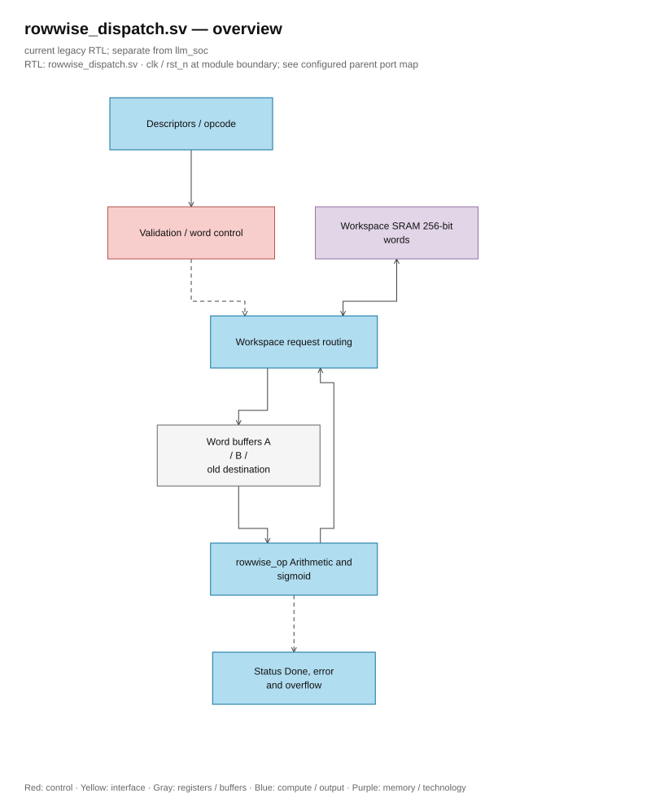
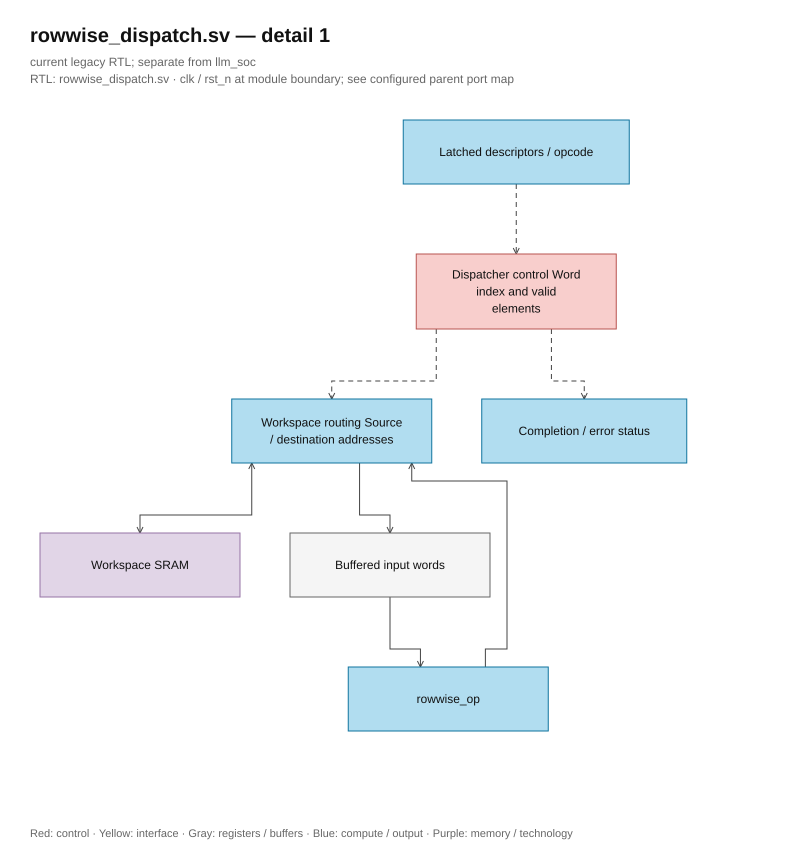

# rowwise_dispatch.sv — Read tensor, call ALU, and write output

> **Category: GUIDE. Scope: LEGACY.** RTL is authoritative; diagrams use the [shared visual style](../../diagrams/diagram_style.md).
[Document](../../README.md) → [Hierarchy RTL](<../legacy/README.md>) → [File Index](README.md)

**Status:** In use — rowwise dispatch.

**Source:** [rowwise_dispatch.sv](<../../../Verilog%20Source%20code/rowwise_dispatch.sv>).

## At a glance

| Item | Description |
|---|---|
| Responsibility | The Dispatcher works at the memory and descriptor level, while rowwise_op performs arithmetic on a single word. A/B/destination must have appropriate length. ADD/SUB require the same source scale; MUL allows different source scales; REC requires candidate and state to have the same scale, gate U16/F15. |

## Overall Architecture Diagram

[Editable draw.io — rowwise_dispatch.sv — overview](../../diagrams/architecture.drawio) · Page `56_rowwise_dispatch.sv_1`.

## Main flow

Read A; if SIG/RELU then call ALU immediately. If it is a two-source operation, then read B; REC also reads the old destination into C-word. After ALU is done, if there is no format error, then WRITE. Loop until ceil(length/16) word. In-place with base is supported in the verified cases; offset overlaps from the base are rejected.

1. Dispatcher validates descriptor before the first read: format, length, F15 of the gate, and memory overlap.
2. Each word starts with REQ_A/WAIT_A. SIG and RELU use A immediately; two-source operations continue to read B.
3. REC reads the old destination into H through REQ_C/WAIT_C. Candidate is in A, gate is in B.
4. START_ALU triggers a one-cycle pulse; WAIT_ALU holds input until `alu_done`. Format error prevents writing the erroneous word.
5. WRITE writes a 256-bit word and then increments the word index. `valid_elems` ensures that the tail of the last word does not become real data.

**RTL convention.** The number of useful elements in a word is cast to 5 bits, word count cast to 8 bits. Tail is still masked and output padding zero; descriptor/ALU contract remains unchanged.

## Important state / datapath groups

### [Lines 1–22: Interface and state](<../../../Verilog%20Source%20code/rowwise_dispatch.sv#L1>)

**Purpose.** One read request at a time, source words are kept in a buffer.

**How the code section works.** This group defines interfaces, widths, types, or intermediate signals. It creates a structure for subsequent processing groups to use, but does not itself represent a separate runtime step.

**Main signals and data.** `start`: request to start transaction; `op`: operand or opcode, according to module interface; `a_desc`: source A metadata; `b_desc`: source B metadata; `dst_desc`: target tensor metadata; `ws_rd_en`: workspace read request; and 23 other auxiliary signals in the code segment.

### [Lines 23–51: Validate and tail](<../../../Verilog%20Source%20code/rowwise_dispatch.sv#L23>)

**Purpose.** Check format, scale, length, and overlap. valid_elems=min(16, remaining elements).

**How the code works.** There is combinational logic: output/intermediate is calculated from the current input; default block values help avoid inferring latches.

**Main signals and data.** `invalid`: descriptor/operation denied; `a_desc`: source metadata A; `dst_desc`: destination tensor metadata; `length`: number of tensor elements; `op`: operand or opcode, according to module interface; `frac_bits`: number of fractional bits of input; and 5 other auxiliary signals in the code segment.

### [Lines 52–71: ALU connection](<../../../Verilog%20Source%20code/rowwise_dispatch.sv#L52>)

**Purpose.** F_t, unsigned flag, and useful lane count accompanying each transaction.

**How the code works.** There is a submodule instance; named-ports in this group precisely define the control/data path between two hierarchy levels.

**Main signals and data.** `start`: request to start transaction; `state`: FSM status of the block; `select`: opcode selecting rowwise operation; `operation_q`: finalized opcode; `a_word`: word A; `b_word`: word B; and 15 other auxiliary signals in the code segment.

### [Lines 72–94: Request memory](<../../../Verilog%20Source%20code/rowwise_dispatch.sv#L72>)

**Purpose.** REQ_A/B/C selects the corresponding base; WRITE uses alu_result.

**Main signals and data.** `ws_rd_en`: request to read workspace; `ws_rd_addr`: workspace read address; `ws_wr_en`: enable workspace write; `ws_wr_addr`: workspace write address; `destination_desc_q`: finalized destination descriptor; `base_word`: address of the first 256 tensor words; and 6 other auxiliary signals in the code segment.

### [Lines 95–113: Reset](<../../../Verilog%20Source%20code/rowwise_dispatch.sv#L95>)

**Purpose.** Clear the control, latched descriptor, and word buffer.

**How the code works.** There is sequential logic: registers/FSM only update on the clock edge; nonblocking assignments read the old value on the right-hand side and latch simultaneously.

**Main signals and data.** `state`: FSM state of the block; `busy`: block being processed; `done`: completion pulse; `overflow`: out-of-range result flag; `format_error`: invalid format/metadata flag; `source_a_desc_q`: source A descriptor latched; and 8 other auxiliary signals in this code segment.

### [Lines 114–135: Receive command and read A](<../../../Verilog%20Source%20code/rowwise_dispatch.sv#L114>)

**Purpose.** Latch the descriptor once. SIG/RELU clears source B if not needed.

**How the code section works.** The statements belong to the same branch/processing phase and must be read consecutively; separating each line will lose the conditional and data relationships.

**Main signals and data.** `start`: request to start the transaction; `source_a_desc_q`: source A descriptor latched; `a_desc`: source A metadata; `source_b_desc_q`: source B descriptor latched; `b_desc`: source B metadata; `destination_desc_q`: target descriptor latched; and 15 other auxiliary signals in the code segment.

#### Hardware block diagram of the group

[Editable draw.io — rowwise_dispatch.sv — detail 1](../../diagrams/architecture.drawio) · Page `57_rowwise_dispatch.sv_2`.

### [Lines 136–151: Read B/state and wait for ALU](<../../../Verilog%20Source%20code/rowwise_dispatch.sv#L136>)

**Purpose.** REC takes state from the destination; format errors from the ALU prevent writing that word.

**Main signals and data.** `state`: FSM state of the block; `ws_rd_valid`: workspace returns valid data; `b_word`: word B; `ws_rd_data`: 256-bit word returned from workspace; `operation_q`: finalized opcode; `c_word`: old state word of REC; and 2 other auxiliary signals in the code section.

### [Lines 152–166: Advance word and finish](<../../../Verilog%20Source%20code/rowwise_dispatch.sv#L152>)

**Purpose.** Increment word_index or FINISH, complete one cycle.

**Main signals and data.** `word_index_q`: currently reading word tensor index; `word_count_q`: number of words to process; `state`: FSM status of the block; `busy`: block currently processing; `done`: completion pulse.
