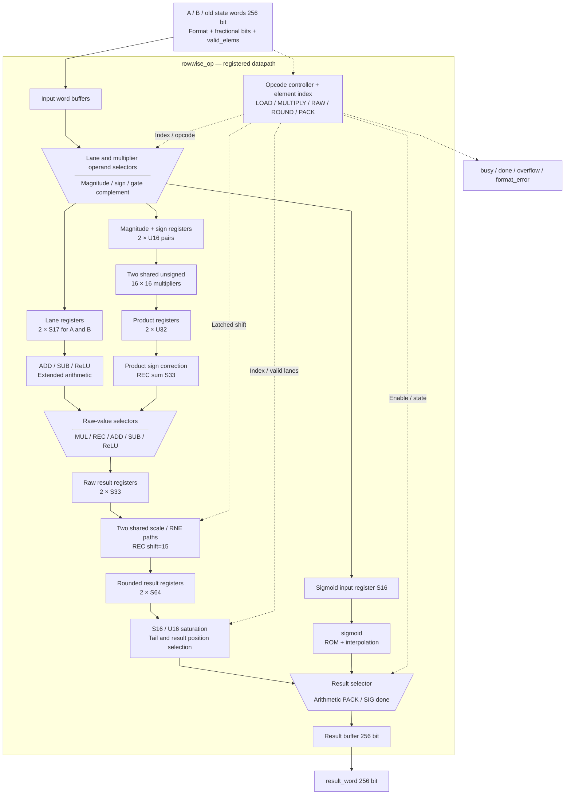
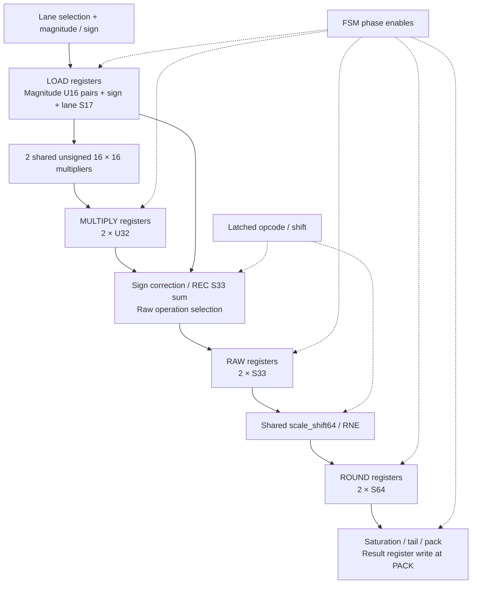

# rowwise_op.sv — ALU vector nhỏ và cập nhật state

[Tài liệu](../../README.md) → [Hierarchy RTL](../README.md) → [Mục lục từng file](README.md)

**Trạng thái:** Đang dùng — datapath rowwise.

**Source:** [rowwise_op.sv](<../../../Verilog%20Source%20code/rowwise_op.sv>). **Số dòng:** 248. **SHA-256:** `ce49a16c12069b0560986f7b8cf5bd0a187ce1d409f0ce0e69515bff11e1a559`.

## Khối này làm gì?

Khối chốt tối đa 16 phần tử trong một word rồi xử lý các batch lần lượt. ADD/SUB/MUL/RELU xử lý hai phần tử qua năm pha; REC xử lý một state bằng hai tích song song qua cùng năm pha. SIG dùng một instance sigmoid. Các register tách chọn lane, multiplier, raw arithmetic, RNE và saturation/pack; hai multiplier 16×16 vẫn dùng chung cho MUL và REC.

## Sơ đồ kiến trúc tổng quan



Nét liền là dữ liệu, nét đứt là control. MUX dùng hình thang thu hẹp về ngõ ra. Các hộp mang tên register là ranh giới clock thực trong datapath; các batch vẫn chạy tuần tự, không nhận một batch mới mỗi clock. Sơ đồ mô tả phần cứng, không phải pipeline instruction CPU.

## Cách hoạt động chi tiết

1. Cạnh start hợp lệ chốt opcode, word, format, số phần tử và shift signed 7 bit. Start khi busy bị bỏ qua; input ngoài thay đổi không làm đổi giao dịch đã chốt.
2. LOAD chọn lane, kiểm tra gate/format và chốt magnitude/sign cho multiplier. `sig_x_q` cũng được chốt tại đây.
3. MULTIPLY chốt hai tích magnitude U32. RAW khôi phục sign và chọn ADD/SUB, ReLU, hai product MUL hoặc tổng REC S33.
4. ROUND sign-extend raw S33 rồi rescale/RNE qua hai đường dùng chung. REC đưa cả tổng vào lane 0 với shift 15, chỉ làm tròn một lần.
5. PACK saturation, ghi hai lane arithmetic hoặc một state REC, gom overflow/format_error và tiến index. Padding ngoài `valid_elems` giữ zero.
6. SIG đi từ LOAD sang SIG_WAIT, chờ sigmoid done rồi ghi một lane. Không dùng các payload RAW/ROUND của giao dịch trước.

| Phép toán, word có n phần tử hữu ích | Chu kỳ từ accepted start đến done |
|---|---:|
| ADD/SUB/MUL/RELU | `5 × ceil(n/2)` |
| REC | `5 × n` |
| SIG | `6 × n` |

Payload magnitude/product/raw/rounded không async reset; FSM chỉ consume sau đúng enable ghi. Reset xóa trạng thái giao dịch, result/status và ngăn payload cũ đi tới output. [Timing report](../../verification/timing/README.md) ghi critical path, constraint và ảnh hưởng chu kỳ model.

**Quy ước RTL.** Magnitude U16 giữ được abs(S16 min) và gate `0x8000`. RAW S33 chứa tổng hai tích REC; rescale dùng S64 để giữ shift trái tối đa 24 bit. Có đúng hai multiplier trong datapath này; chia sẻ hai multiplier toàn chip vẫn là mục tiêu kiến trúc riêng.

## Các nhóm logic trong source

Mỗi nhóm giữ nguyên source và phạm vi dòng để đối chiếu. Giải thích tập trung vào register boundary, enable và số học.


### [Dòng 1–39: Giao diện, controller và sigmoid](<../../../Verilog%20Source%20code/rowwise_op.sv#L1>)

<!-- source-range:1:39 -->
```systemverilog
module rowwise_op (
    input logic clk, rst_n, start,
    input logic [3:0] select,
    input logic [255:0] a_word, b_word, c_word,
    input logic [4:0] a_frac_bits, b_frac_bits, dst_frac_bits, valid_elems,
    input logic a_unsigned, b_unsigned, dst_unsigned,
    output logic [255:0] result_word,
    output logic busy, done, overflow, format_error
);
    import npu_pkg::*;
    localparam logic [3:0] OP_ADD = 4'h1;
    localparam logic [3:0] OP_SUB = 4'h2;
    localparam logic [3:0] OP_MUL = 4'h3;
    localparam logic [3:0] OP_SIG = 4'h6;
    localparam logic [3:0] OP_REC = 4'hb;
    localparam logic [3:0] OP_RELU = 4'hc;
    typedef enum logic [2:0] {IDLE, LOAD, MULTIPLY, RAW, ROUND, PACK, SIG_WAIT} state_t;
    state_t state;

    logic [255:0] source_a_q, source_b_q, state_word_q;
    logic [255:0] result_buffer_q, result_buffer_next;
    logic [4:0] source_a_frac_q, element_count_q, element_index_q;
    logic source_a_unsigned_q, source_b_unsigned_q, destination_unsigned_q;
    logic [3:0] operation_q;
    logic signed [6:0] result_shift_q;

    logic sig_busy, sig_done, sig_start;
    logic [15:0] sig_y;
    logic signed [15:0] sig_x_q;
    assign sig_start = busy && state == SIG_WAIT && !sig_busy && !sig_done;
    sigmoid u_sig(
        .clk(clk),
        .rst_n(rst_n),
        .start(sig_start),
        .x_raw(sig_x_q),
        .frac_bits(source_a_frac_q),
        .busy(sig_busy),
        .done(sig_done),
        .y_raw(sig_y));
```

**Mục đích.** Opcode và FSM xác định pha. Sigmoid nhận sig_x_q đã chốt tại LOAD; sig_start chỉ hợp lệ ở SIG_WAIT khi core con sẵn sàng.

**Cách hoạt động.** source_a_q/source_b_q/state_word_q giữ giao dịch, result_shift_q S7 giữ shift và operation_q giữ opcode.


### [Dòng 40–68: Payload số học và cờ](<../../../Verilog%20Source%20code/rowwise_op.sv#L40>)

<!-- source-range:40:68 -->
```systemverilog

    logic signed [16:0] lane_a[0:1], lane_b[0:1];
    logic signed [16:0] lane_a_q[0:1], lane_b_q[0:1];
    logic signed [16:0] multiply_a[0:1], multiply_b[0:1];
    logic [15:0] magnitude_a[0:1], magnitude_b[0:1];
    logic [15:0] magnitude_a_q[0:1], magnitude_b_q[0:1];
    // MUL and REC retain two unsigned 16x16 multipliers. Their inputs and
    // outputs have registers, so lane selection and sign correction are
    // separate from multiplication. Arithmetic payloads need no reset.
    logic [31:0] magnitude_product_q[0:1];
    wire [31:0] magnitude_product_comb[0:1];
    genvar mul_lane;
    generate
    for (mul_lane = 0; mul_lane < 2; mul_lane = mul_lane + 1) begin : g_bit_mul
        logic_mul #(.A_W(16), .B_W(16), .OUT_W(32), .SIGNED_A(0), .SIGNED_B(0)) u_mul
            (.a(magnitude_a_q[mul_lane]), .b(magnitude_b_q[mul_lane]), .product(magnitude_product_comb[mul_lane]));
    end
    endgenerate
    logic [1:0] product_negative_q, lane_valid_q;
    logic signed [31:0] product[0:1];
    logic signed [32:0] recurrent_sum;
    logic signed [32:0] raw_value_q[0:1];
    logic signed [63:0] scaled_q[0:1];
    logic signed [15:0] old_state, candidate;
    logic [15:0] gate, complement;
    logic source_format_error, source_format_error_q;
    logic lane_overflow, lane_format_error;

    always_comb begin
```

**Mục đích.** Hai lane S17 phân biệt S16 có dấu với gate U16/F15. Magnitude U16, product U32, raw S33 và scaled S64 là các ranh giới clock riêng.

**Cách hoạt động.** product_negative_q khôi phục dấu sau multiplier; lane_valid_q và source_format_error_q đi cùng batch, không đọc lại input ngoài.


### [Dòng 69–98: Chọn lane, magnitude và tổng REC](<../../../Verilog%20Source%20code/rowwise_op.sv#L69>)

<!-- source-range:69:98 -->
```systemverilog
        candidate = source_a_q[(int'(element_index_q) << 4) +: 16];
        old_state = state_word_q[(int'(element_index_q) << 4) +: 16];
        gate = source_b_q[(int'(element_index_q) << 4) +: 16];
        complement = 16'h8000 - gate;
        source_format_error = 1'b0;
        for (integer j = 0; j < 2; j = j + 1) begin
            lane_a[j] = source_a_unsigned_q ? $signed({1'b0, source_a_q[((int'(element_index_q) + j) << 4) +: 16]}) : $signed(source_a_q[((int'(element_index_q) + j) << 4) +: 16]);
            lane_b[j] = source_b_unsigned_q ? $signed({1'b0, source_b_q[((int'(element_index_q) + j) << 4) +: 16]}) : $signed(source_b_q[((int'(element_index_q) + j) << 4) +: 16]);
            multiply_a[j] = '0;
            multiply_b[j] = '0;
            if (operation_q == OP_MUL && element_index_q + j < element_count_q) begin
                multiply_a[j] = lane_a[j];
                multiply_b[j] = lane_b[j];
            end else if (operation_q == OP_REC) begin
                multiply_a[j] = (j == 0) ? {old_state[15], old_state} : {candidate[15], candidate};
                multiply_b[j] = (j == 0) ? $signed({1'b0, gate}) : $signed({1'b0, complement});
            end
            magnitude_a[j] = 16'(multiply_a[j][16] ? - multiply_a[j] : multiply_a[j]);
            magnitude_b[j] = 16'(multiply_b[j][16] ? - multiply_b[j] : multiply_b[j]);
            if (element_index_q + j < element_count_q && operation_q != OP_RELU &&
                ((source_a_unsigned_q && lane_a[j] > 17'sh0_8000) ||
                (source_b_unsigned_q && lane_b[j] > 17'sh0_8000))) source_format_error = 1'b1;
            product[j] = product_negative_q[j] ?
                - $signed(magnitude_product_q[j]) : $signed(magnitude_product_q[j]);
        end
        if (operation_q == OP_REC) source_format_error = gate > 16'h8000;
        recurrent_sum = {product[0][31], product[0]} + {product[1][31], product[1]};
    end

    // Each enable is the validity of its payload. Reset only cancels the FSM;
```

**Mục đích.** MUL chọn hai cặp A/B; REC chọn H×F và C×(0x8000−F). Magnitude 16 bit cộng sign flag cho phép dùng chung hai multiplier. Sign correction đọc product đã chốt; tổng REC giữ S33.

**Cách hoạt động.** Các kết quả tổ hợp chỉ được consume ở LOAD hoặc RAW tương ứng. Gate raw lớn hơn 0x8000 báo format_error; ReLU có quy tắc signed riêng.


### [Dòng 99–140: Chốt operand, product, raw result và RNE](<../../../Verilog%20Source%20code/rowwise_op.sv#L99>)

<!-- source-range:99:140 -->
```systemverilog
    // uninitialized arithmetic registers cannot reach architectural outputs.
    always_ff @(posedge clk) begin
        if (rst_n && start && !busy) begin
            source_a_q <= a_word;
            source_b_q <= b_word;
            state_word_q <= c_word;
        end
        if (rst_n && busy) begin
            case (state)
                LOAD : begin
                    sig_x_q <= source_a_q[(int'(element_index_q) << 4) +: 16];
                    source_format_error_q <= source_format_error;
                    for (integer j = 0; j < 2; j = j + 1) begin
                        lane_a_q[j] <= lane_a[j];
                        lane_b_q[j] <= lane_b[j];
                        magnitude_a_q[j] <= magnitude_a[j];
                        magnitude_b_q[j] <= magnitude_b[j];
                        product_negative_q[j] <= multiply_a[j][16] ^ multiply_b[j][16];
                        lane_valid_q[j] <= element_index_q + j < element_count_q;
                    end
                end
                MULTIPLY : for (integer j = 0; j < 2; j = j + 1)
                    magnitude_product_q[j] <= magnitude_product_comb[j];
                RAW : for (integer j = 0; j < 2; j = j + 1) begin
                    case (operation_q)
                        OP_ADD : raw_value_q[j] <= 33'(lane_a_q[j]) + 33'(lane_b_q[j]);
                        OP_SUB : raw_value_q[j] <= 33'(lane_a_q[j]) - 33'(lane_b_q[j]);
                        OP_RELU : raw_value_q[j] <= lane_a_q[j] < 0 ? 33'sh0 : 33'(lane_a_q[j]);
                        OP_REC : raw_value_q[j] <= (j == 0) ? recurrent_sum : 33'sh0;
                        default : raw_value_q[j] <= {product[j][31], product[j]};
                    endcase
                end
                ROUND : for (integer j = 0; j < 2; j = j + 1)
                    scaled_q[j] <= scale_shift64({{31{raw_value_q[j][32]}}, raw_value_q[j]}, int'(result_shift_q));
                default : ;
            endcase
        end
    end

    always_comb begin
        result_buffer_next = result_buffer_q;
        lane_overflow = 1'b0;
```

**Mục đích.** Clocked payload block không có reset asynchronous. LOAD chốt lane/magnitude/sign; MULTIPLY chốt tích; RAW tạo S33; ROUND chốt scale_shift64 của toàn raw value.

**Cách hoạt động.** rst_n và pha FSM là validity của payload. Mỗi đường đến PACK đi qua mọi capture cần thiết; reset hủy chuỗi, start mới ghi lại payload trước khi dùng.

#### Sơ đồ khối phần cứng của nhóm




### [Dòng 141–172: Saturation, tail và pack](<../../../Verilog%20Source%20code/rowwise_op.sv#L141>)

<!-- source-range:141:172 -->
```systemverilog
        lane_format_error = source_format_error_q;
        for (integer j = 0; j < 2; j = j + 1) begin
            if (lane_valid_q[j]) begin
                if (destination_unsigned_q && operation_q != OP_RELU) begin
                    if (scaled_q[j] < 0) begin
                        result_buffer_next[((int'(element_index_q) + j) << 4) +: 16] = 0;
                        lane_overflow = 1'b1;
                    end else if (scaled_q[j] > 64'sh0000_0000_0000_8000) begin
                        result_buffer_next[((int'(element_index_q) + j) << 4) +: 16] = 16'h8000;
                        lane_overflow = 1'b1;
                    end else result_buffer_next[((int'(element_index_q) + j) << 4) +: 16] = scaled_q[j][15:0];
                end else begin
                    result_buffer_next[((int'(element_index_q) + j) << 4) +: 16] = sat_s16(scaled_q[j]);
                    if (scaled_q[j] > 64'sh0000_0000_0000_7fff || scaled_q[j] < - 64'sh0000_0000_0000_8000) lane_overflow = 1'b1;
                end
            end
        end
        if (operation_q == OP_SIG) begin
            result_buffer_next = result_buffer_q;
            result_buffer_next[(int'(element_index_q) << 4) +: 16] = sig_y;
        end
        if (operation_q == OP_REC) begin
            result_buffer_next = result_buffer_q;
            result_buffer_next[(int'(element_index_q) << 4) +: 16] = sat_s16(scaled_q[0]);
            lane_overflow = scaled_q[0] > 64'sh0000_0000_0000_7fff || scaled_q[0] < - 64'sh0000_0000_0000_8000;
        end
    end

    always_ff @(posedge clk or negedge rst_n) begin
        if (!rst_n) begin
            state <= IDLE;
            busy <= 0;
```

**Mục đích.** Hai rounded result được clamp S16 hoặc U16/F15. Chỉ lane_valid mới ghi. SIG chọn sig_y; REC chỉ ghi lane 0 sau RNE của tổng.

**Cách hoạt động.** result_buffer_next mặc định giữ buffer hiện tại, lane_overflow được gom. Tail không được ghi và buffer khởi tạo zero ở start.


### [Dòng 173–191: Reset control và output](<../../../Verilog%20Source%20code/rowwise_op.sv#L173>)

<!-- source-range:173:191 -->
```systemverilog
            done <= 0;
            overflow <= 0;
            format_error <= 0;
            result_word <= 0;
            result_buffer_q <= 0;
            source_a_frac_q <= 0;
            source_a_unsigned_q <= 0;
            source_b_unsigned_q <= 0;
            destination_unsigned_q <= 0;
            element_count_q <= 0;
            element_index_q <= 0;
            operation_q <= 0;
            result_shift_q <= 0;
        end else begin
            done <= 0;
            if (start && !busy) begin
                source_a_frac_q <= a_frac_bits;
                source_a_unsigned_q <= a_unsigned;
                source_b_unsigned_q <= b_unsigned;
```

**Mục đích.** Reset đưa FSM về IDLE, busy/done/error/overflow về zero và xóa result/control. Payload số học nằm ở block clocked riêng.

**Cách hoạt động.** Không cần reset payload để bảo đảm output kiến trúc sạch: IDLE không consume và giao dịch mới phải qua LOAD/MULTIPLY/RAW/ROUND.


### [Dòng 192–215: Nhận start và từ chối cấu hình](<../../../Verilog%20Source%20code/rowwise_op.sv#L192>)

<!-- source-range:192:215 -->
```systemverilog
                destination_unsigned_q <= dst_unsigned;
                element_count_q <= valid_elems;
                operation_q <= select;
                result_shift_q <= 7'(select == OP_REC ? 15 :
                    (select == OP_MUL ? int'(a_frac_bits) + int'(b_frac_bits) : int'(a_frac_bits)) - int'(dst_frac_bits));
                element_index_q <= 0;
                result_buffer_q <= 0;
                busy <= 1;
                overflow <= 0;
                format_error <= 0;
                state <= LOAD;
                if (valid_elems == 0 || valid_elems > 16 || a_frac_bits > 24 || b_frac_bits > 24 || dst_frac_bits > 24 ||
                    !(select == OP_ADD || select == OP_SUB || select == OP_MUL || select == OP_SIG || select == OP_REC || select == OP_RELU)) begin
                    busy <= 0;
                    done <= 1;
                    format_error <= 1;
                    result_word <= 0;
                    state <= IDLE;
                end
            end else if (busy) begin
                case (state)
                    LOAD : state <= operation_q == OP_SIG ? SIG_WAIT : MULTIPLY;
                    MULTIPLY : state <= RAW;
                    RAW : state <= ROUND;
```

**Mục đích.** Start chỉ nhận khi !busy. Chốt format, valid_elems, opcode và shift một lần; reset index/buffer/cờ. Length=0/>16, F_t>24 hoặc opcode lạ kết thúc ngay với format_error.

**Cách hoạt động.** Shift của REC cố định 15; MUL dùng F_A+F_B−F_dst; ADD/SUB/ReLU dùng F_A−F_dst. Dải signed 7 bit đủ các format được phép.


### [Dòng 216–232: Tiến pha và handshake SIG](<../../../Verilog%20Source%20code/rowwise_op.sv#L216>)

<!-- source-range:216:232 -->
```systemverilog
                    ROUND : state <= PACK;
                    SIG_WAIT : if (sig_done) begin
                        result_buffer_q <= result_buffer_next;
                        if (element_index_q + 1 >= element_count_q) begin
                            result_word <= result_buffer_next;
                            busy <= 0;
                            done <= 1;
                            state <= IDLE;
                        end else begin
                            element_index_q <= element_index_q + 1'b1;
                            state <= LOAD;
                        end
                    end
                    PACK : begin
                        result_buffer_q <= result_buffer_next;
                        overflow <= overflow | lane_overflow;
                        format_error <= format_error | lane_format_error;
```

**Mục đích.** LOAD chọn SIG_WAIT hoặc MULTIPLY. Arithmetic đi qua RAW và ROUND trước PACK. SIG chỉ ghi khi sig_done, xong lane cuối thì pulse done, nếu chưa xong quay lại LOAD.

**Cách hoạt động.** sig_x_q giữ ổn định khi sigmoid busy. LOAD tận dụng khoảng trống done/start giữa các lane; latency SIG tăng một clock mỗi word so với bản trước.


### [Dòng 233–248: PACK, gom cờ và kết thúc](<../../../Verilog%20Source%20code/rowwise_op.sv#L233>)

<!-- source-range:233:248 -->
```systemverilog
                        if (element_index_q + (operation_q == OP_REC ? 1 : 2) >= element_count_q || lane_format_error) begin
                            result_word <= result_buffer_next;
                            busy <= 0;
                            done <= 1;
                            state <= IDLE;
                        end else begin
                            element_index_q <= element_index_q + (operation_q == OP_REC ? 5'd1 : 5'd2);
                            state <= LOAD;
                        end
                    end
                    default : state <= IDLE;
                endcase
            end
        end
    end
endmodule
```

**Mục đích.** PACK chốt result, OR overflow/error và kết thúc khi hết lane hoặc có format_error. REC tăng index một, các phép arithmetic khác tăng hai rồi quay về LOAD.

**Cách hoạt động.** Mỗi batch arithmetic cần năm clock; batch kế tiếp chỉ bắt đầu sau PACK. Dispatcher chờ done, nên số chu kỳ mới không đổi ISA hoặc memory contract.
