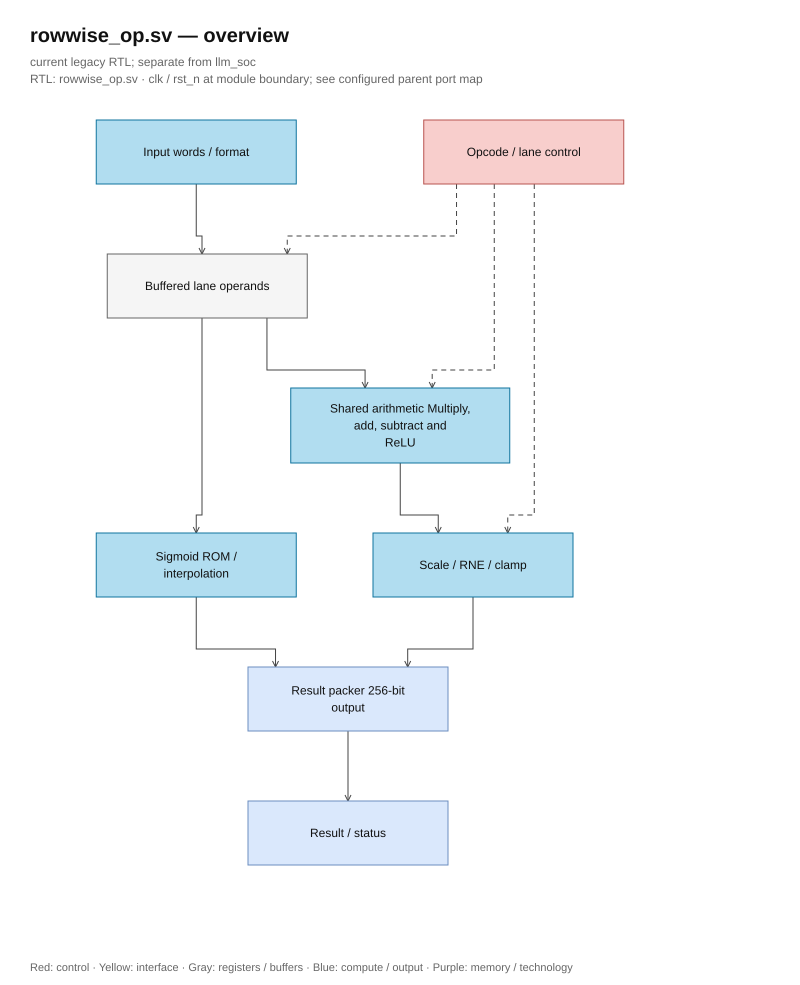
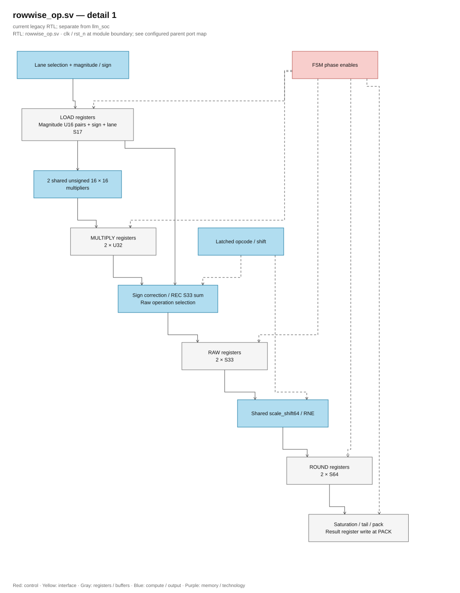

# rowwise_op.sv — Small ALU vector and state update

> **Category: GUIDE. Scope: LEGACY.** RTL is authoritative; diagrams use the [shared visual style](../../diagrams/diagram_style.md).
[Documentation](../../README.md) → [RTL Hierarchy](<../legacy/README.md>) → [Per-file table of contents](README.md)

**Status:** In use — rowwise datapath.

**Source:** [rowwise_op.sv](<../../../Verilog%20Source%20code/rowwise_op.sv>).

## At a glance

| Item | Description |
|---|---|
| Responsibility | The block latches a maximum of 16 elements in one word and then processes the batches sequentially. ADD/SUB/MUL/RELU processes two elements over five phases; REC processes one state with two parallel products over the same five phases. SIG uses one sigmoid instance. The registers select lanes, multiplier, raw arithmetic, RNE, and saturation/pack; the two 16×16 multipliers are still shared for MUL and REC. |

## Overall Architecture Diagram

[Editable draw.io — rowwise_op.sv — overview](../../diagrams/architecture.drawio) · Page `58_rowwise_op.sv_1`.

Solid lines are data, dashed lines are control. The MUX uses a trapezoid narrowing toward the output. Boxes named register are the actual clock boundaries in the datapath; batches still run sequentially, not receiving a new batch each clock. The diagram describes hardware, not CPU instruction pipeline.

## Main flow

1. A valid start edge latches opcode, word, format, number of elements, and 7-bit signed shift. Start when busy is ignored; external input changes do not change the already latched transaction.
2. LOAD selects a lane, checks gate/format, and latches magnitude/sign for the multiplier. `sig_x_q` is also latched here.
3. MULTIPLY latches two U32 magnitude products. RAW restores the sign and selects ADD/SUB, ReLU, two MUL products, or the total REC S33.
4. ROUND sign-extend raw S33 then rescale/RNE through two shared paths. REC puts the entire sum into lane 0 with shift 15, rounding only once.
5. PACK saturation, write two arithmetic lanes or one REC state, collect overflow/format_error and advance index. Padding outside `valid_elems` remains zero.
6. SIG goes from LOAD to SIG_WAIT, wait for sigmoid done then write one lane. Do not use RAW/ROUND payloads of the previous transaction.

| Operation, word with n useful elements | Cycle from accepted start to done |
|---|---:|
| ADD/SUB/MUL/RELU | `5 × ceil(n/2)` |
| REC | `5 × n` |
| SIG | `6 × n` |

Payload magnitude/product/raw/rounded is not async reset; FSM only consumes after the correct write enable. Reset clears the transaction state, result/status, and prevents old payload from going to output. [Timing report](../../verification/timing/README.md) records critical path, constraints, and model cycle impact.

**RTL convention.** U16 magnitude can hold abs(S16 min) and gate `0x8000`. RAW S33 contains the sum of two REC products; rescale uses S64 to hold a maximum left shift of 24 bits. There are exactly two multipliers in this datapath; sharing two multipliers across the chip is still a separate architectural goal.

## Important state / datapath groups

Each group keeps the original source and line scope for reference. Explanation focuses on register boundary, enable, and arithmetic.

### [Lines 1–39: Interface, controller, and sigmoid](<../../../Verilog%20Source%20code/rowwise_op.sv#L1>)

**Purpose.** Opcode and FSM determine the phase. Sigmoid receives sig_x_q latched at LOAD; sig_start is only valid at SIG_WAIT when the sub-core is ready.

**Operation.** source_a_q/source_b_q/state_word_q hold the transaction, result_shift_q S7 holds the shift, and operation_q holds the opcode.

### [Lines 40–68: Arithmetic payload and flags](<../../../Verilog%20Source%20code/rowwise_op.sv#L40>)

**Purpose.** Two S17 lanes distinguish signed S16 with gate U16/F15. Magnitude U16, product U32, raw S33, and scaled S64 have separate clock boundaries.

**Operation.** product_negative_q restores the sign after the multiplier; lane_valid_q and source_format_error_q go together in a batch, no re-reading of external input.

### [Lines 69–98: Select lane, magnitude, and total REC](<../../../Verilog%20Source%20code/rowwise_op.sv#L69>)

**Purpose.** MUL selects two A/B pairs; REC selects H×F and C×(0x8000−F). 16-bit magnitude plus sign flag allows sharing of two multipliers. Sign correction reads the finalized product; REC total keeps S33.

**Operation.** The combinational results are only consumed by the corresponding LOAD or RAW. Raw gate greater than 0x8000 signals format_error; ReLU has its own signed rules.

### [Lines 99–140: Finalize operand, product, raw result, and RNE](<../../../Verilog%20Source%20code/rowwise_op.sv#L99>)

**Purpose.** Clocked payload block does not have asynchronous reset. LOAD latches lane/magnitude/sign; MULTIPLY latches product; RAW generates S33; ROUND latches scale_shift64 of the entire raw value.

**Operation.** rst_n and FSM phase are validity of payload. Each path to PACK goes through all required captures; reset cancels the sequence, start records a new payload before use.

#### Hardware block diagram of the group

[Editable draw.io — rowwise_op.sv — detail 1](../../diagrams/architecture.drawio) · Page `59_rowwise_op.sv_2`.

### [Lines 141–172: Saturation, tail and pack](<../../../Verilog%20Source%20code/rowwise_op.sv#L141>)

**Purpose.** Two rounded results are clamped to S16 or U16/F15. Only lane_valid is written. SIG selects sig_y; REC only writes lane 0 after RNE of the sum.

**Operation.** result_buffer_next by default holds the current buffer, lane_overflow is accumulated. Tail is not written and the buffer is initialized to zero at start.

### [Lines 173–191: Reset control and output](<../../../Verilog%20Source%20code/rowwise_op.sv#L173>)

**Purpose.** Reset returns the FSM to IDLE, busy/done/error/overflow to zero, and clears result/control. Arithmetic payload resides in a separate clocked block.

**Operation.** No need to reset payload to ensure the architecture output is clean: IDLE does not consume and new transactions must go through LOAD/MULTIPLY/RAW/ROUND.

### [Lines 192–215: Receive start and reject configuration](<../../../Verilog%20Source%20code/rowwise_op.sv#L192>)

**Purpose.** Start is only accepted when !busy. Latch format, valid_elems, opcode, and shift once; reset index/buffer/flags. Length=0/>16, F_t>24, or unknown opcode ends immediately with format_error.

**Operation.** REC shift fixed at 15; MUL uses F_A+F_B−F_dst; ADD/SUB/ReLU use F_A−F_dst. Signed 7-bit range accommodates all allowed formats.

### [Lines 216–232: Advance phase and handshake SIG](<../../../Verilog%20Source%20code/rowwise_op.sv#L216>)

**Purpose.** LOAD chooses SIG_WAIT or MULTIPLY. Arithmetic passes through RAW and ROUND before PACK. SIG only writes when sig_done; after the last lane completes, pulse done; if not finished, return to LOAD.

**How it works.** sig_x_q remains stable when sigmoid is busy. LOAD takes advantage of the done/start gaps between lanes; SIG latency increases by one clock per word compared to the previous version.

### [Lines 233–248: PACK, gather flags and finish](<../../../Verilog%20Source%20code/rowwise_op.sv#L233>)

**Purpose.** PACK finalizes the result, ORs overflow/error, and finishes when all lanes are done or there is a format_error. REC increments the index by one, other arithmetic operations increment by two and then return to LOAD.

**How it works.** Each arithmetic batch takes five clocks; the next batch only starts after PACK. The dispatcher waits for done, so the number of cycles does not change for ISA or memory contract.
