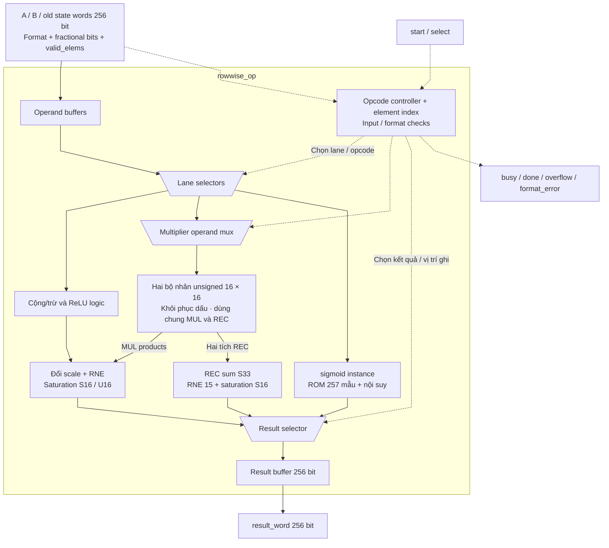
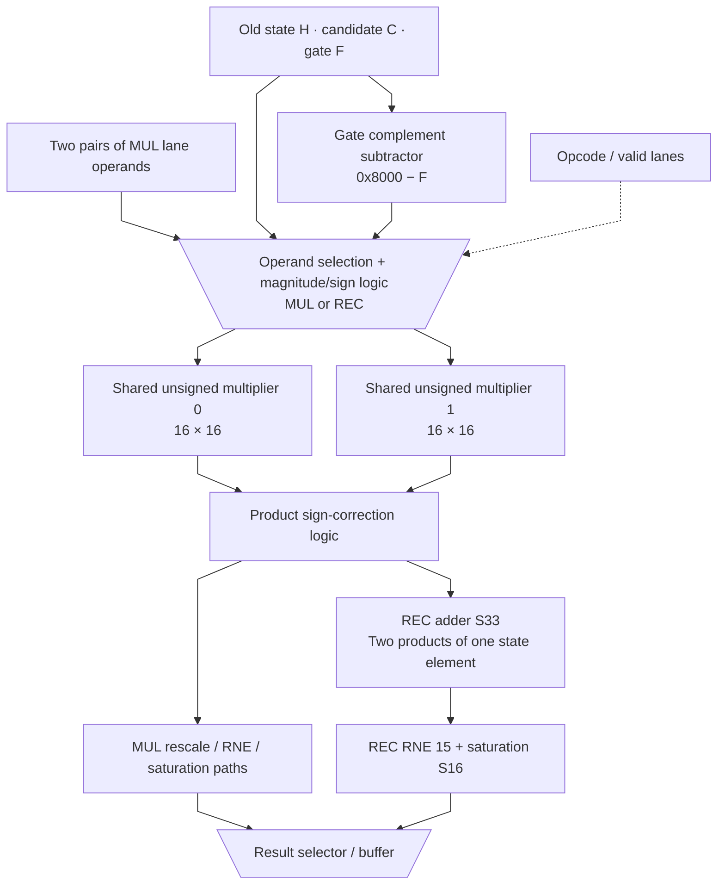

# rowwise_op.sv — ALU vector nhỏ và cập nhật state

[Về mục lục](README.md) · [Về tổng quan](../README.md)

**Trạng thái:** Đang dùng — datapath rowwise.

**Source:** [rowwise_op.sv](<../../../Verilog%20Source%20code/rowwise_op.sv>). **Số dòng:** 194. **SHA-256:** `65996893e6570ee34571c6d1ce7f8b4d3ab1d0792da49239d752f99553b7e9a3`.

## Khối này làm gì?

Khối nhận tối đa 16 phần tử trong một word, chốt input rồi xử lý dần. ADD/SUB/MUL/RELU đi hai phần tử mỗi bước; SIG chờ sigmoid từng phần tử; REC đi một phần tử với hai tích song song. Hai multiplier dùng chung cho MUL và REC; điều này không có nghĩa toàn chip chỉ có hai multiplier.

## Sơ đồ kiến trúc tổng quan



MUX dùng hình thang rộng ở phía nhiều ngõ vào và thu hẹp về ngõ ra; decoder/demux dùng hình thang ngược lại, mở rộng về phía nhiều ngõ ra. Hình chữ nhật có các vạch ngang biểu diễn bộ nhớ hoặc bank descriptor. Các hình chữ nhật thường là datapath, thanh ghi đơn hoặc giao diện. Nét liền là đường dữ liệu, nét đứt là điều khiển/cấu hình. Mũi tên hồi tiếp biểu diễn kết nối phần cứng. Sơ đồ không biểu diễn thứ tự chu kỳ, trạng thái FSM hoặc các tầng pipeline CPU.

## Cách hoạt động chi tiết

Đường tổ hợp tạo result_buffer_next từ buffer hiện tại. Phần sequential chốt kết quả, tiến element_index và trả done. Sign/magnitude cho phép cùng multiplier unsigned xử lý S16 và gate có raw=0x8000. REC cộng hai tích trước RNE15; tail không hữu ích giữ zero trong output.

1. Start chốt word, F_t, unsigned flag và số phần tử hợp lệ, tách giao dịch nhiều chu kỳ khỏi thay đổi bên ngoài.
2. ADD/SUB tính trong S17 rồi đổi scale. MUL có F sản phẩm bằng tổng F của hai nguồn.
3. Hai multiplier xử lý hai lane MUL. Với REC, chúng xử lý H×F và C×(0x8000−F) của một lane.
4. REC cộng hai tích trong S33 rồi RNE một lần tại bit 15; làm tròn riêng từng tích sẽ sai ở các trường hợp nửa đơn vị.
5. SIG dùng một instance sigmoid nên chạy từng phần tử. RELU đưa số âm về zero trước khi rescale.
6. Buffer, cờ và index được cập nhật mỗi bước; hết `valid_elems` thì trả nguyên word và pulse done.

## Các nhóm logic trong source

Source được chia theo chức năng. Mỗi nhóm giữ nguyên phạm vi dòng để đối chiếu, nhưng phần giải thích tập trung vào quan hệ giữa các câu lệnh thay vì lặp lại từng dấu ngoặc, khai báo hoặc phép gán.


### [Dòng 1–34: Giao diện và sigmoid](<../../../Verilog%20Source%20code/rowwise_op.sv#L1>)

<!-- source-range:1:34 -->
```systemverilog
module rowwise_op #(parameter string SIG_LUT_FILE = "") (
    input logic clk, rst_n, start,
    input logic [3:0] select,
    input logic [255:0] a_word, b_word, c_word,
    input logic [4:0] a_frac_bits, b_frac_bits, dst_frac_bits, valid_elems,
    input logic a_unsigned, b_unsigned, dst_unsigned,
    output logic [255:0] result_word,
    output logic busy, done, overflow, format_error
);
    import npu_pkg::*;
    localparam logic [3:0] OP_ADD = 4'h1;
    localparam logic [3:0] OP_SUB = 4'h2;
    localparam logic [3:0] OP_MUL = 4'h3;
    localparam logic [3:0] OP_SIG = 4'h6;
    localparam logic [3:0] OP_REC = 4'hb;
    localparam logic [3:0] OP_RELU = 4'hc;
    logic [255:0] source_a_q, source_b_q, state_word_q, result_buffer_q, result_buffer_next;
    logic [4:0] source_a_frac_q, source_b_frac_q, destination_frac_q, element_count_q, element_index_q;
    logic source_a_unsigned_q, source_b_unsigned_q, destination_unsigned_q;
    logic [3:0] operation_q;
    logic sig_busy, sig_done, sig_start;
    logic [15:0] sig_y;
    logic signed [15:0] sig_x;
    assign sig_x = source_a_q[element_index_q * 16 +: 16];
    assign sig_start = busy && operation_q == OP_SIG && !sig_busy && !sig_done;
    sigmoid #(.LUT_FILE(SIG_LUT_FILE)) u_sig(
        .clk(clk),
        .rst_n(rst_n),
        .start(sig_start),
        .x_raw(sig_x),
        .frac_bits(source_a_frac_q),
        .busy(sig_busy),
        .done(sig_done),
        .y_raw(sig_y));
```

**Mục đích.** Chốt select, input words, scale và số phần tử hữu ích. Sigmoid nhận một lane theo element_index.

**Cách phần code hoạt động.** Có continuous assignment: biểu thức luôn lái tín hiệu đích, không cần start hoặc cạnh clock. Có instance module con; named-port ở nhóm này xác định chính xác đường control/data giữa hai cấp hierarchy.

**Tín hiệu và dữ liệu chính.** `start`: yêu cầu bắt đầu giao dịch; `select`: opcode chọn phép rowwise; `a_word`: word A; `b_word`: word B; `c_word`: word state cũ của REC; `valid_elems`: số lane hữu ích của word cuối; và 27 tín hiệu phụ khác trong đoạn code.


### [Dòng 35–48: Dữ liệu trung gian](<../../../Verilog%20Source%20code/rowwise_op.sv#L35>)

<!-- source-range:35:48 -->
```systemverilog
    logic lane_overflow, lane_format_error;
    logic signed [16:0] lane_a[0:1], lane_b[0:1];
    // MUL and REC share these two physical unsigned 16x16 multipliers.
    // Sign correction happens after multiplication, preserving gate raw 0x8000.
    logic signed [16:0] multiply_a[0:1], multiply_b[0:1];
    logic [15:0] magnitude_a[0:1], magnitude_b[0:1];
    logic [31:0] magnitude_product[0:1];
    logic signed [31:0] product[0:1];
    logic signed [63:0] raw_value[0:1], scaled[0:1];
    logic signed [15:0] old_state, candidate;
    logic [15:0] gate, complement;
    logic signed [32:0] recurrent_sum;
    logic signed [63:0] recurrent_value;
    integer result_shift;
```

**Mục đích.** Lane mở rộng S17 phân biệt unsigned gate với S16 âm. Hai product S32, recurrent_sum S33.

**Cách phần code hoạt động.** Nhóm này định nghĩa giao diện, độ rộng, kiểu hoặc tín hiệu trung gian. Nó tạo cấu trúc để các nhóm xử lý sau sử dụng, chưa tự biểu diễn một bước runtime riêng.

**Tín hiệu và dữ liệu chính.** `lane_overflow`: cờ overflow của bước lane hiện tại; `lane_format_error`: cờ gate/format sai ở bước lane hiện tại; `lane_a`: hai lane A mở rộng17 bit; `lane_b`: hai lane B mở rộng17 bit; `multiply_a`: hai operand A của multiplier dùng chung; `multiply_b`: hai operand B của multiplier dùng chung; và 13 tín hiệu phụ khác trong đoạn code.


### [Dòng 49–57: Mặc định tổ hợp](<../../../Verilog%20Source%20code/rowwise_op.sv#L49>)

<!-- source-range:49:57 -->
```systemverilog
    always_comb begin
        result_buffer_next = result_buffer_q;
        lane_overflow = 0;
        lane_format_error = 0;
        candidate = source_a_q[element_index_q * 16 +: 16];
        old_state = state_word_q[element_index_q * 16 +: 16];
        gate = source_b_q[element_index_q * 16 +: 16];
        complement = 16'h8000 - gate;
        result_shift = (operation_q == OP_MUL ? int'(source_a_frac_q) + int'(source_b_frac_q) : int'(source_a_frac_q)) - int'(destination_frac_q);
```

**Mục đích.** Giữ buffer cũ, xóa cờ lane và tính shift từ scale nguồn/đích. REC dùng complement 0x8000−gate.

**Cách phần code hoạt động.** Có logic tổ hợp: output/intermediate được tính từ input hiện tại; các giá trị mặc định đầu khối giúp tránh suy ra latch.

**Tín hiệu và dữ liệu chính.** `result_buffer_next`: giá trị kế tiếp của buffer kết quả; `result_buffer_q`: buffer kết quả đang xây; `lane_overflow`: cờ overflow của bước lane hiện tại; `lane_format_error`: cờ gate/format sai ở bước lane hiện tại; `candidate`: ứng viên; ở REC là C, ở scale_compose là shift đang thử; `source_a_q`: word nguồn A đã chốt; và 11 tín hiệu phụ khác trong đoạn code.


### [Dòng 58–81: Hai multiplier dùng chung](<../../../Verilog%20Source%20code/rowwise_op.sv#L58>)

<!-- source-range:58:81 -->
```systemverilog
        for (integer j = 0;j < 2;j = j + 1) begin
            lane_a[j] = source_a_unsigned_q ? $signed({1'b0, source_a_q[(element_index_q + j) * 16 +: 16]}) : $signed(source_a_q[(element_index_q + j) * 16 +: 16]);
            lane_b[j] = source_b_unsigned_q ? $signed({1'b0, source_b_q[(element_index_q + j) * 16 +: 16]}) : $signed(source_b_q[(element_index_q + j) * 16 +: 16]);
            // Operand isolation avoids toggling multipliers during ADD/SIG/idle.
            multiply_a[j] = '0;
            multiply_b[j] = '0;
            if (busy && operation_q == OP_MUL && element_index_q + j < element_count_q) begin
                multiply_a[j] = lane_a[j];
                multiply_b[j] = lane_b[j];
            end else if (busy && operation_q == OP_REC) begin
                multiply_a[j] = (j == 0) ? {old_state[15], old_state} : {candidate[15], candidate};
                multiply_b[j] = (j == 0) ? $signed({1'b0, gate}) : $signed({1'b0, complement});
            end
            magnitude_a[j] = multiply_a[j][16] ? - multiply_a[j] : multiply_a[j];
            magnitude_b[j] = multiply_b[j][16] ? - multiply_b[j] : multiply_b[j];
            magnitude_product[j] = magnitude_a[j] * magnitude_b[j];
            product[j] = (multiply_a[j][16] ^ multiply_b[j][16]) ?
             - $signed(magnitude_product[j]) : $signed(magnitude_product[j]);
            case (operation_q)
                OP_ADD : raw_value[j] = 64'(lane_a[j]) + 64'(lane_b[j]);
                OP_SUB : raw_value[j] = 64'(lane_a[j]) - 64'(lane_b[j]);
                default : raw_value[j] = {{32{product[j][31]}}, product[j]};
            endcase
            scaled[j] = scale_shift64(raw_value[j], result_shift);
```

**Mục đích.** MUL đưa hai cặp A/B; REC đưa H×F và C×(1−F). Operand isolation đưa multiplier về 0 khi không cần. Sau nhân magnitude, khôi phục sign.

**Cách phần code hoạt động.** Các câu lệnh thuộc cùng một nhánh/pha xử lý và phải được đọc liền nhau; tách riêng từng dòng sẽ làm mất quan hệ điều kiện và dữ liệu.

**Tín hiệu và dữ liệu chính.** `lane_a`: hai lane A mở rộng17 bit; `source_a_unsigned_q`: A được diễn giải unsigned; `source_a_q`: word nguồn A đã chốt; `element_index_q`: vị trí phần tử đang tính; `lane_b`: hai lane B mở rộng17 bit; `source_b_unsigned_q`: B được diễn giải unsigned; và 17 tín hiệu phụ khác trong đoạn code.

**Điểm cần đọc kỹ.** REC dùng cả hai multiplier trong cùng một lane. Nó không xử lý hai state song song như MUL, vì hai tích của cùng state phải được cộng trước lần RNE duy nhất.

#### Sơ đồ khối phần cứng của nhóm




### [Dòng 82–99: Rounding và saturation](<../../../Verilog%20Source%20code/rowwise_op.sv#L82>)

<!-- source-range:82:99 -->
```systemverilog
            if (element_index_q + j < element_count_q) begin
                if ((source_a_unsigned_q && lane_a[j] > 17'sh0_8000) || (source_b_unsigned_q && lane_b[j] > 17'sh0_8000)) lane_format_error = 1;
                if (destination_unsigned_q) begin
                    if (scaled[j] < 0) begin
                        result_buffer_next[(element_index_q + j) * 16 +: 16] = 0;
                        lane_overflow = 1;
                    end
                    else if (scaled[j] > 64'sh0000_0000_0000_8000) begin
                        result_buffer_next[(element_index_q + j) * 16 +: 16] = 16'h8000;
                        lane_overflow = 1;
                    end
                    else result_buffer_next[(element_index_q + j) * 16 +: 16] = scaled[j][15:0];
                end else begin
                    result_buffer_next[(element_index_q + j) * 16 +: 16] = sat_s16(scaled[j]);
                    if (scaled[j] > 64'sh0000_0000_0000_7fff || scaled[j] < - 64'sh0000_0000_0000_8000) lane_overflow = 1;
                end
            end
        end
```

**Mục đích.** Chỉ lane hữu ích mới cập nhật output/error. Gate bị giới hạn raw 0x0000…0x8000; signed output clamp S16.

**Cách phần code hoạt động.** Các câu lệnh thuộc cùng một nhánh/pha xử lý và phải được đọc liền nhau; tách riêng từng dòng sẽ làm mất quan hệ điều kiện và dữ liệu.

**Tín hiệu và dữ liệu chính.** `element_index_q`: vị trí phần tử đang tính; `element_count_q`: số phần tử hữu ích; `source_a_unsigned_q`: A được diễn giải unsigned; `lane_a`: hai lane A mở rộng17 bit; `source_b_unsigned_q`: B được diễn giải unsigned; `lane_b`: hai lane B mở rộng17 bit; và 5 tín hiệu phụ khác trong đoạn code.


### [Dòng 100–122: SIG, RELU và REC](<../../../Verilog%20Source%20code/rowwise_op.sv#L100>)

<!-- source-range:100:122 -->
```systemverilog
        if (operation_q == OP_SIG) begin
            result_buffer_next = result_buffer_q;
            result_buffer_next[element_index_q * 16 +: 16] = sig_y;
        end
        if (operation_q == OP_RELU) begin
            result_buffer_next = result_buffer_q;
            lane_overflow = 0;
            lane_format_error = 0;
            for (integer j = 0;j < 2;j = j + 1) if (element_index_q + j < element_count_q) begin
                scaled[j] = scale_shift64(lane_a[j] < 0 ? 64'sh0000_0000_0000_0000 : 64'(lane_a[j]), int'(source_a_frac_q) - int'(destination_frac_q));
                result_buffer_next[(element_index_q + j) * 16 +: 16] = sat_s16(scaled[j]);
                if (scaled[j] > 64'sh0000_0000_0000_7fff) lane_overflow = 1;
            end
        end
        recurrent_sum = {product[0][31], product[0]} + {product[1][31], product[1]};
        recurrent_value = rne_shift64({{31{recurrent_sum[32]}}, recurrent_sum}, 6'd15);
        if (operation_q == OP_REC) begin
            result_buffer_next = result_buffer_q;
            result_buffer_next[element_index_q * 16 +: 16] = sat_s16(recurrent_value);
            lane_format_error = gate > 16'h8000;
            lane_overflow = (recurrent_value > 64'sh0000_0000_0000_7fff || recurrent_value < - 64'sh0000_0000_0000_8000);
        end
    end
```

**Mục đích.** Các operation đặc biệt ghi đè đường kết quả chung. REC dùng một RNE sau tổng S33, tránh sai số làm tròn hai lần.

**Cách phần code hoạt động.** Các câu lệnh thuộc cùng một nhánh/pha xử lý và phải được đọc liền nhau; tách riêng từng dòng sẽ làm mất quan hệ điều kiện và dữ liệu.

**Tín hiệu và dữ liệu chính.** `operation_q`: opcode đã chốt; `result_buffer_next`: giá trị kế tiếp của buffer kết quả; `result_buffer_q`: buffer kết quả đang xây; `element_index_q`: vị trí phần tử đang tính; `sig_y`: gate U16/F15 nhận từ sigmoid; `lane_overflow`: cờ overflow của bước lane hiện tại; và 10 tín hiệu phụ khác trong đoạn code.


### [Dòng 123–144: Reset](<../../../Verilog%20Source%20code/rowwise_op.sv#L123>)

<!-- source-range:123:144 -->
```systemverilog
    always_ff @(posedge clk or negedge rst_n) begin
        if (!rst_n) begin
            busy <= 0;
            done <= 0;
            overflow <= 0;
            format_error <= 0;
            result_word <= 0;
            source_a_q <= 0;
            source_b_q <= 0;
            state_word_q <= 0;
            result_buffer_q <= 0;
            source_a_frac_q <= 0;
            source_b_frac_q <= 0;
            destination_frac_q <= 0;
            element_count_q <= 0;
            element_index_q <= 0;
            source_a_unsigned_q <= 0;
            source_b_unsigned_q <= 0;
            destination_unsigned_q <= 0;
            operation_q <= 0;
        end else begin
            done <= 0;
```

**Mục đích.** Xóa buffer và trạng thái giao dịch cũ.

**Cách phần code hoạt động.** Có logic tuần tự: register/FSM chỉ cập nhật tại cạnh clock; nonblocking assignment đọc giá trị cũ ở vế phải rồi chốt đồng thời.

**Tín hiệu và dữ liệu chính.** `busy`: khối đang xử lý; `done`: xung báo hoàn tất; `overflow`: cờ kết quả vượt miền số; `format_error`: cờ format/metadata không hợp lệ; `result_word`: word 256 output rowwise; `source_a_q`: word nguồn A đã chốt; và 12 tín hiệu phụ khác trong đoạn code.


### [Dòng 145–168: Chốt input và validate](<../../../Verilog%20Source%20code/rowwise_op.sv#L145>)

<!-- source-range:145:168 -->
```systemverilog
            if (start && !busy) begin
                source_a_q <= a_word;
                source_b_q <= b_word;
                state_word_q <= c_word;
                source_a_frac_q <= a_frac_bits;
                source_b_frac_q <= b_frac_bits;
                destination_frac_q <= dst_frac_bits;
                source_a_unsigned_q <= a_unsigned;
                source_b_unsigned_q <= b_unsigned;
                destination_unsigned_q <= dst_unsigned;
                element_count_q <= valid_elems;
                operation_q <= select;
                element_index_q <= 0;
                result_buffer_q <= 0;
                busy <= 1;
                overflow <= 0;
                format_error <= 0;
                if (valid_elems == 0 || valid_elems > 16 || a_frac_bits > 24 || b_frac_bits > 24 || dst_frac_bits > 24 ||
                    !(select == OP_ADD || select == OP_SUB || select == OP_MUL || select == OP_SIG || select == OP_REC || select == OP_RELU)) begin
                    busy <= 0;
                    done <= 1;
                    format_error <= 1;
                    result_word <= 0;
                end
```

**Mục đích.** Nhận start khi !busy. Reject số phần tử/scale/opcode sai; input được giữ trong register để host hoặc dispatcher thay tín hiệu ngoài không ảnh hưởng phép tính đang chạy.

**Cách phần code hoạt động.** Các câu lệnh thuộc cùng một nhánh/pha xử lý và phải được đọc liền nhau; tách riêng từng dòng sẽ làm mất quan hệ điều kiện và dữ liệu.

**Tín hiệu và dữ liệu chính.** `start`: yêu cầu bắt đầu giao dịch; `busy`: khối đang xử lý; `source_a_q`: word nguồn A đã chốt; `a_word`: word A; `source_b_q`: word nguồn B đã chốt; `b_word`: word B; và 21 tín hiệu phụ khác trong đoạn code.


### [Dòng 169–194: Chạy từng lane](<../../../Verilog%20Source%20code/rowwise_op.sv#L169>)

<!-- source-range:169:194 -->
```systemverilog
            end else if (busy) begin
                if (operation_q == OP_SIG) begin
                    if (sig_done) begin
                        result_buffer_q <= result_buffer_next;
                        if (element_index_q + 1 >= element_count_q) begin
                            result_word <= result_buffer_next;
                            busy <= 0;
                            done <= 1;
                        end
                        else element_index_q <= element_index_q + 1'b1;
                    end
                end else begin
                    result_buffer_q <= result_buffer_next;
                    overflow <= overflow | lane_overflow;
                    format_error <= format_error | lane_format_error;
                    if (element_index_q + (operation_q == OP_REC ? 1 : 2) >= element_count_q || lane_format_error) begin
                        result_word <= result_buffer_next;
                        busy <= 0;
                        done <= 1;
                    end
                    else element_index_q <= element_index_q + (operation_q == OP_REC ? 1 : 2);
                end
            end
        end
    end
endmodule
```

**Mục đích.** SIG chỉ tiến khi sig_done. Operation khác tích lũy cờ, tăng một lane cho REC hoặc hai lane cho các phép còn lại.

**Cách phần code hoạt động.** Các câu lệnh thuộc cùng một nhánh/pha xử lý và phải được đọc liền nhau; tách riêng từng dòng sẽ làm mất quan hệ điều kiện và dữ liệu.

**Tín hiệu và dữ liệu chính.** `busy`: khối đang xử lý; `operation_q`: opcode đã chốt; `result_buffer_q`: buffer kết quả đang xây; `result_buffer_next`: giá trị kế tiếp của buffer kết quả; `element_index_q`: vị trí phần tử đang tính; `element_count_q`: số phần tử hữu ích; và 6 tín hiệu phụ khác trong đoạn code.

