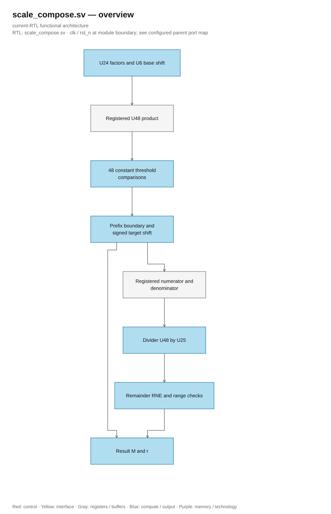

# scale_compose.sv — Compose scales using parallel shift selection

> **Category: GUIDE. Scope: LEGACY.** RTL is authoritative; diagrams use the [shared visual style](../../diagrams/diagram_style.md).
[Document](../../README.md) → [Source guide](<../legacy/README.md>) → [Table of contents](README.md)

**Source:** [scale_compose.sv](<../../../Verilog%20Source%20code/scale_compose.sv>).

## At a glance

| Item | Description |
|---|---|
| Responsibility | Compose factor_m/factor_r with quant_d into result_m U24 and result_r U6. Lock U48 product, evaluate 48 constant thresholds in parallel, select the largest shift that still fits U24, then perform a U48/U25 divider and RNE. No more candidate decrement loop. |

## Architecture diagram

[Editable draw.io — scale_compose.sv — overview](../../diagrams/architecture.drawio) · Page `60_scale_compose.sv_1`.

## Important state / datapath groups

### [Lines 1–29: Interface and state](<../../../Verilog%20Source%20code/scale_compose.sv#L1>)

Valid factors use factor_r≤47 and quant_d not zero. factor_m=0 returns valid zero. Control uses MULTIPLY, SELECT_SHIFT, and SHIFT before DIV_START.

### [Lines 30–53: Parallel threshold selection](<../../../Verilog%20Source%20code/scale_compose.sv#L30>)

positive_fit is the prefix ones. COEFFICIENT_LIMIT=0x7EFF_FFC0_8000; strict inequality excludes tie U24_max+1/2. Boundary encoder selects shift without generating decrement sequence.

### [Lines 54–67: Registered multiplication and shift](<../../../Verilog%20Source%20code/scale_compose.sv#L54>)

Multiply without asynchronous reset; control ensures capture before use. Minimum negative shift −2, so denominator does not exceed U25.

### [Lines 68–76: Divider](<../../../Verilog%20Source%20code/scale_compose.sv#L68>)

One division takes 48 steps. Quotient U48, remainder U25; twice_rem U26 and rounded U49 hold carry for RNE ties-even.

### [Lines 77–116: Launch and selection control](<../../../Verilog%20Source%20code/scale_compose.sv#L77>)

Target r = base_r + selected_shift. If target > 47, clamp r to 47 and adjust shift; negative target or incorrect input reports format_error.

### [Lines 117–154: Result and completion](<../../../Verilog%20Source%20code/scale_compose.sv#L117>)

DIV_WAIT checks zero, underflow, and range; results exceeding U24 cannot occur when the selector is correct. Unit regression records compose_max_clocks = 54.
