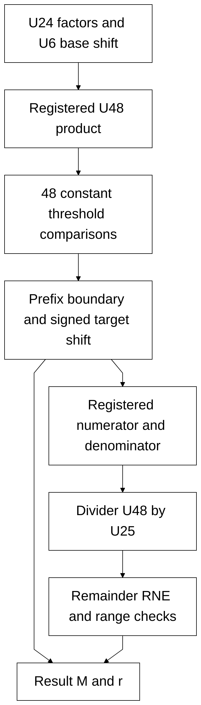

# scale_compose.sv — Ghép scale bằng lựa chọn shift song song

> **Category: GUIDE. Scope: LEGACY.** RTL is authoritative; diagrams are preserved from the existing guide.
[Tài liệu](../../README.md) → [Source guide](<../legacy/README.md>) → [Mục lục](README.md)

**Source:** [scale_compose.sv](<../../../Verilog%20Source%20code/scale_compose.sv>).

## At a glance

| Item | Description |
|---|---|
| Responsibility | Ghép factor_m/factor_r với quant_d thành result_m U24 và result_r U6. Chốt tích U48, đánh giá song song 48 threshold hằng, chọn shift lớn nhất còn vừa U24, rồi thực hiện một divider U48/U25 và RNE. Không còn vòng decrement candidate. |

## Sơ đồ kiến trúc

## Important state / datapath groups

### [Dòng 1–29: Interface and state](<../../../Verilog%20Source%20code/scale_compose.sv#L1>)

Valid factors dùng factor_r≤47 và quant_d khác zero. factor_m=0 trả zero hợp lệ. Control dùng MULTIPLY, SELECT_SHIFT và SHIFT trước DIV_START.

### [Dòng 30–53: Parallel threshold selection](<../../../Verilog%20Source%20code/scale_compose.sv#L30>)

positive_fit là prefix ones. COEFFICIENT_LIMIT=0x7EFF_FFC0_8000; strict inequality loại tie U24_max+1/2. Boundary encoder chọn shift mà không tạo chuỗi decrement.

### [Dòng 54–67: Registered multiplication and shift](<../../../Verilog%20Source%20code/scale_compose.sv#L54>)

Multiply không asynchronous reset; control bảo đảm capture trước use. Shift âm tối thiểu −2, nên denominator không vượt U25.

### [Dòng 68–76: Divider](<../../../Verilog%20Source%20code/scale_compose.sv#L68>)

Một lần chia 48 bước. Quotient U48, remainder U25; twice_rem U26 và rounded U49 giữ carry để RNE ties-even.

### [Dòng 77–116: Launch and selection control](<../../../Verilog%20Source%20code/scale_compose.sv#L77>)

Target r=base_r+selected_shift. Nếu target>47, clamp r về47 và điều chỉnh shift; target âm hoặc input sai báo format_error.

### [Dòng 117–154: Result and completion](<../../../Verilog%20Source%20code/scale_compose.sv#L117>)

DIV_WAIT kiểm tra zero, underflow và range; kết quả vượt U24 không thể xuất hiện khi selector đúng. Unit regression ghi compose_max_clocks=54.
