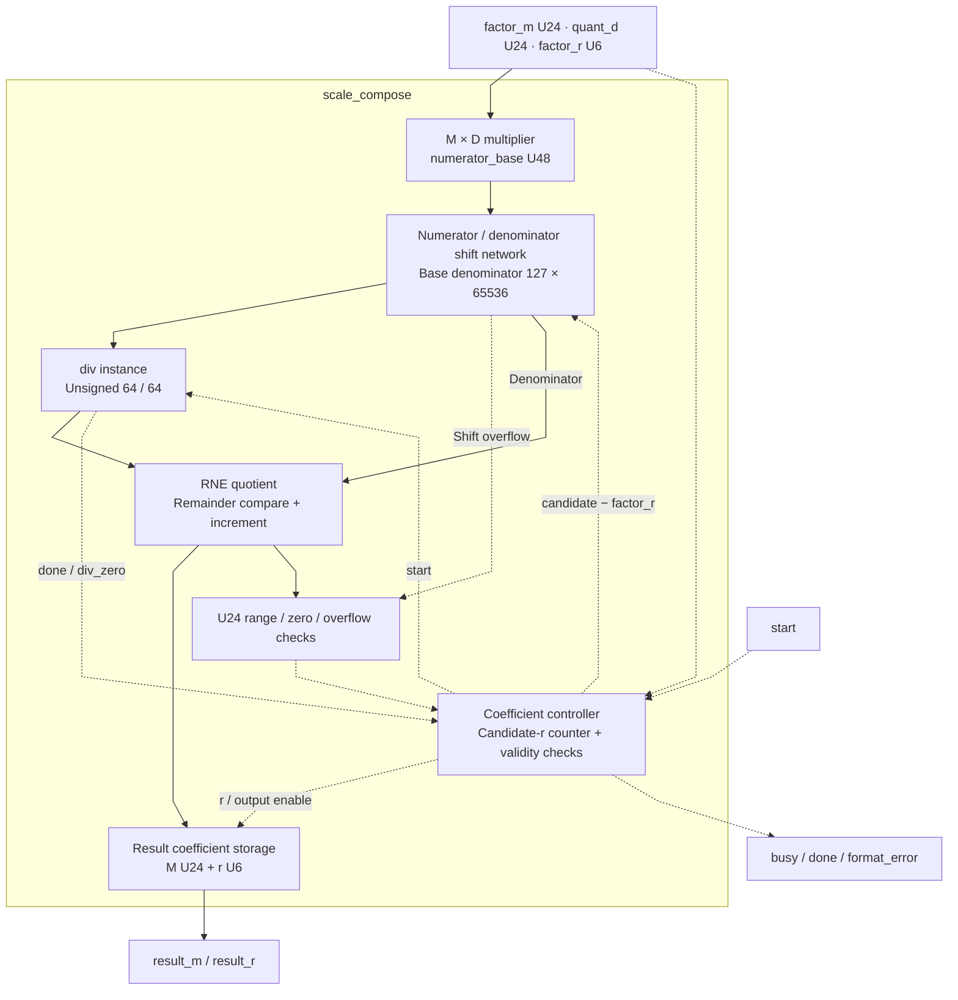
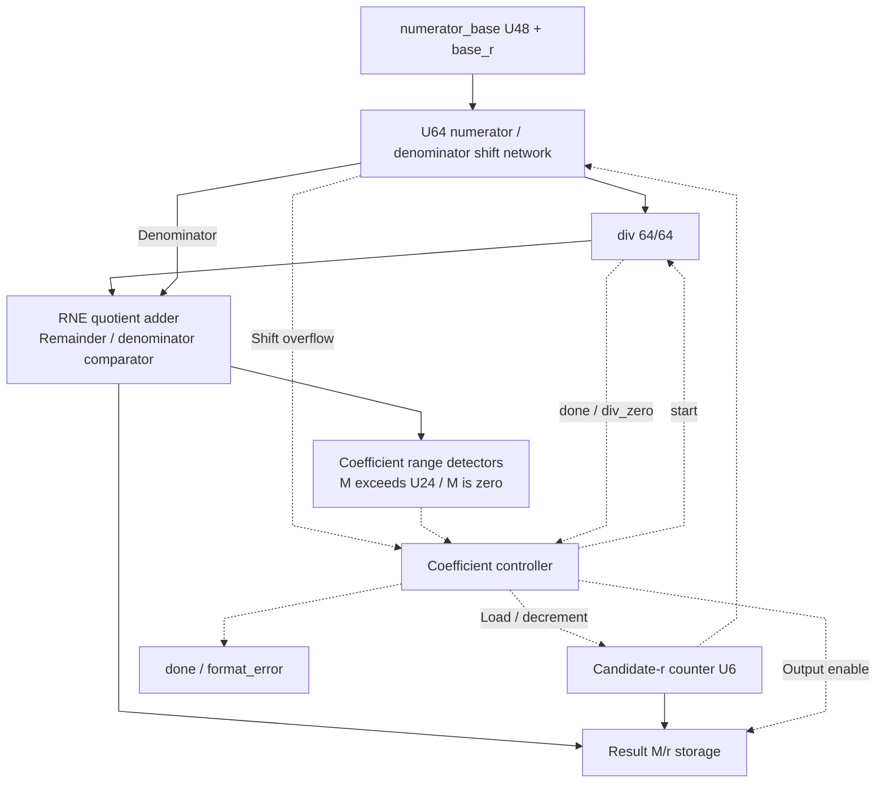

# scale_compose.sv — Ghép scale động của q vào postscale

[Về mục lục](README.md) · [Về tổng quan](../README.md)

**Trạng thái:** Đang dùng — trước TMATMUL dynamic_q.

**Source:** [scale_compose.sv](<../../../Verilog%20Source%20code/scale_compose.sv>). **Số dòng:** 118. **SHA-256:** `39511461e0d88f0075f07981090e64f9a40572c66cc66d3d597c237d93ccc986`.

## Khối này làm gì?

Khối biến `(factor_m/2^factor_r) × quant_d/(0x7F×0x1_0000)` thành một cặp result_m/result_r. factor_m biểu diễn phần scale weight/output; quant_d đến từ NORM. Hệ số được chuẩn bị theo tensor, không tính lại cho từng weight.

## Sơ đồ kiến trúc tổng quan



MUX dùng hình thang rộng ở phía nhiều ngõ vào và thu hẹp về ngõ ra; decoder/demux dùng hình thang ngược lại, mở rộng về phía nhiều ngõ ra. Hình chữ nhật có các vạch ngang biểu diễn bộ nhớ hoặc bank descriptor. Các hình chữ nhật thường là datapath, thanh ghi đơn hoặc giao diện. Nét liền là đường dữ liệu, nét đứt là điều khiển/cấu hình. Mũi tên hồi tiếp biểu diễn kết nối phần cứng. Sơ đồ không biểu diễn thứ tự chu kỳ, trạng thái FSM hoặc các tầng pipeline CPU.

## Cách hoạt động chi tiết

Bắt đầu candidate r=47. Nếu tử số bị tràn hoặc M sau chia quá lớn, giảm r rồi thử lại. Divider 64/64 trả quotient/remainder; RNE quyết định M. Hệ số không biểu diễn được, D=0 hoặc r sai làm format_error; factor_m=0 là trường hợp zero hợp lệ.

1. `factor_m/factor_r` mô tả scale weight/output, còn D mô tả scale activation do NORM tạo. Tích M×D được giữ trong U48.
2. Mẫu cơ sở `0x007F_0000` bằng `0x7F×0x1_0000`. Candidate r quyết định dịch tử hay mẫu để biểu diễn hệ số thành M/2^r.
3. Khối thử từ r=47 để ưu tiên precision. Shift tràn U64 làm giảm candidate trước khi chạy divider.
4. Quotient được RNE bằng remainder. M quá lớn làm giảm r và thử lại; M bằng zero là underflow khi factor khác zero.
5. Tìm được M U24 thì trả result M/r; D bằng zero, r sai hoặc hết candidate gây format error.

## Các nhóm logic trong source

Source được chia theo chức năng. Mỗi nhóm giữ nguyên phạm vi dòng để đối chiếu, nhưng phần giải thích tập trung vào quan hệ giữa các câu lệnh thay vì lặp lại từng dấu ngoặc, khai báo hoặc phép gán.


### [Dòng 1–20: Giao diện và thanh ghi](<../../../Verilog%20Source%20code/scale_compose.sv#L1>)

<!-- source-range:1:20 -->
```systemverilog
// Compose postscale from the runtime NORM+QUANT scale:
// C = factor_m * quant_d / (127*65536 * 2^factor_r).
// Find the largest r<=47 whose RNE coefficient fits U24. No floating point.
module scale_compose (
    input logic clk, rst_n, start,
    input logic [23:0] factor_m, quant_d,
    input logic [5:0] factor_r,
    output logic busy, done, format_error,
    output logic [23:0] result_m,
    output logic [5:0] result_r
);
    typedef enum logic [2:0] {IDLE, PREP, DIV_START, DIV_WAIT, FINISH} state_t;
    state_t state;
    logic [47:0] numerator_base;
    logic [5:0] base_r, candidate;
    logic [63:0] numerator, denominator, quotient, remainder;
    logic div_busy, div_done, div_zero;
    logic [64:0] rounded, twice_rem;
    integer shift;
    logic shift_overflow;
```

**Mục đích.** Tử số cơ sở là U48 từ hai U24; phép chia và shift thực hiện trong U64.

**Cách phần code hoạt động.** Nhóm này định nghĩa giao diện, độ rộng, kiểu hoặc tín hiệu trung gian. Nó tạo cấu trúc để các nhóm xử lý sau sử dụng, chưa tự biểu diễn một bước runtime riêng.

**Tín hiệu và dữ liệu chính.** `start`: yêu cầu bắt đầu giao dịch; `factor_m`: M phần weight/output scale; `quant_d`: D=max(absmax,delta); `factor_r`: r phần weight/output scale; `busy`: khối đang xử lý; `done`: xung báo hoàn tất; và 18 tín hiệu phụ khác trong đoạn code.


### [Dòng 21–37: Chuẩn bị phép chia](<../../../Verilog%20Source%20code/scale_compose.sv#L21>)

<!-- source-range:21:37 -->
```systemverilog
    always_comb begin
        shift = int'(candidate) - int'(base_r);
        numerator = {16'h0000, numerator_base};
        denominator = 64'h0000_0000_007f_0000;
        shift_overflow = 0;
        if (shift >= 0) begin
            shift_overflow = numerator > (64'hffff_ffff_ffff_ffff >> shift);
            numerator = numerator << shift;
        end else begin
            shift_overflow = denominator > (64'hffff_ffff_ffff_ffff >> ( - shift));
            denominator = denominator << ( - shift);
        end
        twice_rem = {1'b0, remainder} << 1;
        rounded = {1'b0, quotient} +
        ((twice_rem > {1'b0, denominator}) ||
            ((twice_rem == {1'b0, denominator}) && quotient[0]));
    end
```

**Mục đích.** Shift candidate−base_r dương đưa vào tử, âm đưa vào mẫu. Hằng `0x007F_0000` bằng `0x7F×0x1_0000`. Kiểm tra overflow trước shift.

**Cách phần code hoạt động.** Có logic tổ hợp: output/intermediate được tính từ input hiện tại; các giá trị mặc định đầu khối giúp tránh suy ra latch.

**Tín hiệu và dữ liệu chính.** `shift`: độ dịch để biểu diễn scale; ý nghĩa dấu theo hàm đang dùng; `candidate`: ứng viên; ở REC là C, ở scale_compose là shift đang thử; `base_r`: r gốc đã chốt; `numerator`: tử số phép chia; `numerator_base`: tích U48 factor_m×D đã chốt; `denominator`: mẫu số phép chia; và 5 tín hiệu phụ khác trong đoạn code.


### [Dòng 38–49: Divider riêng](<../../../Verilog%20Source%20code/scale_compose.sv#L38>)

<!-- source-range:38:49 -->
```systemverilog
    div #(.NUM_W(64),
        .DEN_W(64)) u_div(
        .clk(clk),
        .rst_n(rst_n),
        .start(state == DIV_START),
        .numerator(numerator),
        .denominator(denominator),
        .busy(div_busy),
        .done(div_done),
        .div_zero(div_zero),
        .quotient(quotient),
        .remainder(remainder));
```

**Mục đích.** Một instance 64/64, start chỉ ở DIV_START.

**Cách phần code hoạt động.** Có instance module con; named-port ở nhóm này xác định chính xác đường control/data giữa hai cấp hierarchy.

**Tín hiệu và dữ liệu chính.** `start`: yêu cầu bắt đầu giao dịch; `state`: trạng thái FSM của khối; `numerator`: tử số phép chia; `denominator`: mẫu số phép chia; `busy`: khối đang xử lý; `div_busy`: divider đang chạy; và 5 tín hiệu phụ khác trong đoạn code.


### [Dòng 50–78: Reset và nhận hệ số](<../../../Verilog%20Source%20code/scale_compose.sv#L50>)

<!-- source-range:50:78 -->
```systemverilog
    always_ff @(posedge clk or negedge rst_n) begin
        if (!rst_n) begin
            state <= IDLE;
            busy <= 0;
            done <= 0;
            format_error <= 0;
            numerator_base <= 0;
            base_r <= 0;
            candidate <= 0;
            result_m <= 0;
            result_r <= 0;
        end else begin
            done <= 0;
            case (state)
                IDLE : if (start) begin
                    busy <= 1;
                    format_error <= 0;
                    result_m <= 0;
                    result_r <= 0;
                    numerator_base <= factor_m * quant_d;
                    base_r <= factor_r;
                    candidate <= 47;
                    if (factor_r > 47 || quant_d == 0) begin
                        format_error <= 1;
                        state <= FINISH;
                    end
                    else if (factor_m == 0) state <= FINISH;
                    else state <= PREP;
                end
```

**Mục đích.** Chốt factor_m×D, factor_r; thử r lớn nhất trước.

**Cách phần code hoạt động.** Có logic tuần tự: register/FSM chỉ cập nhật tại cạnh clock; nonblocking assignment đọc giá trị cũ ở vế phải rồi chốt đồng thời.

**Tín hiệu và dữ liệu chính.** `state`: trạng thái FSM của khối; `busy`: khối đang xử lý; `done`: xung báo hoàn tất; `format_error`: cờ format/metadata không hợp lệ; `numerator_base`: tích U48 factor_m×D đã chốt; `base_r`: r gốc đã chốt; và 7 tín hiệu phụ khác trong đoạn code.


### [Dòng 79–108: Thử hệ số](<../../../Verilog%20Source%20code/scale_compose.sv#L79>)

<!-- source-range:79:108 -->
```systemverilog
                PREP : begin
                    if (shift_overflow) begin
                        if (shift < 0 || candidate == 0) begin
                            format_error <= 1;
                            state <= FINISH;
                        end
                        else candidate <= candidate - 1'b1;
                    end else state <= DIV_START;
                end
                DIV_START : state <= DIV_WAIT;
                DIV_WAIT : if (div_done) begin
                    if (div_zero || rounded == 0) begin
                        format_error <= 1;
                        state <= FINISH;
                    end
                    else if (rounded > 65'h00ff_ffff) begin
                        if (candidate == 0) begin
                            format_error <= 1;
                            state <= FINISH;
                        end
                        else begin
                            candidate <= candidate - 1'b1;
                            state <= PREP;
                        end
                    end else begin
                        result_m <= rounded[23:0];
                        result_r <= candidate;
                        state <= FINISH;
                    end
                end
```

**Mục đích.** RNE thương bằng twice_rem; giảm candidate nếu M vượt 0xffffff, reject nếu underflow về 0 hoặc không còn r phù hợp.

**Cách phần code hoạt động.** Các câu lệnh thuộc cùng một nhánh/pha xử lý và phải được đọc liền nhau; tách riêng từng dòng sẽ làm mất quan hệ điều kiện và dữ liệu.

**Tín hiệu và dữ liệu chính.** `shift_overflow`: shift sẽ vượt U64; `shift`: độ dịch để biểu diễn scale; ý nghĩa dấu theo hàm đang dùng; `candidate`: ứng viên; ở REC là C, ở scale_compose là shift đang thử; `format_error`: cờ format/metadata không hợp lệ; `state`: trạng thái FSM của khối; `div_done`: divider đã xong; và 4 tín hiệu phụ khác trong đoạn code.

**Điểm cần đọc kỹ.** Giảm candidate r làm hệ số M nhỏ dần để vừa U24. Thuật toán không cắt các bit cao của M vì thao tác đó sẽ làm sai scale mà không báo lỗi.

#### Sơ đồ khối phần cứng của nhóm




### [Dòng 109–118: Trả kết quả](<../../../Verilog%20Source%20code/scale_compose.sv#L109>)

<!-- source-range:109:118 -->
```systemverilog
                FINISH : begin
                    busy <= 0;
                    done <= 1;
                    state <= IDLE;
                end
                default : state <= IDLE;
            endcase
        end
    end
endmodule
```

**Mục đích.** M/r giữ kết quả khi done; FINISH đưa state về IDLE.

**Cách phần code hoạt động.** Các câu lệnh thuộc cùng một nhánh/pha xử lý và phải được đọc liền nhau; tách riêng từng dòng sẽ làm mất quan hệ điều kiện và dữ liệu.

**Tín hiệu và dữ liệu chính.** `busy`: khối đang xử lý; `done`: xung báo hoàn tất; `state`: trạng thái FSM của khối.

