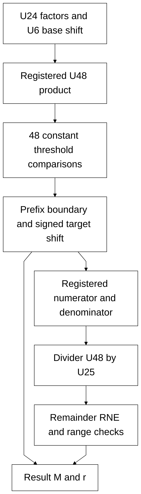

# scale_compose.sv — Ghép scale bằng lựa chọn shift song song

[Tài liệu](../../README.md) → [Source guide](../README.md) → [Mục lục](README.md)

**Source:** [scale_compose.sv](<../../../Verilog%20Source%20code/scale_compose.sv>). **Số dòng:** 154. **SHA-256:** `12c6b58896e3f71367ba1149f6f23784aa0389500aeaf3b66deb2abd198aa55b`.

## Khối này làm gì?

Ghép factor_m/factor_r với quant_d thành result_m U24 và result_r U6. Chốt tích U48, đánh giá song song 48 threshold hằng, chọn shift lớn nhất còn vừa U24, rồi thực hiện một divider U48/U25 và RNE. Không còn vòng decrement candidate.

## Sơ đồ kiến trúc



## Cách hoạt động chi tiết

Ghép factor_m/factor_r với quant_d thành result_m U24 và result_r U6. Chốt tích U48, đánh giá song song 48 threshold hằng, chọn shift lớn nhất còn vừa U24, rồi thực hiện một divider U48/U25 và RNE. Không còn vòng decrement candidate.

## Các nhóm logic trong source

### [Dòng 1–29: Interface and state](<../../../Verilog%20Source%20code/scale_compose.sv#L1>)

<!-- source-range:1:29 -->
```systemverilog
// Compose postscale from the runtime NORM+QUANT scale:
// C = factor_m * quant_d / (127*65536 * 2^factor_r).
// Find the largest r<=47 whose RNE coefficient fits U24. No floating point.
module scale_compose (
    input logic clk, rst_n, start,
    input logic [23:0] factor_m, quant_d,
    input logic [5:0] factor_r,
    output logic busy, done, format_error,
    output logic [23:0] result_m,
    output logic [5:0] result_r
);
    typedef enum logic [2:0] {IDLE, MULTIPLY, SELECT_SHIFT, SHIFT, DIV_START, DIV_WAIT, FINISH} state_t;
    state_t state;
    logic [47:0] numerator_base;
    wire [47:0] product_comb;
    logic [23:0] factor_q, quant_q;
    logic_mul #(.A_W(24), .B_W(24), .OUT_W(48), .SIGNED_A(0), .SIGNED_B(0)) u_bit_mul
        (.a(factor_q), .b(quant_q), .product(product_comb));

    logic [5:0] base_r, candidate;
    logic [47:0] positive_fit;
    logic signed [6:0] selected_shift, shift_q;
    logic signed [7:0] target_r;
    logic [47:0] numerator;
    logic [24:0] denominator;
    logic [47:0] quotient;
    logic [24:0] remainder;
    logic div_busy, div_done, div_zero;
    logic [48:0] rounded;
```

Valid factors dùng factor_r≤47 và quant_d khác zero. factor_m=0 trả zero hợp lệ. Control dùng MULTIPLY, SELECT_SHIFT và SHIFT trước DIV_START.

### [Dòng 30–53: Parallel threshold selection](<../../../Verilog%20Source%20code/scale_compose.sv#L30>)

<!-- source-range:30:53 -->
```systemverilog
    logic [25:0] twice_rem;
    logic round_up;
    // RNE(n/d) fits U24 iff n < (2^24 - 1/2)*d. Test every
    // nonnegative shift in parallel with constant thresholds; the fit vector
    // is a prefix of ones. Its boundary identifies the largest fitting shift.
    localparam logic [46:0] COEFFICIENT_LIMIT = 47'h7eff_ffc0_8000;
    wire [6:0] fit_encoded [0:48];
    genvar fit_shift;
    generate
    for (fit_shift = 0; fit_shift < 48; fit_shift = fit_shift + 1) begin : g_fit_shift
        assign positive_fit[fit_shift] = numerator_base <= (({1'b0, COEFFICIENT_LIMIT} - 48'd1) >> fit_shift);
        if (fit_shift < 47)
            assign fit_encoded[fit_shift + 1] = fit_encoded[fit_shift] |
                (7'(fit_shift) & {7{positive_fit[fit_shift] && !positive_fit[fit_shift + 1]}});
        else assign fit_encoded[48] = fit_encoded[47] | (7'd47 & {7{positive_fit[47]}});
    end
    endgenerate
    assign fit_encoded[0] = 0;
    always_comb begin
        selected_shift = -7'sd2;
        if (!positive_fit[0]) begin
            if (numerator_base < {COEFFICIENT_LIMIT, 1'b0}) selected_shift = -7'sd1;
        end else begin
            selected_shift = fit_encoded[48];
```

positive_fit là prefix ones. COEFFICIENT_LIMIT=0x7EFF_FFC0_8000; strict inequality loại tie U24_max+1/2. Boundary encoder chọn shift mà không tạo chuỗi decrement.

### [Dòng 54–67: Registered multiplication and shift](<../../../Verilog%20Source%20code/scale_compose.sv#L54>)

<!-- source-range:54:67 -->
```systemverilog
        end
        target_r = $signed({2'b00, base_r}) + $signed(selected_shift);
        twice_rem = {1'b0, remainder} << 1;
        round_up = (twice_rem > {1'b0, denominator}) ||
            ((twice_rem == {1'b0, denominator}) && quotient[0]);
        rounded = {1'b0, quotient} + {48'h0000_0000_0000, round_up};
    end
    always_ff @(posedge clk) begin
        if (rst_n && state == MULTIPLY) numerator_base <= product_comb;
        if (rst_n && state == SHIFT) begin
            if (shift_q >= 0) begin
                numerator <= numerator_base << $unsigned(shift_q);
                denominator <= 25'h07f_0000;
            end else begin
```

Multiply không asynchronous reset; control bảo đảm capture trước use. Shift âm tối thiểu −2, nên denominator không vượt U25.

### [Dòng 68–76: Divider](<../../../Verilog%20Source%20code/scale_compose.sv#L68>)

<!-- source-range:68:76 -->
```systemverilog
                numerator <= numerator_base;
                denominator <= 25'h07f_0000 << $unsigned(-shift_q);
            end
        end
    end
    // Every launch has shift >= -2. A fitting positive shift gives n < limit;
    // a negative shift leaves the U48 product unchanged and d <= 127*65536*4.
    div #(.NUM_W(48),
        .DEN_W(25)) u_div(
```

Một lần chia 48 bước. Quotient U48, remainder U25; twice_rem U26 và rounded U49 giữ carry để RNE ties-even.

### [Dòng 77–116: Launch and selection control](<../../../Verilog%20Source%20code/scale_compose.sv#L77>)

<!-- source-range:77:116 -->
```systemverilog
        .clk(clk),
        .rst_n(rst_n),
        .start(state == DIV_START),
        .numerator(numerator),
        .denominator(denominator),
        .busy(div_busy),
        .done(div_done),
        .div_zero(div_zero),
        .quotient(quotient),
        .remainder(remainder));
    always_ff @(posedge clk or negedge rst_n) begin
        if (!rst_n) begin
            state <= IDLE;
            busy <= 0;
            done <= 0;
            format_error <= 0;
            base_r <= 0;
            candidate <= 0;
            result_m <= 0;
            result_r <= 0;
        end else begin
            done <= 0;
            case (state)
                IDLE : if (start) begin
                    busy <= 1;
                    format_error <= 0;
                    result_m <= 0;
                    result_r <= 0;
                    factor_q <= factor_m;
                    quant_q <= quant_d;
                    base_r <= factor_r;
                    candidate <= 47;
                    if (factor_r > 47 || quant_d == 0) begin
                        format_error <= 1;
                        state <= FINISH;
                    end
                    else if (factor_m == 0) state <= FINISH;
                    else state <= MULTIPLY;
                end
                MULTIPLY : state <= SELECT_SHIFT;
```

Target r=base_r+selected_shift. Nếu target>47, clamp r về47 và điều chỉnh shift; target âm hoặc input sai báo format_error.

### [Dòng 117–154: Result and completion](<../../../Verilog%20Source%20code/scale_compose.sv#L117>)

<!-- source-range:117:154 -->
```systemverilog
                SELECT_SHIFT : begin
                    if (target_r < 0) begin
                        format_error <= 1;
                        state <= FINISH;
                    end else begin
                        candidate <= (target_r > 47) ? 6'd47 : target_r[5:0];
                        shift_q <= (target_r > 47) ?
                            (7'sd47 - $signed({1'b0, base_r})) : selected_shift;
                        state <= SHIFT;
                    end
                end
                SHIFT : state <= DIV_START;
                DIV_START : state <= DIV_WAIT;
                DIV_WAIT : if (div_done) begin
                    if (div_zero || rounded == 0) begin
                        format_error <= 1;
                        state <= FINISH;
                    end
                    else if (rounded > 49'h00ff_ffff) begin
                        // The exact threshold selector must exclude this case.
                        format_error <= 1;
                        state <= FINISH;
                    end else begin
                        result_m <= rounded[23:0];
                        result_r <= candidate;
                        state <= FINISH;
                    end
                end
                FINISH : begin
                    busy <= 0;
                    done <= 1;
                    state <= IDLE;
                end
                default : state <= IDLE;
            endcase
        end
    end
endmodule
```

DIV_WAIT kiểm tra zero, underflow và range; kết quả vượt U24 không thể xuất hiện khi selector đúng. Unit regression ghi compose_max_clocks=54.
