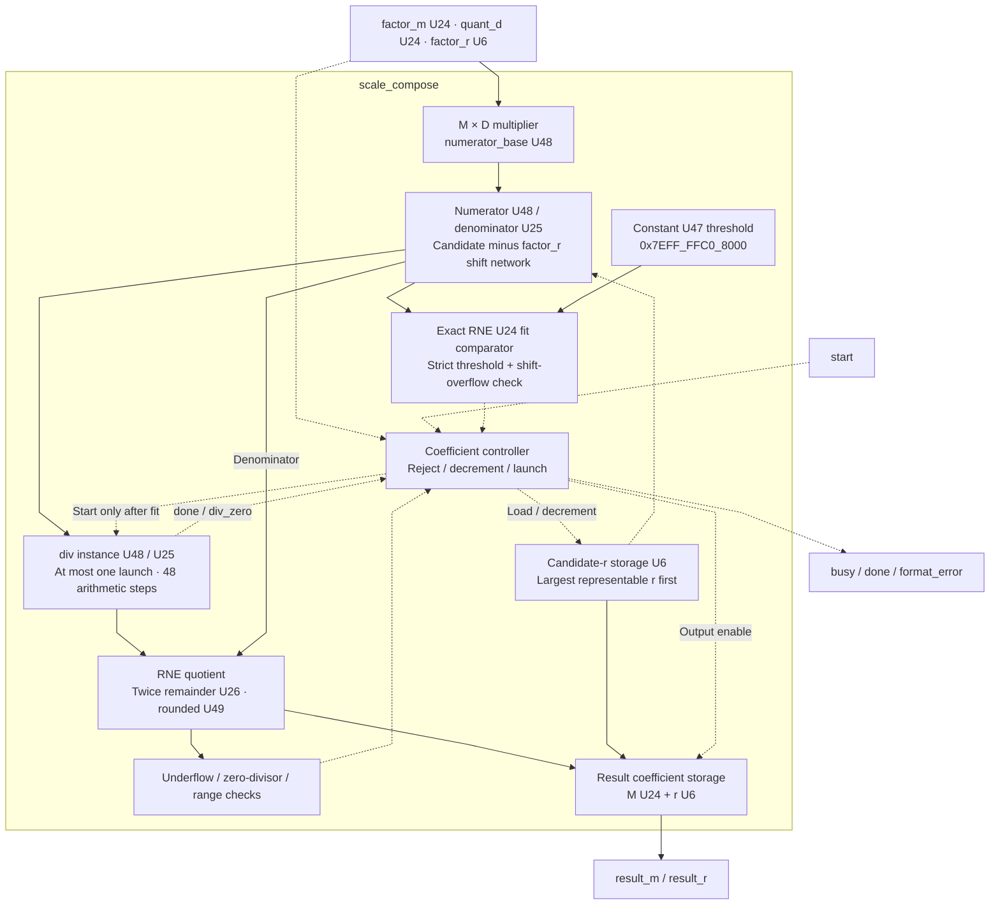
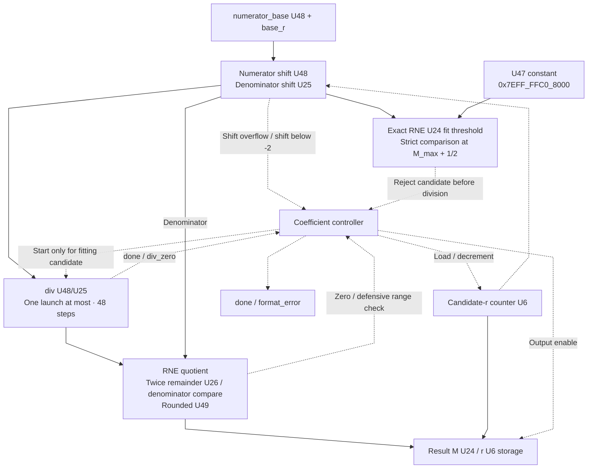

# scale_compose.sv — Ghép scale động của q vào postscale

[Tài liệu](../../README.md) → [Hierarchy RTL](../README.md) → [Mục lục từng file](README.md)

**Trạng thái:** Đang dùng — trước TMATMUL dynamic_q.

**Source:** [scale_compose.sv](<../../../Verilog%20Source%20code/scale_compose.sv>). **Số dòng:** 144. **SHA-256:** `b2f2bdcb88656ff43d92f5e91ed4dbc12ee60c560e09ea6425cd9e92639e1868`.

## Khối này làm gì?

Khối biến `(factor_m/2^factor_r) × quant_d/(0x7F×0x1_0000)` thành một cặp result_m/result_r. factor_m biểu diễn phần scale weight/output; quant_d đến từ NORM. Hệ số được chuẩn bị theo tensor, không tính lại cho từng weight.

## Sơ đồ kiến trúc tổng quan



MUX dùng hình thang rộng ở phía nhiều ngõ vào và thu hẹp về ngõ ra; decoder/demux dùng hình thang ngược lại, mở rộng về phía nhiều ngõ ra. Hình chữ nhật có các vạch ngang biểu diễn bộ nhớ hoặc bank descriptor. Các hình chữ nhật thường là datapath, thanh ghi đơn hoặc giao diện. Nét liền là đường dữ liệu, nét đứt là điều khiển/cấu hình. Mũi tên hồi tiếp biểu diễn kết nối phần cứng. Sơ đồ không biểu diễn thứ tự chu kỳ, trạng thái FSM hoặc các tầng pipeline CPU.

## Cách hoạt động chi tiết

Bắt đầu candidate r=47. PREP dùng overflow check và threshold RNE chính xác để giảm r trước khi chia. Một candidate vừa miền mới launch divider U48/U25; tối đa một phép chia 48 bước cho input hợp lệ. RNE quotient/remainder tạo M. Hệ số không biểu diễn được, D=0 hoặc r sai làm format_error; factor_m=0 là zero hợp lệ.

1. `factor_m/factor_r` mô tả scale weight/output, còn D mô tả scale activation do NORM tạo. Tích M×D được giữ trong U48.
2. Mẫu cơ sở `0x007F_0000` bằng `0x7F×0x1_0000`. Candidate r quyết định dịch tử hay mẫu để biểu diễn hệ số thành M/2^r.
3. Khối thử từ r=47 để ưu tiên precision. Shift tràn U48 hoặc coefficient không fit làm giảm candidate ngay tại PREP, chưa chạy divider.
4. Với mẫu cơ sở d=0x007F_0000, RNE(n/d)≤0xFFFFFF khi và chỉ khi n<(2^24−1/2)×d. Limit U47 là 0x7EFF_FFC0_8000; đúng n=limit là tie với số lẻ 0xFFFFFF nên làm tròn lên 0x1000000 và bị loại. Shift −1 dùng 2×limit; shift≤−2 mọi tích U24×U24 đều fit. Candidate hợp lệ đầu tiên vì thế chỉ cần một division.
5. Tìm được M U24 thì trả result M/r; D bằng zero, r sai hoặc hết candidate gây format error.

**Quy ước RTL.** Numerator/quotient U48, denominator/remainder U25, twice_rem U26 và rounded U49 giữ carry của RNE. Candidate được chọn từ trên xuống; mọi launch có shift≥−2, nên denominator≤4×0x007F_0000 vừa U25. Guard shift<−2 báo lỗi trước launch. PREP và divider đều dùng các độ rộng đã chứng minh, không giữ barrel shifter U64 không cần thiết.

## Các nhóm logic trong source

Source được chia theo chức năng. Mỗi nhóm giữ nguyên phạm vi dòng để đối chiếu, nhưng phần giải thích tập trung vào quan hệ giữa các câu lệnh thay vì lặp lại từng dấu ngoặc, khai báo hoặc phép gán.


### [Dòng 1–25: Giao diện và thanh ghi](<../../../Verilog%20Source%20code/scale_compose.sv#L1>)

<!-- source-range:1:25 -->
```systemverilog
// Compose postscale from the runtime NORM+QUANT scale:
// C = factor_m * quant_d / (127*65536 * 2^factor_r).
// Find the largest r<=47 whose RNE coefficient fits U24. No floating point.
module scale_compose (
    input logic clk, rst_n, start,
    input logic [23:0] factor_m, quant_d,
    input logic [5:0] factor_r,
    output logic busy, done, format_error,
    output logic [23:0] result_m,
    output logic [5:0] result_r
);
    typedef enum logic [2:0] {IDLE, PREP, DIV_START, DIV_WAIT, FINISH} state_t;
    state_t state;
    logic [47:0] numerator_base;
    logic [5:0] base_r, candidate;
    logic [47:0] numerator;
    logic [24:0] denominator;
    logic [47:0] quotient;
    logic [24:0] remainder;
    logic div_busy, div_done, div_zero;
    logic [48:0] rounded;
    logic [25:0] twice_rem;
    logic round_up;
    integer shift;
    logic shift_overflow;
```

**Mục đích.** Tử số cơ sở, shift numerator và quotient là U48; mẫu/remainder U25; rounded U49 và twice_rem U26 giữ carry trước range check.

**Cách phần code hoạt động.** Nhóm này định nghĩa giao diện, độ rộng, kiểu hoặc tín hiệu trung gian. Nó tạo cấu trúc để các nhóm xử lý sau sử dụng, chưa tự biểu diễn một bước runtime riêng.

**Tín hiệu và dữ liệu chính.** `start`: yêu cầu bắt đầu giao dịch; `factor_m`: M phần weight/output scale; `quant_d`: D=max(absmax,delta); `factor_r`: r phần weight/output scale; `busy`: khối đang xử lý; `done`: xung báo hoàn tất; và 18 tín hiệu phụ khác trong đoạn code.


### [Dòng 26–51: Chuẩn bị phép chia](<../../../Verilog%20Source%20code/scale_compose.sv#L26>)

<!-- source-range:26:51 -->
```systemverilog
    logic coefficient_fits;
    // U24 max is odd: the half-way value rounds up to 2^24, which is invalid.
    // RNE(n/d) fits iff n < (2^24 - 1/2)*d. For d=127*65536 this is U47.
    localparam logic [46:0] COEFFICIENT_LIMIT = 47'h7eff_ffc0_8000;
    always_comb begin
        shift = int'(candidate) - int'(base_r);
        numerator = numerator_base;
        denominator = 25'h07f_0000;
        shift_overflow = 0;
        if (shift >= 0) begin
            shift_overflow = numerator > (48'hffff_ffff_ffff >> $unsigned(shift));
            numerator = numerator << $unsigned(shift);
        end else begin
            shift_overflow = denominator > (25'h1ff_ffff >> $unsigned( - shift));
            denominator = denominator << $unsigned( - shift);
        end
        // Reject overlarge coefficients before spending 48 divider cycles.
        // For shift <= -2, even the largest U24*U24 product is below 4*limit.
        coefficient_fits = 1'b1;
        if (shift >= 0) coefficient_fits = numerator < {1'b0, COEFFICIENT_LIMIT};
        else if (shift == -1) coefficient_fits = numerator_base < {COEFFICIENT_LIMIT, 1'b0};
        twice_rem = {1'b0, remainder} << 1;
        round_up = (twice_rem > {1'b0, denominator}) ||
            ((twice_rem == {1'b0, denominator}) && quotient[0]);
        rounded = {1'b0, quotient} + {48'h0000_0000_0000, round_up};
    end
```

**Mục đích.** Shift candidate−base_r dương đưa vào tử U48, âm đưa vào mẫu U25. Hằng `0x007F_0000` bằng `0x7F×0x1_0000`; `COEFFICIENT_LIMIT` U47 mô tả chính xác biên RNE U24. Kiểm tra overflow trước shift và fit trước division, gồm tie ở M_max+1/2.

**Cách phần code hoạt động.** Có logic tổ hợp: output/intermediate được tính từ input hiện tại; các giá trị mặc định đầu khối giúp tránh suy ra latch.

**Tín hiệu và dữ liệu chính.** `shift`: độ dịch để biểu diễn scale; ý nghĩa dấu theo hàm đang dùng; `candidate`: ứng viên; ở REC là C, ở scale_compose là shift đang thử; `base_r`: r gốc đã chốt; `numerator`: tử số phép chia; `numerator_base`: tích U48 factor_m×D đã chốt; `denominator`: mẫu số phép chia; và 5 tín hiệu phụ khác trong đoạn code.


### [Dòng 52–65: Divider riêng](<../../../Verilog%20Source%20code/scale_compose.sv#L52>)

<!-- source-range:52:65 -->
```systemverilog
    // Every launch has shift >= -2. A fitting positive shift gives n < limit;
    // a negative shift leaves the U48 product unchanged and d <= 127*65536*4.
    div #(.NUM_W(48),
        .DEN_W(25)) u_div(
        .clk(clk),
        .rst_n(rst_n),
        .start(state == DIV_START),
        .numerator(numerator),
        .denominator(denominator),
        .busy(div_busy),
        .done(div_done),
        .div_zero(div_zero),
        .quotient(quotient),
        .remainder(remainder));
```

**Mục đích.** Một instance U48/U25, start chỉ ở DIV_START và một phép chia cần 48 bước. PREP bảo đảm numerator và denominator vừa hai cổng, không launch shift<−2.

**Cách phần code hoạt động.** Có instance module con; named-port ở nhóm này xác định chính xác đường control/data giữa hai cấp hierarchy.

**Tín hiệu và dữ liệu chính.** `start`: yêu cầu bắt đầu giao dịch; `state`: trạng thái FSM của khối; `numerator`: tử số phép chia; `denominator`: mẫu số phép chia; `busy`: khối đang xử lý; `div_busy`: divider đang chạy; và 5 tín hiệu phụ khác trong đoạn code.


### [Dòng 66–94: Reset và nhận hệ số](<../../../Verilog%20Source%20code/scale_compose.sv#L66>)

<!-- source-range:66:94 -->
```systemverilog
    always_ff @(posedge clk or negedge rst_n) begin
        if (!rst_n) begin
            state <= IDLE;
            busy <= 0;
            done <= 0;
            format_error <= 0;
            numerator_base <= 0;
            base_r <= 0;
            candidate <= 0;
            result_m <= 0;
            result_r <= 0;
        end else begin
            done <= 0;
            case (state)
                IDLE : if (start) begin
                    busy <= 1;
                    format_error <= 0;
                    result_m <= 0;
                    result_r <= 0;
                    numerator_base <= factor_m * quant_d;
                    base_r <= factor_r;
                    candidate <= 47;
                    if (factor_r > 47 || quant_d == 0) begin
                        format_error <= 1;
                        state <= FINISH;
                    end
                    else if (factor_m == 0) state <= FINISH;
                    else state <= PREP;
                end
```

**Mục đích.** Chốt factor_m×D, factor_r; thử r lớn nhất trước.

**Cách phần code hoạt động.** Có logic tuần tự: register/FSM chỉ cập nhật tại cạnh clock; nonblocking assignment đọc giá trị cũ ở vế phải rồi chốt đồng thời.

**Tín hiệu và dữ liệu chính.** `state`: trạng thái FSM của khối; `busy`: khối đang xử lý; `done`: xung báo hoàn tất; `format_error`: cờ format/metadata không hợp lệ; `numerator_base`: tích U48 factor_m×D đã chốt; `base_r`: r gốc đã chốt; và 7 tín hiệu phụ khác trong đoạn code.


### [Dòng 95–134: Thử hệ số](<../../../Verilog%20Source%20code/scale_compose.sv#L95>)

<!-- source-range:95:134 -->
```systemverilog
                PREP : begin
                    // Starting shift is nonnegative, and shift=-2 always fits.
                    // Guard the narrowed divider interface if that invariant is violated.
                    if (shift < -2) begin
                        format_error <= 1;
                        state <= FINISH;
                    end else if (shift_overflow) begin
                        if (shift < 0 || candidate == 0) begin
                            format_error <= 1;
                            state <= FINISH;
                        end
                        else candidate <= candidate - 1'b1;
                    end else if (!coefficient_fits) begin
                        if (candidate == 0) begin
                            format_error <= 1;
                            state <= FINISH;
                        end else candidate <= candidate - 1'b1;
                    end else state <= DIV_START;
                end
                DIV_START : state <= DIV_WAIT;
                DIV_WAIT : if (div_done) begin
                    if (div_zero || rounded == 0) begin
                        format_error <= 1;
                        state <= FINISH;
                    end
                    else if (rounded > 49'h00ff_ffff) begin
                        if (candidate == 0) begin
                            format_error <= 1;
                            state <= FINISH;
                        end
                        else begin
                            candidate <= candidate - 1'b1;
                            state <= PREP;
                        end
                    end else begin
                        result_m <= rounded[23:0];
                        result_r <= candidate;
                        state <= FINISH;
                    end
                end
```

**Mục đích.** PREP giảm candidate khi shift overflow hoặc threshold cho thấy coefficient vượt U24; chỉ candidate fit mới chạy divider. DIV_WAIT RNE thương bằng twice_rem, reject underflow về 0; nhánh rounded>0xFFFFFF là kiểm tra phòng vệ và không xảy ra với threshold đúng trên input hợp lệ.

**Cách phần code hoạt động.** Các câu lệnh thuộc cùng một nhánh/pha xử lý và phải được đọc liền nhau; tách riêng từng dòng sẽ làm mất quan hệ điều kiện và dữ liệu.

**Tín hiệu và dữ liệu chính.** `shift_overflow`: shift sẽ vượt U48 numerator hoặc U25 denominator; `shift`: độ dịch để biểu diễn scale; ý nghĩa dấu theo hàm đang dùng; `candidate`: ứng viên; ở REC là C, ở scale_compose là shift đang thử; `format_error`: cờ format/metadata không hợp lệ; `state`: trạng thái FSM của khối; `div_done`: divider đã xong; và 4 tín hiệu phụ khác trong đoạn code.

**Điểm cần đọc kỹ.** Giảm candidate r làm hệ số M nhỏ dần để vừa U24. Threshold dùng dấu < nghiêm ngặt vì U24_max lẻ: tie phải làm tròn lên giá trị không vừa U24. Mọi candidate vượt biên bị loại trước division, nên trường hợp hợp lệ chạy tối đa một division thay vì thử nhiều thương rộng rồi bỏ.

#### Sơ đồ khối phần cứng của nhóm




### [Dòng 135–144: Trả kết quả](<../../../Verilog%20Source%20code/scale_compose.sv#L135>)

<!-- source-range:135:144 -->
```systemverilog
                FINISH : begin
                    busy <= 0;
                    done <= 1;
                    state <= IDLE;
                end
                default : state <= IDLE;
            endcase
        end
    end
endmodule
```

**Mục đích.** M/r giữ kết quả khi done; FINISH đưa state về IDLE.

**Cách phần code hoạt động.** Các câu lệnh thuộc cùng một nhánh/pha xử lý và phải được đọc liền nhau; tách riêng từng dòng sẽ làm mất quan hệ điều kiện và dữ liệu.

**Tín hiệu và dữ liệu chính.** `busy`: khối đang xử lý; `done`: xung báo hoàn tất; `state`: trạng thái FSM của khối.

