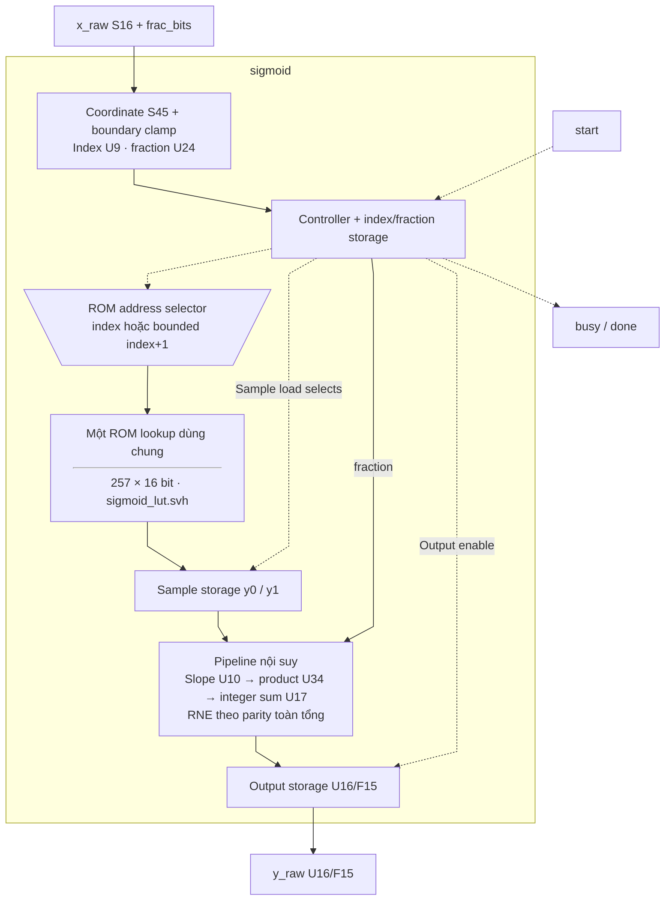
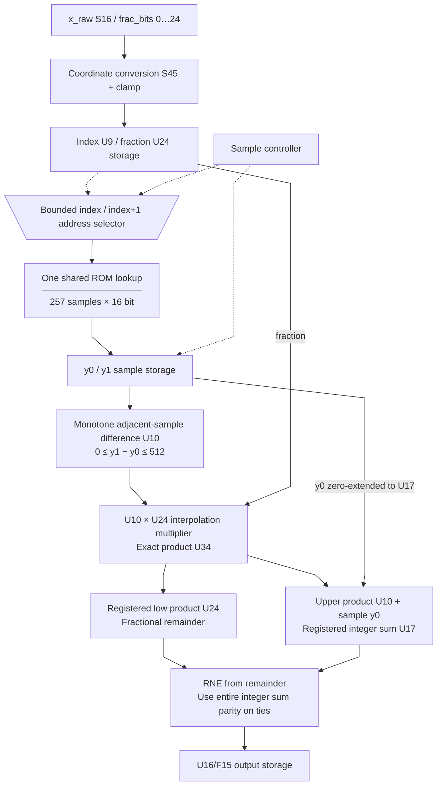

# sigmoid.sv — Sigmoid bằng ROM và nội suy

[Tài liệu](../../README.md) → [Hierarchy RTL](../README.md) → [Mục lục từng file](README.md)

**Trạng thái:** Đang dùng — gọi từ rowwise_op.

**Source:** [sigmoid.sv](<../../../Verilog%20Source%20code/sigmoid.sv>). **Số dòng:** 106. **SHA-256:** `d00693c9bf91ee834e49d75e276bc4fdca8af3b594fcf4b20a98a033c7b600a7`.

## Khối này làm gì?

Input là S16 với F_t=0…24, output gate U16/F15. LUT có 257 mẫu từ −8 đến +8, bước 1/16. Với điểm giữa hai mẫu, khối đọc lần lượt y0 và y1 rồi nội suy bằng fraction 24 bit. Bảng tính sẵn, nên runtime không cần exp.

## Sơ đồ kiến trúc tổng quan



MUX dùng hình thang rộng ở phía nhiều ngõ vào và thu hẹp về ngõ ra; decoder/demux dùng hình thang ngược lại, mở rộng về phía nhiều ngõ ra. Hình chữ nhật có các vạch ngang biểu diễn bộ nhớ hoặc bank descriptor. Các hình chữ nhật thường là datapath, thanh ghi đơn hoặc giao diện. Nét liền là đường dữ liệu, nét đứt là điều khiển/cấu hình. Mũi tên hồi tiếp biểu diễn kết nối phần cứng. Sơ đồ không biểu diễn thứ tự chu kỳ, trạng thái FSM hoặc các tầng pipeline CPU.

## Cách hoạt động chi tiết

`IDLE → READ0 → READ1 → SLOPE → MULTIPLY → ADD → ROUND → IDLE`. Index/fraction chốt lúc start; thay x_raw sau đó không đổi kết quả. Product U34 được chốt sau slope U10, rồi chốt tổng nguyên U17 và remainder U24 trước RNE. Parity của toàn tổng giữ ties-to-even đúng. Payload không reset; control reset hủy giao dịch. Ngoài miền LUT dùng mẫu biên; constant case LUT dùng chung simulation/synthesis.

1. Input S16/F_t được đổi thành tọa độ `(16×x_real+0x80)` với 24 fractional bit; −8 ánh xạ index 0x000 và +8 ánh xạ 0x100.
2. Tọa độ ngoài bảng bị clamp. Index/fraction được chốt lúc start, nên thay input sau đó không ảnh hưởng giao dịch.
3. Một cổng ROM được dùng hai chu kỳ: READ0 lấy y0, READ1 lấy mẫu kế y1. Endpoint 0x100 dùng lại cùng mẫu.
4. SLOPE/MULTIPLY/ADD/ROUND chốt slope, product, tổng nguyên/remainder và RNE, trả U16/F15 với parity toàn tổng.
5. `sigmoid_lut.svh` là nguồn ROM duy nhất trong RTL. `sigmoid_257.mem` giữ cùng các giá trị để generator/test đối chiếu, không được load lúc chạy.

**Quy ước RTL.** Tọa độ S45 chứa đủ toàn miền S16/F_t=0…24 với offset 128×2^24; index U9 và fraction U24 giữ nguyên. LUT đơn điệu và chênh hai mẫu kề nhau tối đa 512, nên slope U10 và product U34 đủ, thay cho slope U16/product U40. Tích được zero-extend khi cộng y0<<24 rồi dùng hàm RNE trên toàn tổng; parity và output U16/F15 không đổi.

## Các nhóm logic trong source

Các đoạn dưới đây bao phủ nguyên văn toàn bộ source hiện tại, theo thứ tự dòng.

### [Dòng 1–34: Giao diện và ROM lookup dùng chung](<../../../Verilog%20Source%20code/sigmoid.sv#L1>)

<!-- source-range:1:34 -->
```systemverilog
module sigmoid (
    input logic clk, rst_n, start,
    input logic signed [15:0] x_raw,
    input logic [4:0] frac_bits,
    output logic busy, done,
    output logic [15:0] y_raw
);
    import npu_pkg::*;
    // Generated together with sigmoid_257.mem; default ROM is independent of CWD.
`include "sigmoid_lut.svh"
    typedef enum logic [2:0] {IDLE, READ0, READ1, SLOPE, MULTIPLY, ADD, ROUND} state_t;
    state_t state;
    logic [8:0] index_q, index_next;
    logic [23:0] fraction_q, fraction_next;
    logic [15:0] y0, y1;
    logic signed [44:0] grid, x_extended;
    logic [9:0] difference_q;
    logic [33:0] product_q;
    wire [33:0] product_comb;
    logic_mul #(.A_W(24), .B_W(10), .OUT_W(34), .SIGNED_A(0), .SIGNED_B(0)) u_bit_mul
        (.a(fraction_q), .b(difference_q), .product(product_comb));

    logic [16:0] integer_q;
    logic [23:0] remainder_q;
    logic round_up;

    logic [8:0] rom_address;
    logic [15:0] rom_data;

    // A single ROM lookup feeds both sample registers on successive cycles.
    // ASIC synthesis sees a constant case table, never an initialized RAM.
    assign rom_address = (state == READ1 && index_q != 9'h100) ?
    index_q + 9'h001 : index_q;
    assign rom_data = sigmoid_sample(int'(rom_address));
```

**Cách hoạt động.** `sigmoid_sample` từ include chứa 257 hằng U16/F15. Selector chọn `index_q` ở READ0 và `index_q+1` ở READ1, trừ endpoint 0x100 dùng lại cùng mẫu. Một lookup tổ hợp dùng chung cho cả hai sample registers. Không cần parameter đường dẫn file hoặc initialize array.

**Tín hiệu chính.** `x_raw`, `frac_bits`, `index_q/index_next`, `fraction_q/fraction_next`, `rom_address/rom_data`, `y0/y1`, `busy/done/y_raw`.

### [Dòng 35–71: Tọa độ và nội suy RNE](<../../../Verilog%20Source%20code/sigmoid.sv#L35>)

<!-- source-range:35:71 -->
```systemverilog
    always_comb begin
        // S16 at F_t=0..24 needs at most 45 signed coordinate bits,
        // including the 128-point offset. Keep all 24 fractional bits.
        x_extended = {{29{x_raw[15]}}, x_raw};
        grid = (x_extended <<< $unsigned(28 - int'(frac_bits))) + (45'sh000_0000_0080 <<< 24);
        if (grid <= 0) begin
            index_next = 0;
            fraction_next = 0;
        end
        else if (grid >= (45'sh000_0000_0100 <<< 24)) begin
            index_next = 9'h100;
            fraction_next = 0;
        end
        else begin
            index_next = grid[32:24];
            fraction_next = grid[23:0];
        end
        // Adjacent samples in the fixed LUT differ by at most 512.
        // Ten unsigned bits retain the exact slope, including the peak step.
    end
    // Registered logic-tree operands/product; rounding uses the parity of the whole
    // interpolated integer, not only the fractional increment.
    assign round_up = remainder_q > 24'h800000 ||
        (remainder_q == 24'h800000 && integer_q[0]);
    always_ff @(posedge clk) begin
        if (rst_n) begin
            if (state == IDLE && start) fraction_q <= fraction_next;
            if (state == READ0) y0 <= rom_data;
            if (state == READ1) y1 <= rom_data;
            if (state == SLOPE) difference_q <= 10'(y1 - y0);
            if (state == MULTIPLY) product_q <= product_comb;
            if (state == ADD) begin
                integer_q <= {1'b0, y0} + {7'h0, product_q[33:24]};
                remainder_q <= product_q[23:0];
            end
        end
    end
```

**Cách hoạt động.** `grid=(x_raw×2^(28−F_t))+(0x80×2^24)` dùng S45 đưa input lên lưới LUT Q24. Logic clamp bảo đảm index 0…256; phần fraction là U24. `difference` U10 giữ slope lớn nhất 512; product U34 từ difference×fraction_q được zero-extend để cộng với y0×2^24, rồi RNE toàn tổng để xét đúng parity của y0 khi tie.

**Điểm cần đọc kỹ.** Host descriptor giới hạn F_t trong 0…24. Điểm ngoài miền ±8 dùng mẫu biên. Không làm tròn riêng phần delta vì có thể lệch một LSB.

#### Sơ đồ khối phần cứng của nhóm



### [Dòng 72–106: FSM lấy hai mẫu và chốt output](<../../../Verilog%20Source%20code/sigmoid.sv#L72>)

<!-- source-range:72:106 -->
```systemverilog
    always_ff @(posedge clk or negedge rst_n) begin
        if (!rst_n) begin
            state <= IDLE;
            busy <= 0;
            done <= 0;
            y_raw <= 0;
            index_q <= 0;
        end else begin
            done <= 0;
            case (state)
                IDLE : if (start) begin
                    busy <= 1;
                    index_q <= index_next;
                    state <= READ0;
                end
                READ0 : begin
                    state <= READ1;
                end
                READ1 : begin
                    state <= SLOPE;
                end
                SLOPE : state <= MULTIPLY;
                MULTIPLY : state <= ADD;
                ADD : state <= ROUND;
                ROUND : begin
                    y_raw <= 16'(integer_q + {16'h0, round_up});
                    busy <= 0;
                    done <= 1;
                    state <= IDLE;
                end
                default : state <= IDLE;
            endcase
        end
    end
endmodule
```

**Cách hoạt động.** IDLE chốt index/fraction; READ0/READ1 lấy samples; SLOPE/MULTIPLY/ADD chốt từng bước arithmetic. ROUND xuất U16/F15, hạ busy và phát done một clock. Sáu pha pipeline đã được thử reset/cancel/restart; toàn 1.638.400 input ở 25 format giữ kết quả reference. Payload dùng nonblocking assignment và không reset; control về IDLE khi reset.
