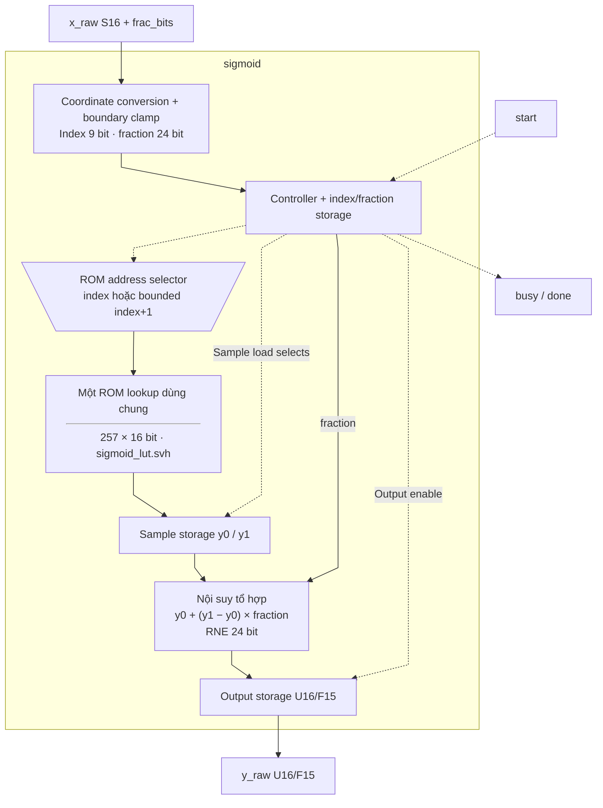
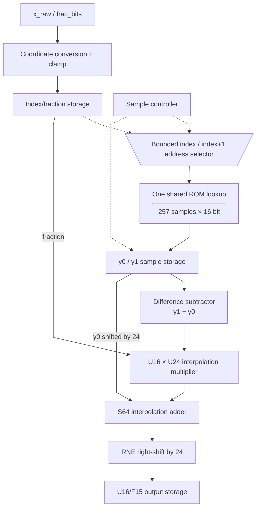

# sigmoid.sv — Sigmoid bằng ROM và nội suy

[Về mục lục](README.md) · [Về tổng quan](../README.md)

**Trạng thái:** Đang dùng — gọi từ rowwise_op.

**Source:** [sigmoid.sv](<../../../Verilog%20Source%20code/sigmoid.sv>). **Số dòng:** 117. **SHA-256:** `f34d409a788828da1a76e2fa65b80d5ee9a00332bb16781be234dfd2021b43a3`.

## Khối này làm gì?

Input là S16 với F_t=0…24, output gate U16/F15. LUT có 257 mẫu từ −8 đến +8, bước 1/16. Với điểm giữa hai mẫu, khối đọc lần lượt y0 và y1 rồi nội suy bằng fraction 24 bit. Bảng tính sẵn, nên runtime không cần exp.

## Sơ đồ kiến trúc tổng quan



MUX dùng hình thang rộng ở phía nhiều ngõ vào và thu hẹp về ngõ ra; decoder/demux dùng hình thang ngược lại, mở rộng về phía nhiều ngõ ra. Hình chữ nhật có các vạch ngang biểu diễn bộ nhớ hoặc bank descriptor. Các hình chữ nhật thường là datapath, thanh ghi đơn hoặc giao diện. Nét liền là đường dữ liệu, nét đứt là điều khiển/cấu hình. Mũi tên hồi tiếp biểu diễn kết nối phần cứng. Sơ đồ không biểu diễn thứ tự chu kỳ, trạng thái FSM hoặc các tầng pipeline CPU.

## Cách hoạt động chi tiết

`IDLE → READ0 → READ1 → INTERP → IDLE`. Chỉ index/fraction được chốt lúc start; thay x_raw sau đó không thay kết quả. Ngoài miền LUT, dùng mẫu biên. Branch SYNTHESIS luôn dùng function case; file LUT ngoài chỉ dành cho simulation và bị kiểm tra từng mẫu.

1. Input S16/F_t được đổi thành tọa độ `(16×x_real+0x80)` với 24 fractional bit; −8 ánh xạ index 0x000 và +8 ánh xạ 0x100.
2. Tọa độ ngoài bảng bị clamp. Index/fraction được chốt lúc start, nên thay input sau đó không ảnh hưởng giao dịch.
3. Một cổng ROM được dùng hai chu kỳ: READ0 lấy y0, READ1 lấy mẫu kế y1. Endpoint 0x100 dùng lại cùng mẫu.
4. INTERP tính y0 cộng phần chênh theo fraction rồi RNE 24 bit, trả U16/F15.
5. Synthesis dùng case table hằng. Simulation có thể dùng file ngoài nhưng kiểm tra đủ 257 giá trị và đúng từng mẫu.

## Các nhóm logic trong source

Source được chia theo chức năng. Mỗi nhóm giữ nguyên phạm vi dòng để đối chiếu, nhưng phần giải thích tập trung vào quan hệ giữa các câu lệnh thay vì lặp lại từng dấu ngoặc, khai báo hoặc phép gán.


### [Dòng 1–26: Giao diện và ROM address](<../../../Verilog%20Source%20code/sigmoid.sv#L1>)

<!-- source-range:1:26 -->
```systemverilog
module sigmoid #(parameter string LUT_FILE = "") (
    input logic clk, rst_n, start,
    input logic signed [15:0] x_raw,
    input logic [4:0] frac_bits,
    output logic busy, done,
    output logic [15:0] y_raw
);
    import npu_pkg::*;
    // Generated together with sigmoid_257.mem; default ROM is independent of CWD.
`include "sigmoid_lut.svh"
    typedef enum logic [1:0] {IDLE, READ0, READ1, INTERP} state_t;
    state_t state;
    logic [8:0] index_q, index_next;
    logic [23:0] fraction_q, fraction_next;
    logic [15:0] y0, y1;
    logic signed [63:0] grid, x_extended, interpolated;
    logic [15:0] difference;
    logic [39:0] product;

    logic [8:0] rom_address;
    logic [15:0] rom_data;

    // A single ROM lookup feeds both sample registers on successive cycles.
    // ASIC synthesis sees a constant case table, never an initialized RAM.
    assign rom_address = (state == READ1 && index_q != 9'h100) ?
    index_q + 9'h001 : index_q;
```

**Mục đích.** Một lookup ROM được dùng hai lần kế tiếp; endpoint `0x100` không đọc index kế tiếp.

**Cách phần code hoạt động.** Có continuous assignment: biểu thức luôn lái tín hiệu đích, không cần start hoặc cạnh clock.

**Tín hiệu và dữ liệu chính.** `start`: yêu cầu bắt đầu giao dịch; `x_raw`: input raw S16 của sigmoid; `frac_bits`: số bit phần lẻ của input; `busy`: khối đang xử lý; `done`: xung báo hoàn tất; `y_raw`: gate raw U16/F15; và 14 tín hiệu phụ khác trong đoạn code.


### [Dòng 27–58: Synthesis và simulation](<../../../Verilog%20Source%20code/sigmoid.sv#L27>)

<!-- source-range:27:58 -->
```systemverilog
`ifdef SYNTHESIS
    assign rom_data = sigmoid_sample(int'(rom_address));
`else
    generate
        if (LUT_FILE == "") begin : g_builtin_rom
            assign rom_data = sigmoid_sample(int'(rom_address));
        end else begin : g_file_rom
            logic [15:0] lut [0:256];
            initial begin
                begin : validate_file
                    integer fd, rc, value, count;
                    fd = $fopen(LUT_FILE, "r");
                    if (fd == 0) $fatal(1, "Missing sigmoid LUT: %s", LUT_FILE);
                    count = 0;
                    while (!$feof(fd)) begin
                        rc = $fscanf(fd, "%h", value);
                        if (rc == 1) begin
                            if (count >= 257) $fatal(1, "Extra sigmoid LUT entries");
                            if (value !== {16'h0000, sigmoid_sample(count)})
                                $fatal(1, "Incorrect sigmoid LUT sample %0d", count);
                            count = count + 1;
                        end else if (!$feof(fd)) $fatal(1, "Malformed sigmoid LUT");
                    end
                    $fclose(fd);
                    if (count != 257) $fatal(1, "Sigmoid LUT requires exactly 257 samples");
                end
                $readmemh(LUT_FILE, lut);
            end
            assign rom_data = lut[rom_address];
        end
    endgenerate
`endif
```

**Mục đích.** Case ROM hằng dùng ở synthesis. Simulation có thể load hex sau khi kiểm tra đúng 257 mẫu; lỗi file gây fatal.

**Cách phần code hoạt động.** Có continuous assignment: biểu thức luôn lái tín hiệu đích, không cần start hoặc cạnh clock.

**Tín hiệu và dữ liệu chính.** `rom_data`: giá trị mẫu ROM; `rom_address`: địa chỉ mẫu ROM; `lut`: array mẫu dùng cho simulation từ file; `count`: bộ đếm bước lặp.


### [Dòng 59–79: Tọa độ và nội suy](<../../../Verilog%20Source%20code/sigmoid.sv#L59>)

<!-- source-range:59:79 -->
```systemverilog
    always_comb begin
        // All S16 inputs at F_t=0..24 have exact coordinates with 24 fraction bits.
        x_extended = {{48{x_raw[15]}}, x_raw};
        grid = (x_extended <<< (28 - int'(frac_bits))) + (64'sh0000_0000_0000_0080 <<< 24);
        if (grid <= 0) begin
            index_next = 0;
            fraction_next = 0;
        end
        else if (grid >= (64'sh0000_0000_0000_0100 <<< 24)) begin
            index_next = 9'h100;
            fraction_next = 0;
        end
        else begin
            index_next = grid[32:24];
            fraction_next = grid[23:0];
        end
        difference = y1 - y0;
        product = difference * fraction_q;
        // RNE applies to the entire result, including the integer parity of y0.
        interpolated = rne_shift64($signed({24'h00_0000, product}) + (64'(y0) << 24), 6'd24);
    end
```

**Mục đích.** grid=(x_raw×2^(28−F_t))+(0x80×2^24), tương đương (x_real×16+0x80) trong Q24. RNE áp dụng trên cả y0+delta, giữ đúng parity khi tie.

**Cách phần code hoạt động.** Có logic tổ hợp: output/intermediate được tính từ input hiện tại; các giá trị mặc định đầu khối giúp tránh suy ra latch.

**Tín hiệu và dữ liệu chính.** `x_extended`: input S16 sign-extend lên S64; `x_raw`: input raw S16 của sigmoid; `grid`: tọa độ LUT trong Q24; `frac_bits`: số bit phần lẻ của input; `index_next`: chỉ số LUT tính từ input; `fraction_next`: phần lẻ LUT tính từ input; và 6 tín hiệu phụ khác trong đoạn code.

**Điểm cần đọc kỹ.** Phép RNE áp dụng lên toàn tổng `y0×2^24 + difference×fraction`. Nhờ vậy trường hợp tie còn xét parity của y0; làm tròn riêng phần nội suy có thể lệch một LSB.

#### Sơ đồ khối phần cứng của nhóm




### [Dòng 80–117: FSM lấy hai mẫu](<../../../Verilog%20Source%20code/sigmoid.sv#L80>)

<!-- source-range:80:117 -->
```systemverilog
    always_ff @(posedge clk or negedge rst_n) begin
        if (!rst_n) begin
            state <= IDLE;
            busy <= 0;
            done <= 0;
            y_raw <= 0;
            index_q <= 0;
            fraction_q <= 0;
            y0 <= 0;
            y1 <= 0;
        end else begin
            done <= 0;
            case (state)
                IDLE : if (start) begin
                    busy <= 1;
                    index_q <= index_next;
                    fraction_q <= fraction_next;
                    state <= READ0;
                end
                READ0 : begin
                    y0 <= rom_data;
                    state <= READ1;
                end
                READ1 : begin
                    y1 <= rom_data;
                    state <= INTERP;
                end
                INTERP : begin
                    y_raw <= interpolated[15:0];
                    busy <= 0;
                    done <= 1;
                    state <= IDLE;
                end
                default : state <= IDLE;
            endcase
        end
    end
endmodule
```

**Mục đích.** READ0/READ1 chốt giá trị ROM; INTERP ghi output và phát done.

**Cách phần code hoạt động.** Có logic tuần tự: register/FSM chỉ cập nhật tại cạnh clock; nonblocking assignment đọc giá trị cũ ở vế phải rồi chốt đồng thời.

**Tín hiệu và dữ liệu chính.** `state`: trạng thái FSM của khối; `busy`: khối đang xử lý; `done`: xung báo hoàn tất; `y_raw`: gate raw U16/F15; `index_q`: chỉ số mẫu thấp đã chốt; `fraction_q`: phần lẻ Q24 của tọa độ LUT đã chốt; và 7 tín hiệu phụ khác trong đoạn code.

