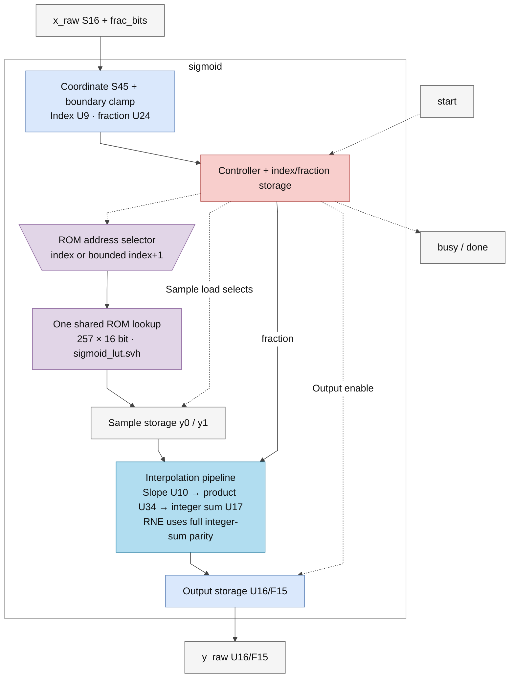
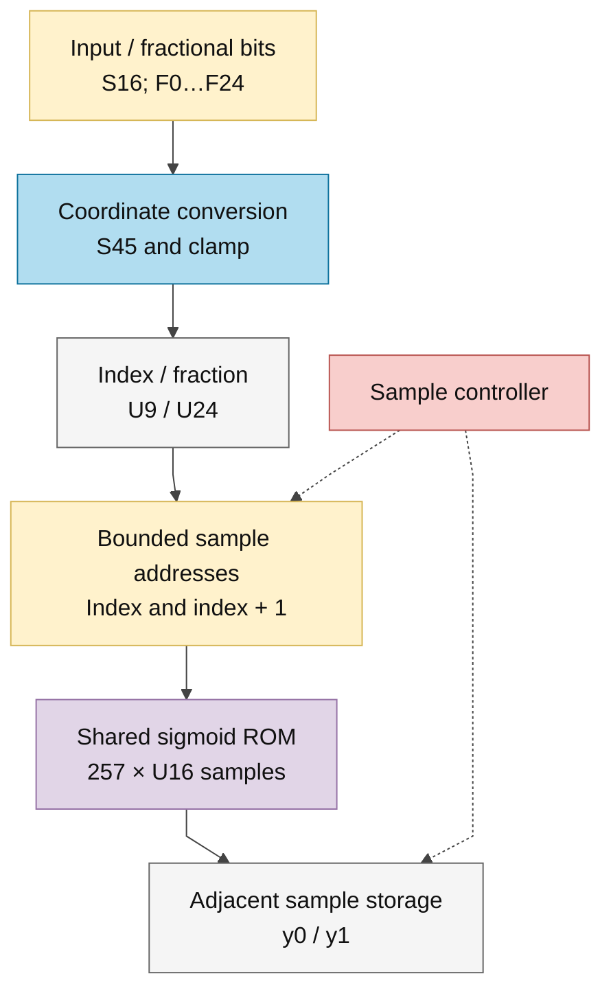
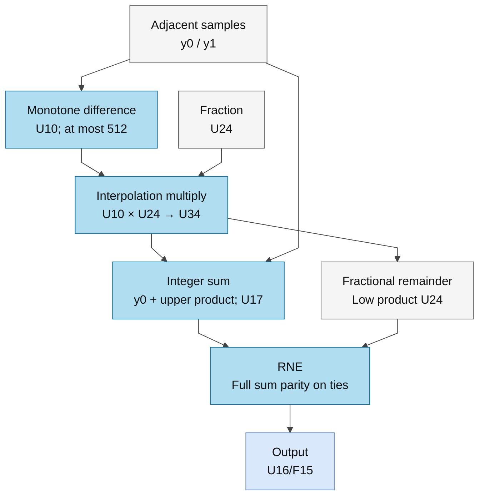

# sigmoid.sv — Sigmoid bằng ROM và nội suy

> **Category: GUIDE. Scope: CURRENT (may also have legacy callers).** RTL is authoritative; diagrams use the [shared visual style](../../diagrams/diagram_style.md).
[Tài liệu](../../README.md) → [Source guide](../README.md) → [Mục lục từng file](README.md)

**Trạng thái:** Đang dùng — gọi từ rowwise_op.

**Source:** [sigmoid.sv](<../../../Verilog%20Source%20code/sigmoid.sv>).

## At a glance

| Item | Description |
|---|---|
| Responsibility | Input là S16 với F_t=0…24, output gate U16/F15. LUT có 257 mẫu từ −8 đến +8, bước 1/16. Với điểm giữa hai mẫu, khối đọc lần lượt y0 và y1 rồi nội suy bằng fraction 24 bit. Bảng tính sẵn, nên runtime không cần exp. |

## Sơ đồ kiến trúc tổng quan

## Main flow

`IDLE → READ0 → READ1 → SLOPE → MULTIPLY → ADD → ROUND → IDLE`. Index/fraction chốt lúc start; thay x_raw sau đó không đổi kết quả. Product U34 được chốt sau slope U10, rồi chốt tổng nguyên U17 và remainder U24 trước RNE. Parity của toàn tổng giữ ties-to-even đúng. Payload không reset; control reset hủy giao dịch. Ngoài miền LUT dùng mẫu biên; constant case LUT dùng chung simulation/synthesis.

1. Input S16/F_t được đổi thành tọa độ `(16×x_real+0x80)` với 24 fractional bit; −8 ánh xạ index 0x000 và +8 ánh xạ 0x100.
2. Tọa độ ngoài bảng bị clamp. Index/fraction được chốt lúc start, nên thay input sau đó không ảnh hưởng giao dịch.
3. Một cổng ROM được dùng hai chu kỳ: READ0 lấy y0, READ1 lấy mẫu kế y1. Endpoint 0x100 dùng lại cùng mẫu.
4. SLOPE/MULTIPLY/ADD/ROUND chốt slope, product, tổng nguyên/remainder và RNE, trả U16/F15 với parity toàn tổng.
5. `sigmoid_lut.svh` là nguồn ROM duy nhất trong RTL. `sigmoid_257.mem` giữ cùng các giá trị để generator/test đối chiếu, không được load lúc chạy.

**Quy ước RTL.** Tọa độ S45 chứa đủ toàn miền S16/F_t=0…24 với offset 128×2^24; index U9 và fraction U24 giữ nguyên. LUT đơn điệu và chênh hai mẫu kề nhau tối đa 512, nên slope U10 và product U34 đủ, thay cho slope U16/product U40. Tích được zero-extend khi cộng y0<<24 rồi dùng hàm RNE trên toàn tổng; parity và output U16/F15 không đổi.

## Important state / datapath groups

Các đoạn dưới đây bao phủ nguyên văn toàn bộ source hiện tại, theo thứ tự dòng.

### [Dòng 1–34: Giao diện và ROM lookup dùng chung](<../../../Verilog%20Source%20code/sigmoid.sv#L1>)

**Cách hoạt động.** `sigmoid_sample` từ include chứa 257 hằng U16/F15. Selector chọn `index_q` ở READ0 và `index_q+1` ở READ1, trừ endpoint 0x100 dùng lại cùng mẫu. Một lookup tổ hợp dùng chung cho cả hai sample registers. Không cần parameter đường dẫn file hoặc initialize array.

**Tín hiệu chính.** `x_raw`, `frac_bits`, `index_q/index_next`, `fraction_q/fraction_next`, `rom_address/rom_data`, `y0/y1`, `busy/done/y_raw`.

### [Dòng 35–71: Tọa độ và nội suy RNE](<../../../Verilog%20Source%20code/sigmoid.sv#L35>)

**Cách hoạt động.** `grid=(x_raw×2^(28−F_t))+(0x80×2^24)` dùng S45 đưa input lên lưới LUT Q24. Logic clamp bảo đảm index 0…256; phần fraction là U24. `difference` U10 giữ slope lớn nhất 512; product U34 từ difference×fraction_q được zero-extend để cộng với y0×2^24, rồi RNE toàn tổng để xét đúng parity của y0 khi tie.

**Điểm cần đọc kỹ.** Host descriptor giới hạn F_t trong 0…24. Điểm ngoài miền ±8 dùng mẫu biên. Không làm tròn riêng phần delta vì có thể lệch một LSB.

#### Sơ đồ khối phần cứng của nhóm

### [Dòng 72–106: FSM lấy hai mẫu và chốt output](<../../../Verilog%20Source%20code/sigmoid.sv#L72>)

**Cách hoạt động.** IDLE chốt index/fraction; READ0/READ1 lấy samples; SLOPE/MULTIPLY/ADD chốt từng bước arithmetic. ROUND xuất U16/F15, hạ busy và phát done một clock. Sáu pha pipeline đã được thử reset/cancel/restart; toàn 1.638.400 input ở 25 format giữ kết quả reference. Payload dùng nonblocking assignment và không reset; control về IDLE khi reset.
