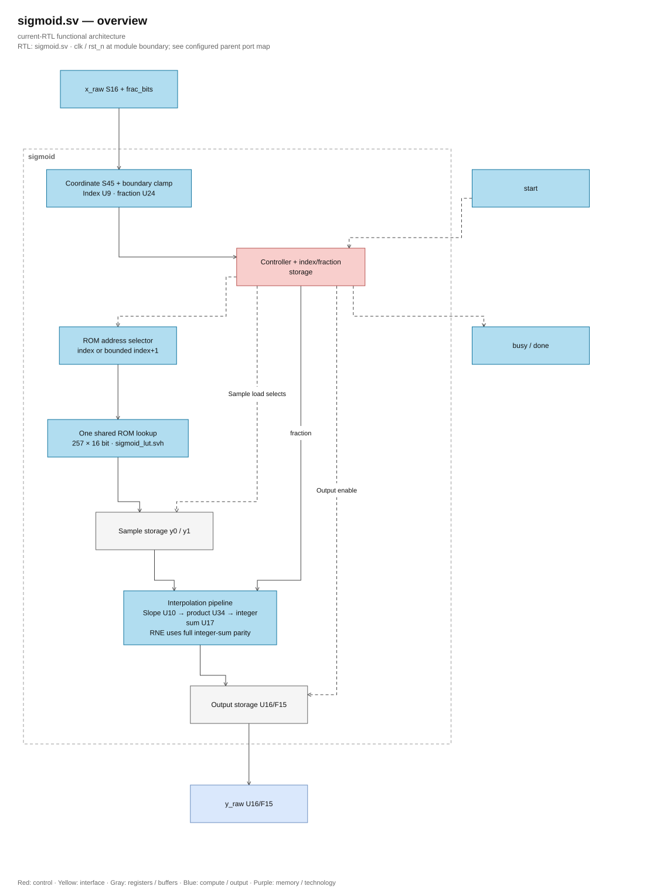
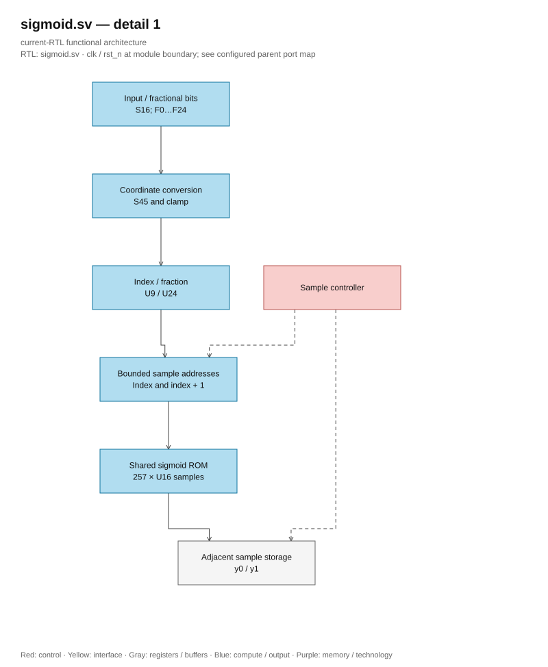
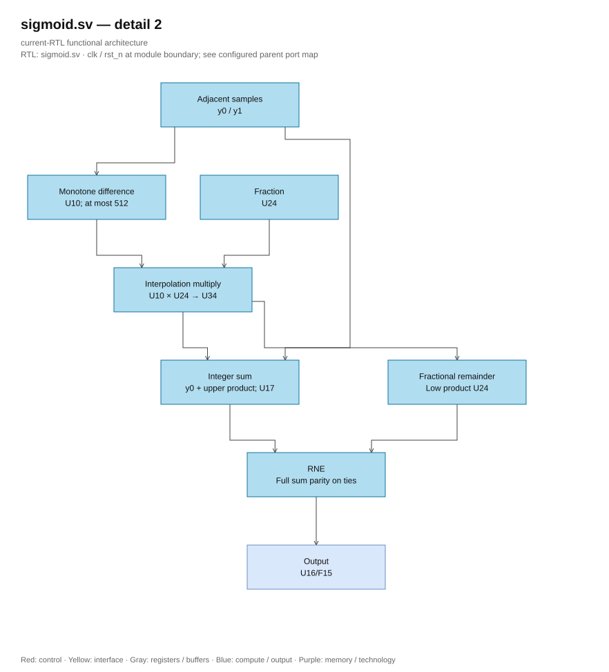

# sigmoid.sv — Sigmoid using ROM and interpolation

<!-- reading-navigation:start -->
[Documentation](../../README.md) → [02 · Architecture](../../02-architecture/README.md) → [Module catalog](README.md)

| Reading guide | Document |
|---|---|
| New to the subject | [NPU and RTL fundamentals](../../00-start-here/fundamentals.md) · [Glossary](../../00-start-here/glossary.md) |
| Read first | [Full RTL graph](../full_graph.md) |
| Related implementation | [sigmoid_lut.svh](sigmoid_lut.svh.md) |
<!-- reading-navigation:end -->

> **Category: GUIDE. Scope: CURRENT (may also have legacy callers).** RTL is authoritative; diagrams use the [shared visual style](../../diagrams/diagram_style.md).

**Status:** In use — called from rowwise_op.

**Source:** [sigmoid.sv](<../../../Verilog%20Source%20code/sigmoid.sv>).

## At a glance

| Item | Description |
|---|---|
| Responsibility | Input is S16 with F_t=0…24, output gate U16/F15. LUT has 257 samples from −8 to +8, step 1/16. At the midpoint between two samples, the block reads y0 and y1 sequentially and then interpolates using a 24-bit fraction. Precomputed table, so runtime does not require exp. |

## Overall Architecture Diagram

[Editable draw.io — sigmoid.sv — overview](../../diagrams/architecture.drawio) · Page `61_sigmoid.sv_1`.

## Main flow

`IDLE → READ0 → READ1 → SLOPE → MULTIPLY → ADD → ROUND → IDLE`. Index/fraction is fixed at start; changing x_raw afterward does not change the result. Product U34 is fixed after slope U10, then the total integer U17 and remainder U24 are fixed before RNE. Parity of the entire sum maintains ties-to-even correctly. Payload is not reset; control reset cancels the transaction. Outside the LUT domain, edge samples are used; constant case LUT is shared for both simulation and synthesis.

1. Input S16/F_t is converted to coordinate `(16×x_real+0x80)` with 24 fractional bits; −8 maps to index 0x000 and +8 maps to 0x100.
2. Coordinates outside the table are clamped. Index/fraction is fixed at start, so changing the input afterward does not affect the transaction.
3. One ROM port is used for two cycles: READ0 fetches y0, READ1 fetches the next sample y1. Endpoint 0x100 reuses the same sample.
4. SLOPE/MULTIPLY/ADD/ROUND fixes the slope, product, integer/sum remainder, and RNE, returning U16/F15 with overall sum parity.
5. `sigmoid_lut.svh` is the only ROM source in RTL. `sigmoid_257.mem` retains the same values for generator/test comparison, not to be loaded during runtime.

**RTL convention.** Coordinate S45 contains the entire S16/F_t=0…24 domain with an offset of 128×2^24; index U9 and fraction U24 remain unchanged. The LUT is monotonic and the difference between two adjacent samples is at most 512, so slope U10 and product U34 are sufficient, replacing slope U16/product U40. The product can be zero-extended when adding y0<<24 and then using the RNE function on the entire sum; parity and output U16/F15 remain unchanged.

## Important state / datapath groups

The sections below cover the entire current source verbatim, in line order.

### [Lines 1–34: Shared interface and ROM lookup](<../../../Verilog%20Source%20code/sigmoid.sv#L1>)

**How it works.** `sigmoid_sample` from include contains 257 constants U16/F15. Selector chooses `index_q` at READ0 and `index_q+1` at READ1, except endpoint 0x100 which reuses the same pattern. A combined lookup is shared for both sample registers. No need for file path parameter or array initialization.

**Main signals.** `x_raw`, `frac_bits`, `index_q/index_next`, `fraction_q/fraction_next`, `rom_address/rom_data`, `y0/y1`, `busy/done/y_raw`.

### [Lines 35–71: Coordinates and RNE interpolation](<../../../Verilog%20Source%20code/sigmoid.sv#L35>)

**How it works.** `grid=(x_raw×2^(28−F_t))+(0x80×2^24)` uses S45 to input into the LUT Q24 grid. Clamp logic ensures the index 0…256; the fraction part is U24. `difference` U10 keeps the maximum slope 512; the product U34 from difference×fraction_q is zero-extended to add with y0×2^24, then the total sum is rounded to nearest even (RNE) to correctly check the parity of y0 when tied.

**Points to read carefully.** Host descriptor limits F_t to 0…24. Points outside the ±8 domain use boundary samples. Do not separately round the delta part as it may shift by one LSB.

#### Hardware block diagram of the group

[Editable draw.io — sigmoid.sv — detail 1](../../diagrams/architecture.drawio) · Page `62_sigmoid.sv_2`.

[Editable draw.io — sigmoid.sv — detail 2](../../diagrams/architecture.drawio) · Page `63_sigmoid.sv_3`.

### [Lines 72–106: FSM takes two samples and latches output](<../../../Verilog%20Source%20code/sigmoid.sv#L72>)

**Operation.** IDLE latches index/fraction; READ0/READ1 takes samples; SLOPE/MULTIPLY/ADD latches each arithmetic step. ROUND outputs U16/F15, lowers busy and triggers done in one clock. Six-stage pipeline has been tested for reset/cancel/restart; all 1,638,400 inputs in 25 format keep reference result. Payload uses nonblocking assignment and no reset; control returns to IDLE on reset.
