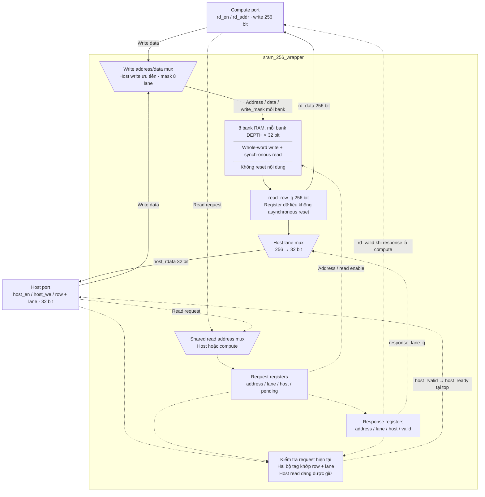
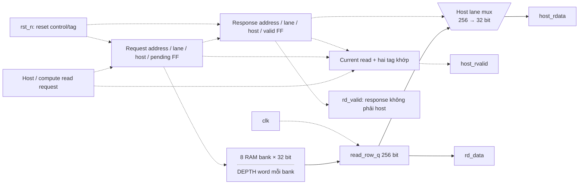

# sram_256_wrapper.sv — SRAM đồng bộ với mask 32 bit

[Tài liệu](../../README.md) → [Hierarchy RTL](../README.md) → [Mục lục từng file](README.md)

**Trạng thái:** Đang dùng — chung cho parameter và workspace.

**Source:** [sram_256_wrapper.sv](<../../../Verilog%20Source%20code/sram_256_wrapper.sv>). **Số dòng:** 104. **SHA-256:** `80d77f1ad41fda47969ca686807db5f069b81667b4fc5f613ff476264da8d10b`.

## Khối này làm gì?

Compute đọc/ghi word 256 bit; host đọc/ghi một lane 32 bit. `ADDR_W=8` tạo workspace 8 KiB, `ADDR_W=10` tạo parameter 32 KiB. Tám bank 32 bit dùng cùng địa chỉ đọc đồng bộ và write-enable riêng theo mask. RTL có một implementation cho simulation và synthesis, không có define hoặc thuộc tính của hãng FPGA. Đây là model bộ nhớ để thay bằng adapter SRAM của PDK theo cùng interface.

## Sơ đồ kiến trúc tổng quan



Nét liền biểu diễn dữ liệu; nét đứt biểu diễn địa chỉ, enable và valid. Hộp RAM mô tả storage logic, không quy định SRAM macro hoặc block RAM vật lý. Reset chỉ xóa control/tag; dữ liệu chỉ được dùng khi valid.

## Cách hoạt động chi tiết

1. Top bảo đảm host và compute không truy cập đồng thời. Host write chọn một lane 32 bit; compute write chọn cả tám lane.
2. Cạnh lên đầu tiên chốt read request, địa chỉ, client và lane. Cạnh lên tiếp theo đọc word vào `read_row_q` và chuyển tag/valid sang response. Hai client dùng cùng hợp đồng hai cạnh lên.
3. Compute tiêu thụ word 256 bit khi `rd_valid=1`. Host giữ `host_en=1`, `host_we=0` và địa chỉ đến khi `host_rvalid=1`, rồi top acknowledge qua `host_ready`.
4. Host valid yêu cầu current request, request tag và response tag cùng row/lane và client. Đổi địa chỉ, write hoặc idle làm response cũ mất hiệu lực; đọc lại cùng địa chỉ sau write vẫn phải chờ.
5. RAM và register dữ liệu đọc không asynchronous reset và không có vòng initialize. Reset chỉ xóa tag/control. Host phải nạp dữ liệu trước khi đọc; dữ liệu khi valid=0 không được sử dụng.
6. Khi thay storage bằng SRAM macro, adapter phải giữ mask 32 bit, hợp đồng read/valid, arbitration và reset control. Chính sách read/write cùng địa chỉ phải được xử lý nếu hệ thống mới cho phép overlap; top hiện tại dùng các pha đọc và ghi riêng.

## Các nhóm logic trong source

Các đoạn dưới đây bao phủ nguyên văn toàn bộ source hiện tại, theo thứ tự dòng.

### [Dòng 1–25: Giao diện và cổng ghi nội bộ](<../../../Verilog%20Source%20code/sram_256_wrapper.sv#L1>)

<!-- source-range:1:25 -->
```systemverilog
// Generic synchronous memory boundary for replacement by a foundry SRAM adapter.
// Host and compute reads share the same two-cycle request/response contract.
module sram_256_wrapper #(
    parameter int ADDR_W = 8
) (
    input logic clk,
    input logic rst_n,
    input logic rd_en,
    input logic [ADDR_W - 1 : 0] rd_addr,
    output logic [255:0] rd_data,
    output logic rd_valid,
    input logic wr_en,
    input logic [ADDR_W - 1 : 0] wr_addr,
    input logic [255:0] wr_data,
    input logic host_en,
    input logic host_we,
    input logic [ADDR_W + 2 : 0] host_addr,
    input logic [31:0] host_wdata,
    output logic [31:0] host_rdata,
    output logic host_rvalid
);
    localparam int DEPTH = 1 << ADDR_W;
    logic [ADDR_W - 1 : 0] write_address;
    logic [255:0] write_data;
    logic [7:0] write_mask;
```

**Mục đích.** Công bố hai client và kích thước word; address host là chỉ số word 32 bit, gồm row và ba bit lane.

**Tín hiệu chính.** `ADDR_W`, `DEPTH`, `rd_en/rd_addr/rd_data/rd_valid`, `wr_en/wr_addr/wr_data`, `host_en/host_we/host_addr/host_wdata/host_rdata/host_rvalid`. Ba tín hiệu `write_address`, `write_data`, `write_mask` nối write mux với các bank.

### [Dòng 26–39: Mux địa chỉ và mask ghi](<../../../Verilog%20Source%20code/sram_256_wrapper.sv#L26>)

<!-- source-range:26:39 -->
```systemverilog


    // One masked write port. Top-level arbitration makes the clients exclusive.
    always_comb begin
        write_address = wr_addr;
        write_data = wr_data;
        write_mask = {8{wr_en}};
        if (host_en && host_we) begin
            write_address = host_addr[ADDR_W + 2 : 3];
            write_data = {8{host_wdata}};
            write_mask = 8'b1 << host_addr[2:0];
        end
    end

```

**Cách hoạt động.** Default chọn compute write, mask là tám bản sao `wr_en`. Host write chọn row từ `host_addr[ADDR_W+2:3]`, lặp dữ liệu 32 bit sang tám lane và bật một bit mask từ `host_addr[2:0]`. Mỗi bank chỉ nhận dữ liệu khi bit mask tương ứng bằng 1. Các default được gán đầy đủ trong `always_comb`, không tạo latch.

### [Dòng 40–57: Dữ liệu đọc và kiểm tra response](<../../../Verilog%20Source%20code/sram_256_wrapper.sv#L40>)

<!-- source-range:40:57 -->
```systemverilog

    // Top-level arbitration makes host and compute accesses exclusive.
    // One synchronous read port serves both clients with tagged responses.
    logic read_pending_q, read_host_q, response_host_q, read_valid_q;
    logic [ADDR_W - 1 : 0] shared_read_address_q;
    logic [ADDR_W - 1 : 0] response_address_q;
    logic [2:0] read_lane_q, response_lane_q;
    logic [255:0] read_row_q;

    assign rd_data = read_row_q;
    assign rd_valid = read_valid_q && !response_host_q;
    assign host_rdata = read_row_q[response_lane_q * 32 +: 32];
    // Both pipeline stages must belong to the current held request. A write
    // or idle cycle invalidates an earlier response, including the same address.
    assign host_rvalid = host_en && !host_we && read_valid_q && response_host_q &&
        read_pending_q && read_host_q &&
        {shared_read_address_q, read_lane_q} == host_addr &&
        {response_address_q, response_lane_q} == host_addr;
```

**Cách hoạt động.** `read_row_q` lái compute data; response lane chọn host data 32 bit. Compute valid chọn response không phải host. Host valid còn kiểm tra enable/read hiện tại và cả hai bộ tag cùng row/lane, ngăn nhận data cũ sau một request khác.

**Tín hiệu chính.** `read_pending_q/read_host_q`, `shared_read_address_q/read_lane_q`, `read_valid_q/response_host_q`, `response_address_q/response_lane_q`, `read_row_q`.

### [Dòng 58–74: Tám bank đọc đồng bộ và ghi nguyên word](<../../../Verilog%20Source%20code/sram_256_wrapper.sv#L58>)

<!-- source-range:58:74 -->
```systemverilog

    // Eight independent 32-bit banks implement the lane mask with a write
    // enable per bank. Each bank has one whole-word write and synchronous read.
    // Neither the memory nor its output register has an asynchronous reset.
    genvar lane;
    generate
    for (lane = 0; lane < 8; lane = lane + 1) begin : g_ram_lane
        logic [31:0] memory [0 : DEPTH - 1];
        always_ff @(posedge clk) begin
            if (rst_n && write_mask[lane])
                memory[write_address] <= write_data[lane * 32 +: 32];
            if (read_pending_q)
                read_row_q[lane * 32 +: 32] <= memory[shared_read_address_q];
        end
    end
    endgenerate

```

**Cách hoạt động.** `generate` tạo tám bank độc lập khi elaboration; index lane là hằng. Mỗi bank ghi toàn word 32 bit với enable riêng và chốt một slice của `read_row_q` từ địa chỉ đọc chung. RAM và read data register chỉ dùng `posedge clk`, giúp storage có thể ánh xạ bằng flow synthesis tương ứng.

**Điểm cần đọc kỹ.** `rst_n` chỉ gate write trong memory process. Nó không xóa memory hoặc data output; reset control phía dưới loại bỏ valid cũ.

### [Dòng 75–104: Request, response tag và reset control](<../../../Verilog%20Source%20code/sram_256_wrapper.sv#L75>)

<!-- source-range:75:104 -->
```systemverilog
    always_ff @(posedge clk or negedge rst_n) begin
        if (!rst_n) begin
            read_pending_q <= 1'b0;
            read_host_q <= 1'b0;
            response_host_q <= 1'b0;
            read_valid_q <= 1'b0;
            shared_read_address_q <= '0;
            response_address_q <= '0;
            read_lane_q <= '0;
            response_lane_q <= '0;
        end else begin
            read_valid_q <= read_pending_q;
            response_host_q <= read_host_q;
            response_lane_q <= read_lane_q;
            response_address_q <= shared_read_address_q;

            read_pending_q <= rd_en || (host_en && !host_we);
            if (host_en && !host_we) begin
                shared_read_address_q <= host_addr[ADDR_W + 2 : 3];
                read_host_q <= 1'b1;
                read_lane_q <= host_addr[2:0];
            end else if (rd_en) begin
                shared_read_address_q <= rd_addr;
                read_host_q <= 1'b0;
                read_lane_q <= '0;
            end
        end
    end

endmodule
```

**Cách hoạt động.** Reset xóa pending/valid và tag. Mỗi cạnh chuyển request tag sang response, đồng thời chốt request host read hoặc compute read mới. Khi không có read, pending về zero. Host có ưu tiên trong mux nhưng caller phải bảo đảm arbitration theo hợp đồng; ưu tiên này không hỗ trợ hai giao dịch đồng thời.

#### Sơ đồ khối phần cứng của nhóm



`read_row_q` chỉ có clock và capture enable. Tag/valid bảo đảm client không tiêu thụ dữ liệu chưa hợp lệ.

