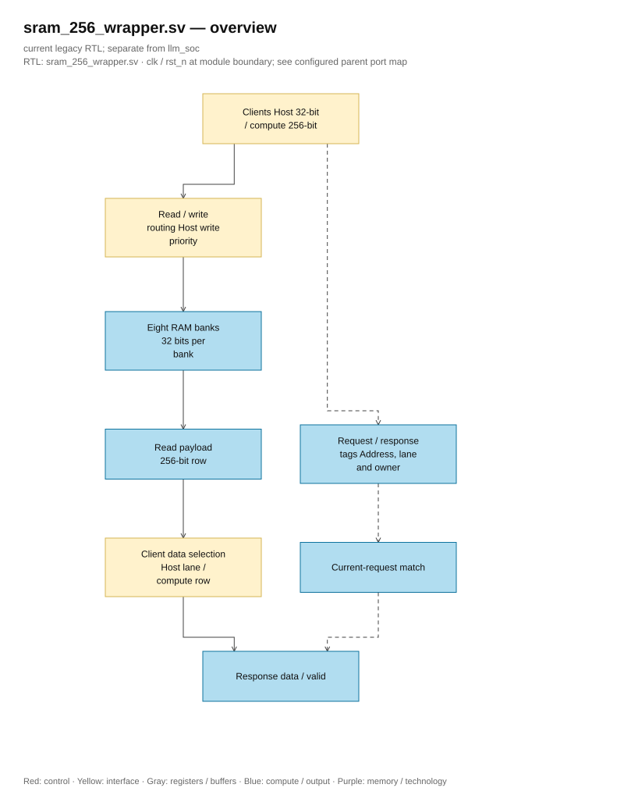
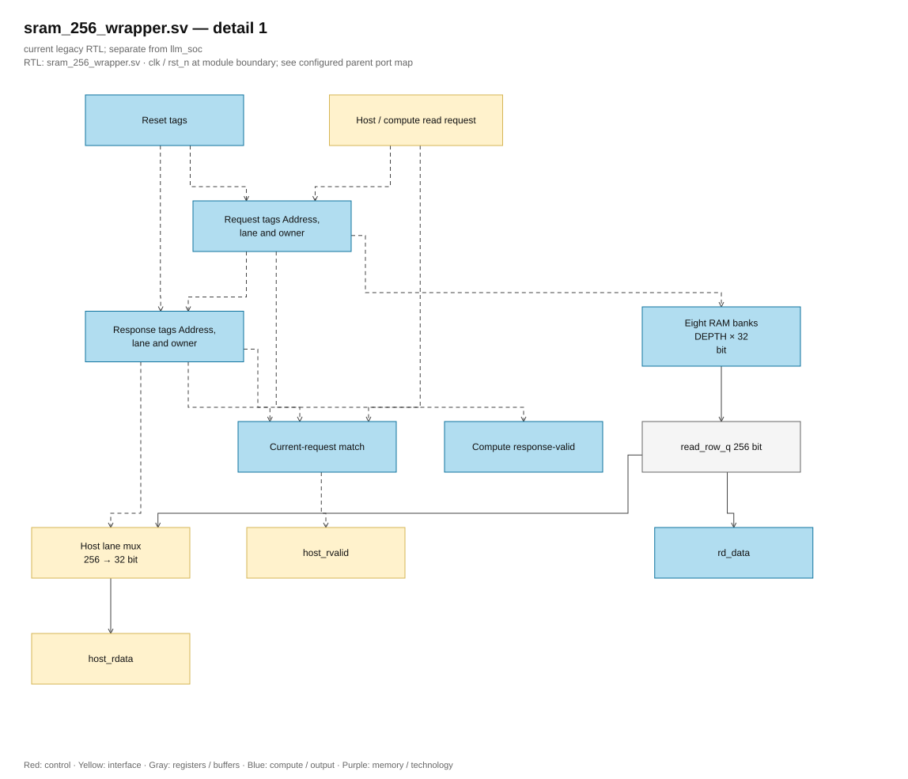

# sram_256_wrapper.sv — SRAM đồng bộ với mask 32 bit

> **Category: GUIDE. Scope: LEGACY.** RTL is authoritative; diagrams use the [shared visual style](../../diagrams/diagram_style.md).
[Tài liệu](../../README.md) → [Hierarchy RTL](<../legacy/README.md>) → [Mục lục từng file](README.md)

**Trạng thái:** Đang dùng — chung cho parameter và workspace.

**Source:** [sram_256_wrapper.sv](<../../../Verilog%20Source%20code/sram_256_wrapper.sv>).

## At a glance

| Item | Description |
|---|---|
| Responsibility | Compute đọc/ghi word 256 bit; host đọc/ghi một lane 32 bit. `ADDR_W=8` tạo workspace 8 KiB, `ADDR_W=10` tạo parameter 32 KiB; `llm_soc` dùng `ADDR_W=15, DEPTH=24576` cho 768 KiB. Tám bank 32 bit dùng cùng địa chỉ đọc đồng bộ và write-enable riêng theo mask; mỗi bank chia thành tile tối đa 1024 word trong [banked_word_ram](banked_word_ram.sv.md). RTL có một implementation cho simulation và synthesis, không có define hoặc thuộc tính của hãng FPGA. Leaf tile là ranh giới để thay bằng Quartus IP hoặc ASIC SRAM adapter. |

## Sơ đồ kiến trúc tổng quan

[Editable draw.io — sram_256_wrapper.sv — overview](../../diagrams/architecture.drawio) · Page `64_sram_256_wrapper.sv_1`.

Nét liền biểu diễn dữ liệu; nét đứt biểu diễn địa chỉ, enable và valid. Hộp RAM mô tả storage logic, không quy định SRAM macro hoặc block RAM vật lý. Reset chỉ xóa control/tag; dữ liệu chỉ được dùng khi valid.

## Main flow

1. Top bảo đảm host và compute không truy cập đồng thời. Host write chọn một lane 32 bit; compute write chọn cả tám lane.
2. Cạnh lên đầu tiên chốt read request, địa chỉ, client và lane. Cạnh lên tiếp theo đọc word vào `read_row_q` và chuyển tag/valid sang response. Hai client dùng cùng hợp đồng hai cạnh lên.
3. Compute tiêu thụ word 256 bit khi `rd_valid=1`. Cổng host của adapter giữ `host_en=1`, `host_we=0` và địa chỉ đến `host_rvalid=1`. Frontend top chốt request và response, nên host ngoài nhận `host_ready` sau bốn cạnh lên; latency adapter vẫn hai cạnh.
4. Host valid yêu cầu current request, request tag và response tag cùng row/lane và client. Đổi địa chỉ, write hoặc idle làm response cũ mất hiệu lực; đọc lại cùng địa chỉ sau write vẫn phải chờ.
5. RAM và register dữ liệu đọc không asynchronous reset và không có vòng initialize. Reset chỉ xóa tag/control. Host phải nạp dữ liệu trước khi đọc; dữ liệu khi valid=0 không được sử dụng.
6. Khi thay storage bằng SRAM macro, adapter phải giữ mask 32 bit, hợp đồng read/valid, arbitration và reset control. Leaf read/write cùng địa chỉ tại một cạnh trả old-data. Read request của wrapper chốt ở cạnh trước leaf read: collision được định nghĩa tại cạnh thực sự đọc leaf, không tại cạnh nhận wrapper request. Unit test xác minh tile boundaries và collision; nội dung không reset.

## Important state / datapath groups

Các đoạn dưới đây bao phủ nguyên văn toàn bộ source hiện tại, theo thứ tự dòng.

### [Dòng 1–25: Giao diện và cổng ghi nội bộ](<../../../Verilog%20Source%20code/sram_256_wrapper.sv#L1>)

**Mục đích.** Công bố hai client và kích thước word; address host là chỉ số word 32 bit, gồm row và ba bit lane.

**Tín hiệu chính.** `ADDR_W`, `DEPTH`, `rd_en/rd_addr/rd_data/rd_valid`, `wr_en/wr_addr/wr_data`, `host_en/host_we/host_addr/host_wdata/host_rdata/host_rvalid`. Ba tín hiệu `write_address`, `write_data`, `write_mask` nối write mux với các bank.

### [Dòng 26–41: Mux địa chỉ và mask ghi](<../../../Verilog%20Source%20code/sram_256_wrapper.sv#L26>)

**Cách hoạt động.** Default chọn compute write, mask là tám bản sao `wr_en`. Host write chọn row từ `host_addr[ADDR_W+2:3]`, lặp dữ liệu 32 bit sang tám lane và bật một bit mask từ `host_addr[2:0]`. Mỗi bank chỉ nhận dữ liệu khi bit mask tương ứng bằng 1. Các default được gán đầy đủ trong `always_comb`, không tạo latch.

### [Dòng 42–60: Dữ liệu đọc và kiểm tra response](<../../../Verilog%20Source%20code/sram_256_wrapper.sv#L42>)

**Cách hoạt động.** `read_row_q` lái compute data; response lane chọn host data 32 bit. Compute valid chọn response không phải host. Host valid còn kiểm tra enable/read hiện tại và cả hai bộ tag cùng row/lane, ngăn nhận data cũ sau một request khác.

**Tín hiệu chính.** `read_pending_q/read_host_q`, `shared_read_address_q/read_lane_q`, `read_valid_q/response_host_q`, `response_address_q/response_lane_q`, `read_row_q`.

### [Dòng 61–75: Tám bank đọc đồng bộ và ghi nguyên word](<../../../Verilog%20Source%20code/sram_256_wrapper.sv#L61>)

**Cách hoạt động.** `generate` tạo tám bank độc lập khi elaboration; index lane là hằng. Mỗi bank ghi toàn word 32 bit với enable riêng và chốt một slice của `read_row_q` từ địa chỉ đọc chung. RAM và read data register chỉ dùng `posedge clk`, giúp storage có thể ánh xạ bằng flow synthesis tương ứng.

**Điểm cần đọc kỹ.** `rst_n` chỉ gate write trong memory process. Nó không xóa memory hoặc data output; reset control phía dưới loại bỏ valid cũ.

### [Dòng 76–101: Request, response tag và reset control](<../../../Verilog%20Source%20code/sram_256_wrapper.sv#L76>)

**Cách hoạt động.** Reset xóa pending/valid và tag. Mỗi cạnh chuyển request tag sang response, đồng thời chốt request host read hoặc compute read mới. Khi không có read, pending về zero. Host có ưu tiên trong mux nhưng caller phải bảo đảm arbitration theo hợp đồng; ưu tiên này không hỗ trợ hai giao dịch đồng thời.

#### Sơ đồ khối phần cứng của nhóm

[Editable draw.io — sram_256_wrapper.sv — detail 1](../../diagrams/architecture.drawio) · Page `65_sram_256_wrapper.sv_2`.

`read_row_q` chỉ có clock và capture enable. Tag/valid bảo đảm client không tiêu thụ dữ liệu chưa hợp lệ.
