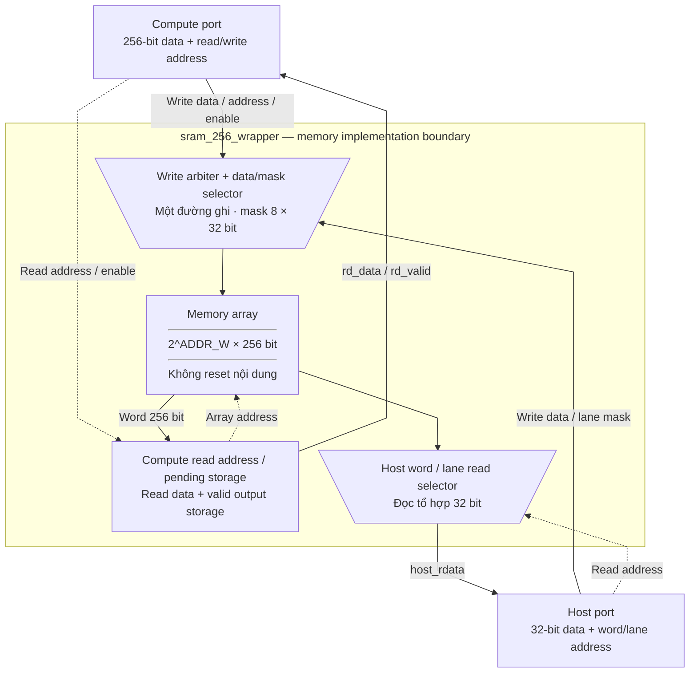
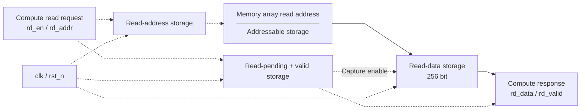

# sram_256_wrapper.sv — Ranh giới giữa RTL và SRAM macro

[Về mục lục](README.md) · [Về tổng quan](../README.md)

**Trạng thái:** Đang dùng — chung cho hai SRAM.

**Source:** [sram_256_wrapper.sv](<../../../Verilog%20Source%20code/sram_256_wrapper.sv>). **Số dòng:** 80. **SHA-256:** `5d732588e5b4e775127a8346cbb9c5302413c156060f4d5ff99a81da16758acd`.

## Khối này làm gì?

Mảng memory có word 256 bit và depth=2^ADDR_W. Host thao tác một lane 32 bit, compute thao tác cả word. Đây là behavioral model có ranh giới rõ để thay bằng adapter macro; chưa chứng minh ánh xạ vào SRAM macro cụ thể.

## Sơ đồ kiến trúc tổng quan



MUX dùng hình thang rộng ở phía nhiều ngõ vào và thu hẹp về ngõ ra; decoder/demux dùng hình thang ngược lại, mở rộng về phía nhiều ngõ ra. Hình chữ nhật có các vạch ngang biểu diễn bộ nhớ hoặc bank descriptor. Các hình chữ nhật thường là datapath, thanh ghi đơn hoặc giao diện. Nét liền là đường dữ liệu, nét đứt là điều khiển/cấu hình. Mũi tên hồi tiếp biểu diễn kết nối phần cứng. Sơ đồ không biểu diễn thứ tự chu kỳ, trạng thái FSM hoặc các tầng pipeline CPU.

## Cách hoạt động chi tiết

Một mux tạo write_address/data/mask. Host write có ưu tiên trong mux, nhưng top phải bảo đảm host và compute không đồng thời truy cập. SRAM data không reset; chỉ read-control và read-output reset. Tại cạnh nhận rd_en, chốt địa chỉ; cạnh kế tiếp khi read_pending_q=1, xuất data/valid. Consumer synchronous thấy kết quả ở cạnh lấy mẫu tiếp theo. Host read là combinational và cần bridge khi thay macro synchronous.

1. Compute đọc/ghi word 256 bit. Host dùng địa chỉ word 32 bit; ba bit thấp chọn lane và các bit cao chọn word.
2. Write mux ưu tiên host khi host write. Host data được nhân bản tám lane nhưng mask one-hot chỉ cập nhật lane được chọn.
3. Mảng memory không reset hoặc initialize. Reset chỉ xóa control read/output; host phải nạp dữ liệu cần thiết.
4. Compute read là request/response: chốt address và pending, sau đó trả data cùng `rd_valid`. Consumer phải chờ valid.
5. Host read hiện là tổ hợp; SRAM macro đồng bộ cần bridge. Assertion simulation bắt truy cập host và compute chồng nhau.

## Các nhóm logic trong source

Source được chia theo chức năng. Mỗi nhóm giữ nguyên phạm vi dòng để đối chiếu, nhưng phần giải thích tập trung vào quan hệ giữa các câu lệnh thay vì lặp lại từng dấu ngoặc, khai báo hoặc phép gán.


### [Dòng 1–28: Giao diện và memory](<../../../Verilog%20Source%20code/sram_256_wrapper.sv#L1>)

<!-- source-range:1:28 -->
```systemverilog
// Behavioral memory boundary for replacement by a foundry SRAM adapter.
// Compute reads retain the existing two-cycle request/response contract.
// Host reads are asynchronous in this model; a synchronous macro needs a host bridge.
module sram_256_wrapper #(
    parameter int ADDR_W = 8
) (
    input logic clk,
    input logic rst_n,
    input logic rd_en,
    input logic [ADDR_W - 1 : 0] rd_addr,
    output logic [255:0] rd_data,
    output logic rd_valid,
    input logic wr_en,
    input logic [ADDR_W - 1 : 0] wr_addr,
    input logic [255:0] wr_data,
    input logic host_en,
    input logic host_we,
    input logic [ADDR_W + 2 : 0] host_addr,
    input logic [31:0] host_wdata,
    output logic [31:0] host_rdata
);
    localparam int DEPTH = 1 << ADDR_W;
    logic [255:0] memory [0 : DEPTH - 1];
    logic [ADDR_W - 1 : 0] read_address_q;
    logic read_pending_q;
    logic [ADDR_W - 1 : 0] write_address;
    logic [255:0] write_data;
    logic [7:0] write_mask;
```

**Mục đích.** ADDR_W=8 cho workspace, =10 cho parameter. Host address ở đây là chỉ số word 32, không còn là byte address.

**Cách phần code hoạt động.** Nhóm này định nghĩa giao diện, độ rộng, kiểu hoặc tín hiệu trung gian. Nó tạo cấu trúc để các nhóm xử lý sau sử dụng, chưa tự biểu diễn một bước runtime riêng.

**Tín hiệu và dữ liệu chính.** `rd_en`: request đọc của compute; `rd_addr`: địa chỉ word cần đọc; `rd_data`: word dữ liệu đọc ra; `rd_valid`: response đọc hợp lệ; `wr_en`: cho phép ghi compute; `wr_addr`: địa chỉ word cần ghi; và 12 tín hiệu phụ khác trong đoạn code.


### [Dòng 29–42: Host read và write mux](<../../../Verilog%20Source%20code/sram_256_wrapper.sv#L29>)

<!-- source-range:29:42 -->
```systemverilog

    assign host_rdata = memory[host_addr[ADDR_W + 2 : 3]][host_addr[2:0] * 32 +: 32];

    // One masked write port. Top-level arbitration makes the clients exclusive.
    always_comb begin
        write_address = wr_addr;
        write_data = wr_data;
        write_mask = {8{wr_en}};
        if (host_en && host_we) begin
            write_address = host_addr[ADDR_W + 2 : 3];
            write_data = {8{host_wdata}};
            write_mask = 8'b1 << host_addr[2:0];
        end
    end
```

**Mục đích.** Ba bit thấp host_addr chọn một trong tám lane 32; các bit cao chọn word 256.

**Cách phần code hoạt động.** Có logic tổ hợp: output/intermediate được tính từ input hiện tại; các giá trị mặc định đầu khối giúp tránh suy ra latch. Có continuous assignment: biểu thức luôn lái tín hiệu đích, không cần start hoặc cạnh clock.

**Tín hiệu và dữ liệu chính.** `host_rdata`: data 32 trả về host; `memory`: array dữ liệu SRAM word 256; `host_addr`: địa chỉ phía host; `write_address`: địa chỉ ghi sau arbitration; `wr_addr`: địa chỉ word cần ghi; `write_data`: data 256 sau arbitration; và 6 tín hiệu phụ khác trong đoạn code.


### [Dòng 43–53: Ghi memory](<../../../Verilog%20Source%20code/sram_256_wrapper.sv#L43>)

<!-- source-range:43:53 -->
```systemverilog

    // Memory data has no asynchronous reset, clear loop or initialization.
    always_ff @(posedge clk) begin
        if (rst_n) begin
            for (int lane = 0; lane < 8; lane ++ ) begin
                if (write_mask[lane]) begin
                    memory[write_address][lane * 32 +: 32] <= write_data[lane * 32 +: 32];
                end
            end
        end
    end
```

**Mục đích.** Không có reset loop trên array. Mask8 cho phép chỉ cập nhật lane host yêu cầu.

**Cách phần code hoạt động.** Có logic tuần tự: register/FSM chỉ cập nhật tại cạnh clock; nonblocking assignment đọc giá trị cũ ở vế phải rồi chốt đồng thời.

**Tín hiệu và dữ liệu chính.** `lane`: vị trí phần tử trong word; `write_mask`: mask 8 chọn lane 32 cần ghi; `memory`: array dữ liệu SRAM word 256; `write_address`: địa chỉ ghi sau arbitration; `write_data`: data 256 sau arbitration.


### [Dòng 54–71: Compute read](<../../../Verilog%20Source%20code/sram_256_wrapper.sv#L54>)

<!-- source-range:54:71 -->
```systemverilog

    always_ff @(posedge clk or negedge rst_n) begin
        if (!rst_n) begin
            rd_valid <= 1'b0;
            read_pending_q <= 1'b0;
            read_address_q <= '0;
            rd_data <= '0;
        end else begin
            rd_valid <= read_pending_q;
            read_pending_q <= rd_en;
            if (rd_en) begin
                read_address_q <= rd_addr;
            end
            if (read_pending_q) begin
                rd_data <= memory[read_address_q];
            end
        end
    end
```

**Mục đích.** Pipeline request/response dựa trên read_pending_q và read_address_q; đọc không phụ thuộc giá trị rd_addr mới khi trả kết quả cũ.

**Cách phần code hoạt động.** Có logic tuần tự: register/FSM chỉ cập nhật tại cạnh clock; nonblocking assignment đọc giá trị cũ ở vế phải rồi chốt đồng thời.

**Tín hiệu và dữ liệu chính.** `rd_valid`: response đọc hợp lệ; `read_pending_q`: có request đọc đang chờ response; `read_address_q`: địa chỉ SRAM đã chốt; `rd_data`: word dữ liệu đọc ra; `rd_en`: request đọc của compute; `rd_addr`: địa chỉ word cần đọc; và 1 tín hiệu phụ khác trong đoạn code.

**Điểm cần đọc kỹ.** Tên gọi “hai chu kỳ” trong tài liệu là hợp đồng request/response nhìn từ client đồng bộ: request được chốt trước, sau đó data/valid mới được quan sát ở response. Không được dùng `rd_data` ngay tại chu kỳ phát `rd_en`.

#### Sơ đồ khối phần cứng của nhóm




### [Dòng 72–80: Assertion simulation](<../../../Verilog%20Source%20code/sram_256_wrapper.sv#L72>)

<!-- source-range:72:80 -->
```systemverilog

`ifndef SYNTHESIS
    always @(posedge clk) begin
        if (rst_n && host_en && (rd_en || wr_en || read_pending_q)) begin
            $error("Host and compute memory transactions must not overlap");
        end
    end
`endif
endmodule
```

**Mục đích.** Báo lỗi nếu host chồng giao dịch compute, kể cả read đang pending. Assertion không tạo phần cứng trong SYNTHESIS.

**Cách phần code hoạt động.** Có logic tuần tự: register/FSM chỉ cập nhật tại cạnh clock; nonblocking assignment đọc giá trị cũ ở vế phải rồi chốt đồng thời.

**Tín hiệu và dữ liệu chính.** `host_en`: host đang yêu cầu truy cập; `rd_en`: request đọc của compute; `wr_en`: cho phép ghi compute; `read_pending_q`: có request đọc đang chờ response; `error`: cờ lỗi của lượt chạy; `memory`: array dữ liệu SRAM word 256.

