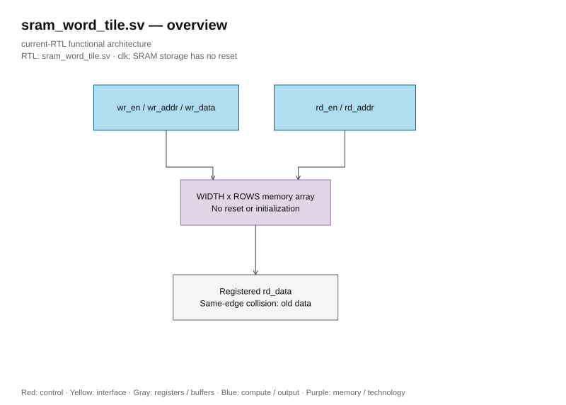

# sram_word_tile.sv

<!-- reading-navigation:start -->
[Documentation](../../README.md) → [02 · Architecture](../../02-architecture/README.md) → [Module catalog](README.md)

| Reading guide | Document |
|---|---|
| New to the subject | [NPU and RTL fundamentals](../../00-start-here/fundamentals.md) · [Glossary](../../00-start-here/glossary.md) |
| Learn the RTL syntax | [How to read the SystemVerilog](../../00-start-here/reading-systemverilog.md) |
| Read first | [Full RTL graph](../full_graph.md) |
| Related implementation | [quartus_word_ram.sv](quartus_word_ram.sv.md) |
<!-- reading-navigation:end -->

> **Category: GUIDE. Scope: CURRENT (may also have legacy callers).** RTL is authoritative; diagrams use the [shared visual style](../../diagrams/diagram_style.md).

**Source:** [sram_word_tile.sv](<../../../Verilog%20Source%20code/sram_word_tile.sv>).

## At a glance

| Item | Description |
|---|---|
| Responsibility | Replaceable portable SRAM behavior leaf with one synchronous read and one write. Nonblocking assignments preserve old data for same-edge same-address read/write. Storage and read payload have no reset or initialization. |

Optional `SYNTH_RAM_BLACKBOX` excludes only the leaf storage/read process, leaving
an empty parameterized module that Genus preserves as a black box. Ports and
dimensions remain intact; enclosing RAM wrappers retain their pipeline/control
RTL. Xcelium receives no such define and uses the original functional model.
The placeholder requires an SRAM implementation with the same synchronous read,
output hold and OLD_DATA collision contract; its area and timing are unmodeled
without SRAM libraries. The diagram below describes the functional model.

## Architecture diagram

[Editable draw.io — sram_word_tile.sv — overview](../../diagrams/architecture.drawio) · Page `66_sram_word_tile.sv_1`.
