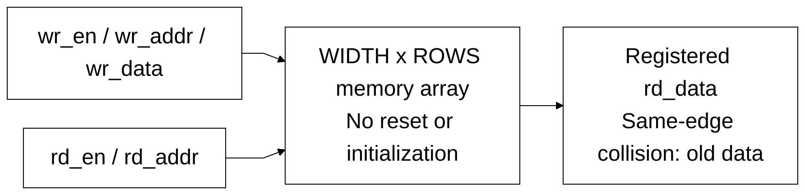

# sram_word_tile.sv

[Documentation](../../README.md) → [Source guide](../full_graph.md) → [RTL index](README.md)

**Source:** [sram_word_tile.sv](<../../../Verilog%20Source%20code/sram_word_tile.sv>). **Số dòng:** 15. **SHA-256:** `fca521ff4a1c9458f1731025684d0db81a6842caf06f1762d84b51a7b1bd176c`.

## Khối này làm gì?

Replaceable portable SRAM behavior leaf with one synchronous read and one write. Nonblocking assignments preserve old data for same-edge same-address read/write. Storage and read payload have no reset or initialization.

## Sơ đồ kiến trúc



## Cách hoạt động chi tiết

Replaceable portable SRAM behavior leaf with one synchronous read and one write. Nonblocking assignments preserve old data for same-edge same-address read/write. Storage and read payload have no reset or initialization.

## Các nhóm logic trong source

### [Dòng 1–9: Replaceable memory interface](<../../../Verilog%20Source%20code/sram_word_tile.sv#L1>)

<!-- source-range:1:9 -->
```systemverilog
module sram_word_tile #(
    parameter int WIDTH = 32,
    parameter int ROWS = 1024
) (
    input logic clk, rd_en, wr_en,
    input logic [9:0] rd_addr, wr_addr,
    input logic [WIDTH - 1:0] wr_data,
    output logic [WIDTH - 1:0] rd_data
);
```

### [Dòng 10–15: Synchronous read and write storage behavior](<../../../Verilog%20Source%20code/sram_word_tile.sv#L10>)

<!-- source-range:10:15 -->
```systemverilog
    logic [WIDTH - 1:0] memory [0:ROWS - 1];
    always_ff @(posedge clk) begin
        if (wr_en) memory[wr_addr] <= wr_data;
        if (rd_en) rd_data <= memory[rd_addr];
    end
endmodule
```
