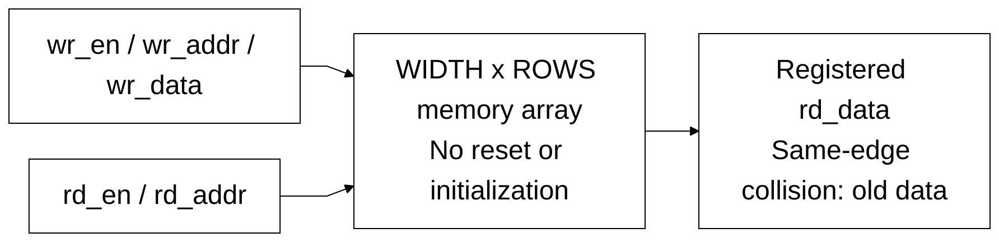

# sram_word_tile.sv

> **Category: GUIDE. Scope: CURRENT (may also have legacy callers).** RTL is authoritative; diagrams are preserved from the existing guide.
[Documentation](../../README.md) → [Source guide](../full_graph.md) → [RTL index](README.md)

**Source:** [sram_word_tile.sv](<../../../Verilog%20Source%20code/sram_word_tile.sv>).

## At a glance

| Item | Description |
|---|---|
| Responsibility | Replaceable portable SRAM behavior leaf with one synchronous read and one write. Nonblocking assignments preserve old data for same-edge same-address read/write. Storage and read payload have no reset or initialization. |

## Sơ đồ kiến trúc

