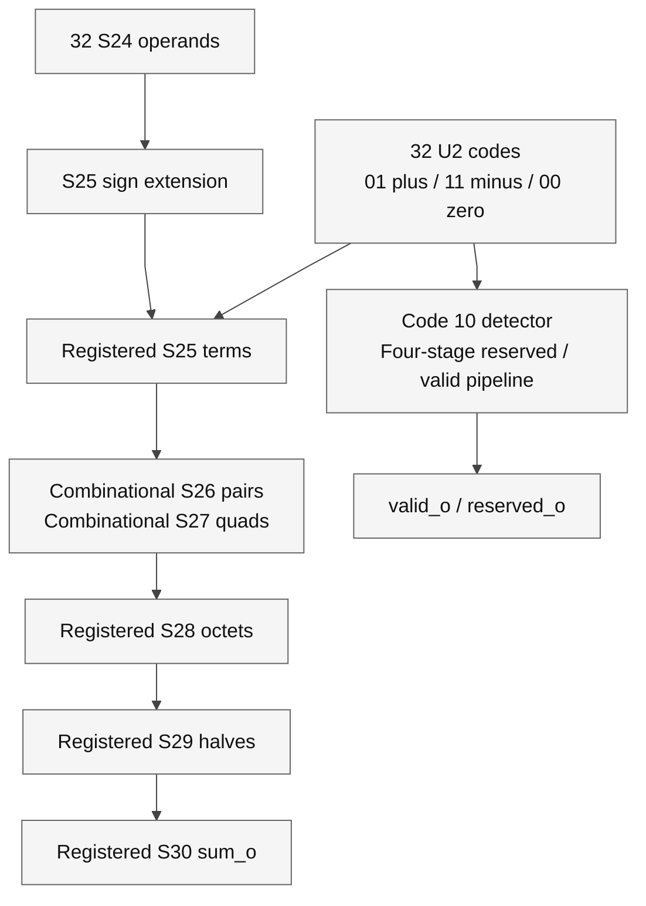

# ternary_dot32.sv

> **Category: GUIDE. Scope: CURRENT (may also have legacy callers).** RTL is authoritative; diagrams use the [shared visual style](../../diagrams/diagram_style.md).
[Documentation](../../README.md) → [Source guide](../full_graph.md) → [RTL index](README.md)

**Source:** [ternary_dot32.sv](<../../../Verilog%20Source%20code/ternary_dot32.sv>).

## At a glance

| Item | Description |
|---|---|
| Responsibility | Thirty-two signed S24 operands multiply ternary codes through S25 sign extension, zero selection and negation. Code 10 produces an aligned reserved flag. Four registered stages implement S25 terms, S28 octets, S29 halves and S30 sum; intervening pair/quad adders are combinational. Throughput is one transaction per cycle. |

## Sơ đồ kiến trúc

