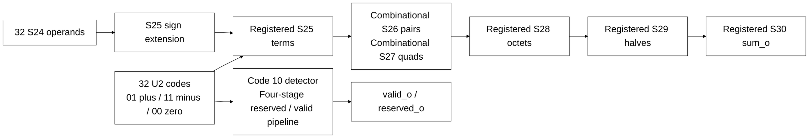

# ternary_dot32.sv

[Documentation](../../README.md) → [Source guide](../full_graph.md) → [RTL index](README.md)

**Source:** [ternary_dot32.sv](<../../../Verilog%20Source%20code/ternary_dot32.sv>). **Số dòng:** 55. **SHA-256:** `6b0f803c23034b94874ca8a2f450408078deb77a3eaa029917d63b43efdab8d9`.

## Khối này làm gì?

Thirty-two signed S24 operands multiply ternary codes through S25 sign extension, zero selection and negation. Code 10 produces an aligned reserved flag. Four registered stages implement S25 terms, S28 octets, S29 halves and S30 sum; intervening pair/quad adders are combinational. Throughput is one transaction per cycle.

## Sơ đồ kiến trúc



## Cách hoạt động chi tiết

Thirty-two signed S24 operands multiply ternary codes through S25 sign extension, zero selection and negation. Code 10 produces an aligned reserved flag. Four registered stages implement S25 terms, S28 octets, S29 halves and S30 sum; intervening pair/quad adders are combinational. Throughput is one transaction per cycle.

## Các nhóm logic trong source

### [Dòng 1–25: Interface and validity pipeline](<../../../Verilog%20Source%20code/ternary_dot32.sv#L1>)

<!-- source-range:1:25 -->
```systemverilog
// Exact S24 by ternary dot product. Four registered stages, throughput one/cycle.
// Code 10 raises the transaction fault; it must never be silently accepted.
module ternary_dot32 (
    input logic clk, rst_n, valid_i,
    input logic signed [23:0] x_i [0:31],
    input logic [1:0] w_i [0:31],
    output logic valid_o, reserved_o,
    output logic signed [29:0] sum_o
);
    genvar lane, node;
    logic [3:0] valid_q, reserved_q;
    logic signed [24:0] term_q [0:31];
    wire [31:0] reserved_lane;
    wire signed [25:0] pair [0:15];
    wire signed [26:0] quad [0:7];
    logic signed [27:0] oct_q [0:3];
    logic signed [28:0] half_q [0:1];
    assign valid_o = valid_q[3];
    assign reserved_o = valid_q[3] && reserved_q[3];
    always_ff @(posedge clk or negedge rst_n)
        if (!rst_n) begin valid_q <= 0; reserved_q <= 0; end
        else begin
            valid_q <= {valid_q[2:0], valid_i};
            reserved_q <= {reserved_q[2:0], valid_i && |reserved_lane};
        end
```

### [Dòng 26–38: Ternary decode with extended sign](<../../../Verilog%20Source%20code/ternary_dot32.sv#L26>)

<!-- source-range:26:38 -->
```systemverilog
    generate
    for (lane = 0; lane < 32; lane = lane + 1) begin : g_term
        wire signed [24:0] extended_x = {x_i[lane][23], x_i[lane]};
        assign reserved_lane[lane] = w_i[lane] == 2'b10;
        always_ff @(posedge clk)
            if (rst_n && valid_i) begin
                case (w_i[lane])
                    2'b01: term_q[lane] <= extended_x;
                    2'b11: term_q[lane] <= -extended_x;
                    default: term_q[lane] <= 0;
                endcase
            end
    end
```

### [Dòng 39–55: Balanced addition and registered stages](<../../../Verilog%20Source%20code/ternary_dot32.sv#L39>)

<!-- source-range:39:55 -->
```systemverilog
    for (node = 0; node < 16; node = node + 1) begin : g_pair
        assign pair[node] = 26'(term_q[node * 2]) + 26'(term_q[node * 2 + 1]);
    end
    for (node = 0; node < 8; node = node + 1) begin : g_quad
        assign quad[node] = 27'(pair[node * 2]) + 27'(pair[node * 2 + 1]);
    end
    for (node = 0; node < 4; node = node + 1) begin : g_oct
        always_ff @(posedge clk)
            oct_q[node] <= 28'(quad[node * 2]) + 28'(quad[node * 2 + 1]);
    end
    for (node = 0; node < 2; node = node + 1) begin : g_half
        always_ff @(posedge clk)
            half_q[node] <= 29'(oct_q[node * 2]) + 29'(oct_q[node * 2 + 1]);
    end
    endgenerate
    always_ff @(posedge clk) sum_o <= 30'(half_q[0]) + 30'(half_q[1]);
endmodule
```
