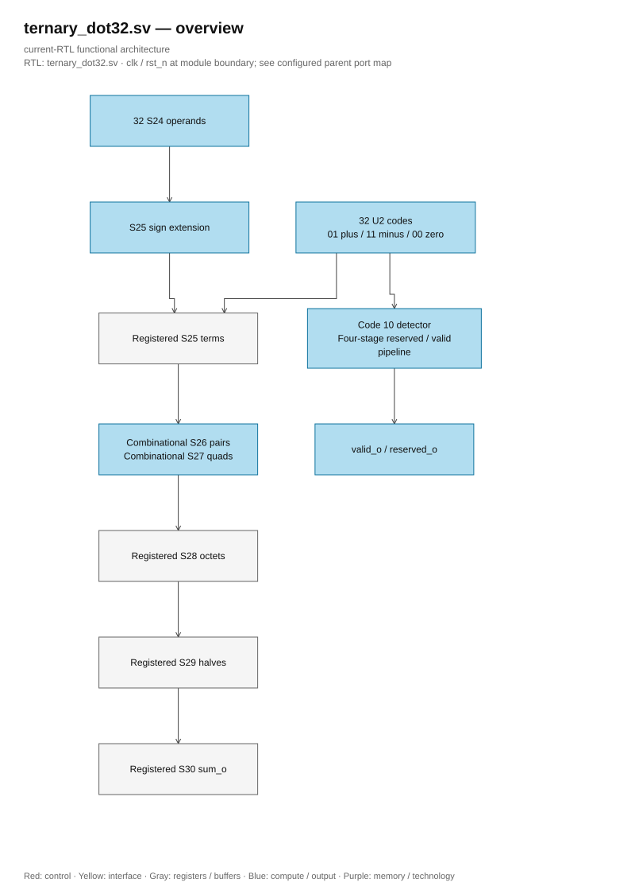

# ternary_dot32.sv

<!-- reading-navigation:start -->
[Documentation](../../README.md) → [02 · Architecture](../../02-architecture/README.md) → [Module catalog](README.md)

| Reading guide | Document |
|---|---|
| New to the subject | [NPU and RTL fundamentals](../../00-start-here/fundamentals.md) · [Glossary](../../00-start-here/glossary.md) |
| Learn the RTL syntax | [How to read the SystemVerilog](../../00-start-here/reading-systemverilog.md) |
| Read first | [Full RTL graph](../full_graph.md) |
| Related implementation | [llm_math.sv](llm_math.sv.md) |
<!-- reading-navigation:end -->

**Structural generation.** Named SystemVerilog generate constructs are retained without the optional `generate`/`endgenerate` regions, following lowRISC. Loop bounds, conditional branches, instance names and lane ownership are unchanged.

> **Category: GUIDE. Scope: CURRENT (may also have legacy callers).** RTL is authoritative; diagrams use the [shared visual style](../../diagrams/diagram_style.md).

**Source:** [ternary_dot32.sv](<../../../Verilog%20Source%20code/ternary_dot32.sv>).

## At a glance

| Item | Description |
|---|---|
| Responsibility | Thirty-two signed S24 operands multiply ternary codes through S25 sign extension, zero selection and negation. Code 10 produces an aligned reserved flag. Four registered stages implement S25 terms, S28 octets, S29 halves and S30 sum; intervening pair/quad adders are combinational. Throughput is one transaction per cycle. |

## Architecture diagram

[Editable draw.io — ternary_dot32.sv — overview](../../diagrams/architecture.drawio) · Page `67_ternary_dot32.sv_1`.
