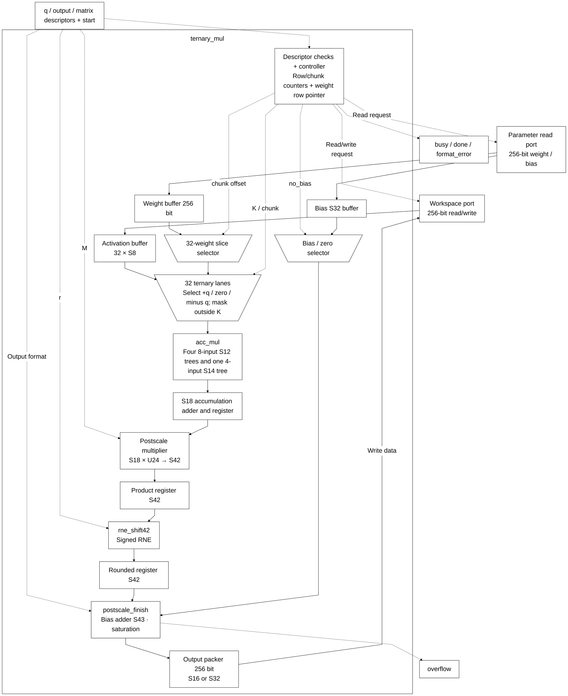
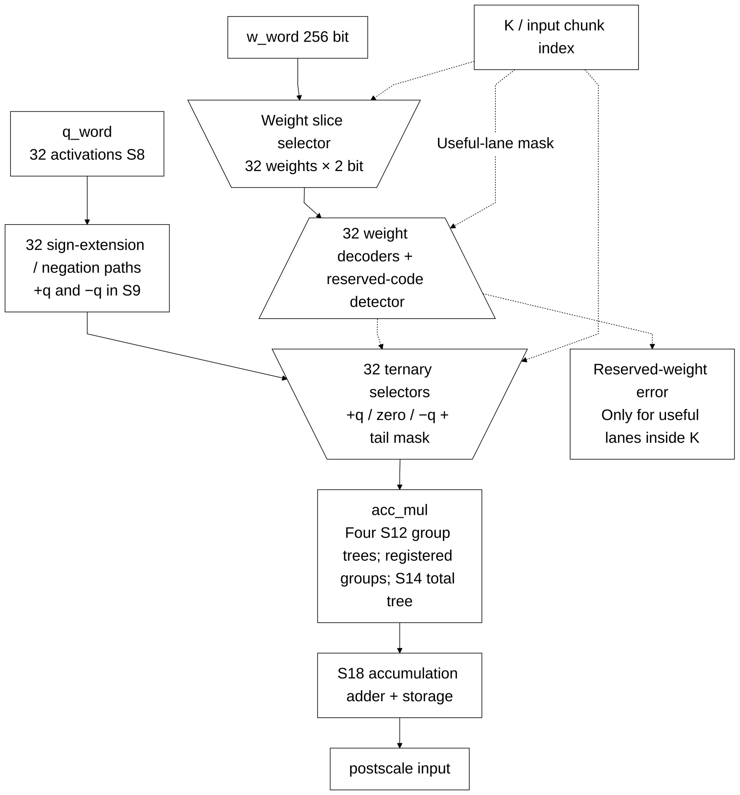

# ternary_mul.sv — 32 PE ternary và vòng lặp dot product

> **Category: GUIDE. Scope: LEGACY.** RTL is authoritative; diagrams are preserved from the existing guide.
[Tài liệu](../../README.md) → [Hierarchy RTL](<../legacy/README.md>) → [Mục lục từng file](README.md)

**Trạng thái:** Đang dùng — TMATMUL.

**Source:** [ternary_mul.sv](<../../../Verilog%20Source%20code/ternary_mul.sv>).

## At a glance

| Item | Description |
|---|---|
| Responsibility | Mỗi instruction tính n_rows dot product, mỗi dot product dài K. 32 PE là 32 phép chọn +q/−q/0 trong một chunk, không phải 32 output song song. Sau mỗi hàng, accumulator được rescale, cộng bias rồi pack vào output. |

## Sơ đồ kiến trúc tổng quan

## Main flow

`REQ_CHUNK → WAIT_CHUNK → ACCUM` lặp qua ceil(K/32) chunk. Mỗi word weight chứa 128 mã, nên chỉ fetch weight ở chunk chia hết cho 4; q luôn cần word mới. Hết row thì đọc bias (trừ no_bias), đi qua SCALE_PRODUCT → SCALE_ROUND → SCALE rồi WRITE khi pack đầy hoặc hết output. Tail được mask, mã 10 hữu ích gây lỗi.

1. Start chốt ba descriptor rồi kiểm tra format, K, số hàng, shift, bounds và overlap.
2. Mỗi chunk đọc 32 activation S8. Một word chứa 128 weight nên weight chỉ đọc lại mỗi bốn chunk; các chunk còn lại dùng buffer cũ.
3. Mỗi PE giải mã weight: 01 giữ q, 11 đổi dấu, 00 tạo zero. Mã 10 trong phần K hữu ích gây format error; tail ngoài K luôn bị mask.
4. `acc_mul` cộng 32 term thành partial. Accumulator S18 cộng partial của `ceil(K/32)` chunk để tạo một output.
5. Sau chunk cuối, core đọc bias hoặc dùng zero. SCALE_PRODUCT chốt tích S42; SCALE_ROUND chốt RNE S42; SCALE cộng bias S43/saturation rồi pack. Thêm hai clock mỗi output row so với bản trước tối ưu timing.
6. Các output row được xử lý lần lượt; 32 PE tăng tốc chiều K chứ không tạo 32 output đồng thời.

**Tối ưu địa chỉ 01/10.** `weight_words_per_row` U3 chứa stride 1..4. Pointer `weight_row_addr_q` U10 bắt đầu tại weight_base và tăng stride mỗi khi chuyển row, kể cả đường flush output. Địa chỉ weight là pointer + (chunk>>2), thay phép nhân row×stride. Bounds dùng shift/add cho extent n_rows×stride với trung gian U12, trước khi chấp nhận descriptor; không wrap nếu extent vượt SRAM. Refactor địa chỉ giữ K≤512, tail mask và số chu kỳ chunk. Test bao phủ K=257/384/385, stride 1..4, base khác zero, vùng kết thúc đúng 1024 và cấu hình vượt một word.

**Tối ưu timing.** Postscale chốt product và rounded result bằng hai register S42 không async reset, tách multiplier/RNE khỏi bias/saturation. FSM chỉ tới SCALE sau hai capture của row hiện tại. Reset hủy control; payload mới được ghi trước khi consume. `postscale_finish` dùng chung với wrapper tổ hợp cho regression, giữ output/error bit-exact. [Timing report](../../verification/timing/README.md) ghi Fmax và ảnh hưởng chu kỳ model.

## Important state / datapath groups

### [Dòng 1–77: Giao diện và register](<../../../Verilog%20Source%20code/ternary_mul.sv#L1>)

**Mục đích.** Descriptor được chốt khi start. Accumulator S18, mỗi term S9. Hai register S42 chốt product/RNE; postscale_finish chỉ cộng bias S43 và saturation.

**Cách phần code hoạt động.** Có instance module con; named-port ở nhóm này xác định chính xác đường control/data giữa hai cấp hierarchy.

**Tín hiệu và dữ liệu chính.** `start`: yêu cầu bắt đầu giao dịch; `q_desc`: metadata nguồn activation S8; `out_desc`: metadata output TMATMUL; `mat_desc`: metadata ma trận và postscale; `ws_rd_en`: request đọc workspace; `ws_rd_addr`: địa chỉ đọc workspace; và 43 tín hiệu phụ khác trong đoạn code.

### [Dòng 78–137: Ternary PE và cây cộng](<../../../Verilog%20Source%20code/ternary_mul.sv#L78>)

**Mục đích.** Offset weight là 64×(chunk mod 4). Mỗi lane tách q S8 và mã weight 2 bit; sign-extend trước khi đổi dấu.

**Cách phần code hoạt động.** Có logic tổ hợp: output/intermediate được tính từ input hiện tại; các giá trị mặc định đầu khối giúp tránh suy ra latch. Có instance module con; named-port ở nhóm này xác định chính xác đường control/data giữa hai cấp hierarchy.

**Tín hiệu và dữ liệu chính.** `weight_bit_base`: offset bit của nhóm32weight trong w_word; `input_chunk_q`: chunk 32 activation trong hàng hiện tại; `reserved_weight`: đã gặp weightcode10 trong lane hữu ích; `a`: operand A; `w`: mã2 bit của một weight; `q_word`: buffer32 activation S8; và 7 tín hiệu phụ khác trong đoạn code.

**Điểm cần đọc kỹ.** Đổi dấu phải diễn ra sau khi mở rộng S8 lên S9. Nếu đổi dấu ngay trong S8, trường hợp q = −128 (raw 0x80) và weight = −1 sẽ wrap thay vì cho +128 (S9 raw 0x080).

#### Sơ đồ khối phần cứng của nhóm

### [Dòng 138–162: Địa chỉ SRAM](<../../../Verilog%20Source%20code/ternary_mul.sv#L138>)

**Mục đích.** Weight row stride=ceil(K/128); q stride một word/chunk; bias index=row/8; output ghi từng word.

**Cách phần code hoạt động.** Có logic tổ hợp: output/intermediate được tính từ input hiện tại; các giá trị mặc định đầu khối giúp tránh suy ra latch.

**Tín hiệu và dữ liệu chính.** `ws_rd_en`: request đọc workspace; `ws_rd_addr`: địa chỉ đọc workspace; `ws_wr_en`: cho phép ghi workspace; `ws_wr_addr`: địa chỉ ghi workspace; `ws_wr_data`: word 256 ghi workspace; `pack_buf`: buffer pack output trước khi ghi SRAM; và 13 tín hiệu phụ khác trong đoạn code.

### [Dòng 163–189: Reset](<../../../Verilog%20Source%20code/ternary_mul.sv#L163>)

**Mục đích.** Xóa control và buffer cục bộ, không xóa SRAM.

**Cách phần code hoạt động.** Có logic tuần tự: register/FSM chỉ cập nhật tại cạnh clock; nonblocking assignment đọc giá trị cũ ở vế phải rồi chốt đồng thời.

**Tín hiệu và dữ liệu chính.** `state`: trạng thái FSM của khối; `busy`: khối đang xử lý; `done`: xung báo hoàn tất; `overflow`: cờ kết quả vượt miền số; `format_error`: cờ format/metadata không hợp lệ; `input_desc_q`: descriptor q đã chốt; và 15 tín hiệu phụ khác trong đoạn code.

### [Dòng 190–220: Chốt lệnh và validate](<../../../Verilog%20Source%20code/ternary_mul.sv#L190>)

**Mục đích.** Kiểm tra format, length, r, memory bounds và q/output overlap trước khi tính.

**Cách phần code hoạt động.** Các câu lệnh thuộc cùng một nhánh/pha xử lý và phải được đọc liền nhau; tách riêng từng dòng sẽ làm mất quan hệ điều kiện và dữ liệu.

**Tín hiệu và dữ liệu chính.** `start`: yêu cầu bắt đầu giao dịch; `busy`: khối đang xử lý; `overflow`: cờ kết quả vượt miền số; `format_error`: cờ format/metadata không hợp lệ; `input_desc_q`: descriptor q đã chốt; `q_desc`: metadata nguồn activation S8; và 24 tín hiệu phụ khác trong đoạn code.

### [Dòng 221–238: Nhận q và weight](<../../../Verilog%20Source%20code/ternary_mul.sv#L221>)

**Mục đích.** got_q/got_w nhớ dữ liệu đã đến để chấp nhận hai cổng trả ở các thời điểm khác nhau.

**Tín hiệu và dữ liệu chính.** `got_q`: đã nhận word activation; `got_w`: đã có word weight cho chunk; `input_chunk_q`: chunk 32 activation trong hàng hiện tại; `state`: trạng thái FSM của khối; `ws_rd_valid`: workspace trả dữ liệu hợp lệ; `q_word`: buffer32 activation S8; và 4 tín hiệu phụ khác trong đoạn code.

### [Dòng 239–262: Accumulate và bias](<../../../Verilog%20Source%20code/ternary_mul.sv#L239>)

**Mục đích.** Cộng partial vào accumulator. Chunk cuối chuyển sang bias hoặc scale; reserved weight gây format_error.

**Tín hiệu và dữ liệu chính.** `input_chunk_q`: chunk 32 activation trong hàng hiện tại; `chunks_per_row`: ceil(K/32), số bước accumulate một hàng; `accumulator_q`: tổng tích lũy S18 của hàng; `partial`: tổng 32 term của chunk; `matrix_desc_q`: matrix descriptor đã chốt; `reserved`: bit để dành hoặc flag mở rộng theo loại descriptor; và 7 tín hiệu phụ khác trong đoạn code.

### [Dòng 263–288: Rescale và pack](<../../../Verilog%20Source%20code/ternary_mul.sv#L263>)

**Mục đích.** Ghi y16 hoặc y32 vào pack_buf. Khi chưa đầy, tăng output_row và tái sử dụng cùng core.

**Tín hiệu và dữ liệu chính.** `overflow`: cờ kết quả vượt miền số; `scale_ov`: overflow của postscale_finish; `matrix_desc_q`: matrix descriptor đã chốt; `output_s32`: chọn format output S32 thay vì S16; `pack_buf`: buffer pack output trước khi ghi SRAM; `pack_count`: số/vị trí phần tử đang pack; và 6 tín hiệu phụ khác trong đoạn code.

### [Dòng 289–309: Write và finish](<../../../Verilog%20Source%20code/ternary_mul.sv#L289>)

**Mục đích.** Xóa pack buffer sau ghi, chuyển row tiếp theo hoặc phát done.

**Tín hiệu và dữ liệu chính.** `pack_buf`: buffer pack output trước khi ghi SRAM; `pack_count`: số/vị trí phần tử đang pack; `out_word`: chỉ số word output TMATMUL; `output_row_q`: hàng output đang tính; `matrix_desc_q`: matrix descriptor đã chốt; `n_rows`: số output của ma trận; và 4 tín hiệu phụ khác trong đoạn code.
