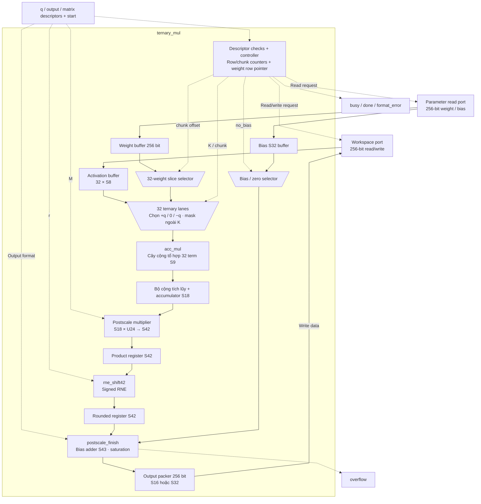
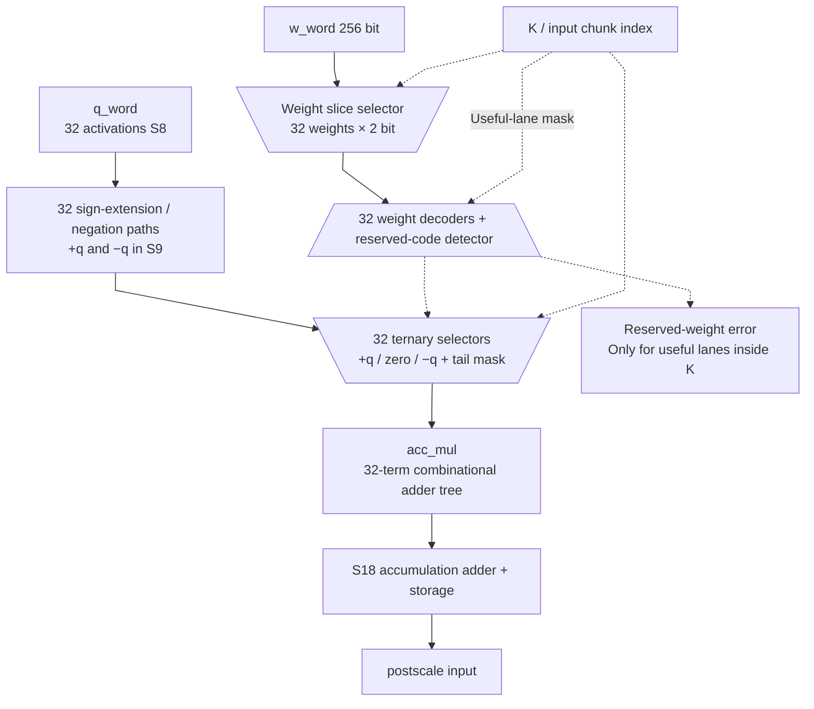

# ternary_mul.sv — 32 PE ternary và vòng lặp dot product

[Tài liệu](../../README.md) → [Hierarchy RTL](../README.md) → [Mục lục từng file](README.md)

**Trạng thái:** Đang dùng — TMATMUL.

**Source:** [ternary_mul.sv](<../../../Verilog%20Source%20code/ternary_mul.sv>). **Số dòng:** 305. **SHA-256:** `b3f3dba3b08bf7044631566890082627521a12818b8da8a86d6f6499c292da50`.

## Khối này làm gì?

Mỗi instruction tính n_rows dot product, mỗi dot product dài K. 32 PE là 32 phép chọn +q/−q/0 trong một chunk, không phải 32 output song song. Sau mỗi hàng, accumulator được rescale, cộng bias rồi pack vào output.

## Sơ đồ kiến trúc tổng quan



MUX dùng hình thang rộng ở phía nhiều ngõ vào và thu hẹp về ngõ ra; decoder/demux dùng hình thang ngược lại, mở rộng về phía nhiều ngõ ra. Hình chữ nhật có các vạch ngang biểu diễn bộ nhớ hoặc bank descriptor. Các hình chữ nhật thường là datapath, thanh ghi đơn hoặc giao diện. Nét liền là đường dữ liệu, nét đứt là điều khiển/cấu hình. Mũi tên hồi tiếp biểu diễn kết nối phần cứng. Sơ đồ không biểu diễn thứ tự chu kỳ, trạng thái FSM hoặc các tầng pipeline CPU.

## Cách hoạt động chi tiết

`REQ_CHUNK → WAIT_CHUNK → ACCUM` lặp qua ceil(K/32) chunk. Mỗi word weight chứa 128 mã, nên chỉ fetch weight ở chunk chia hết cho 4; q luôn cần word mới. Hết row thì đọc bias (trừ no_bias), đi qua SCALE_PRODUCT → SCALE_ROUND → SCALE rồi WRITE khi pack đầy hoặc hết output. Tail được mask, mã 10 hữu ích gây lỗi.

1. Start chốt ba descriptor rồi kiểm tra format, K, số hàng, shift, bounds và overlap.
2. Mỗi chunk đọc 32 activation S8. Một word chứa 128 weight nên weight chỉ đọc lại mỗi bốn chunk; các chunk còn lại dùng buffer cũ.
3. Mỗi PE giải mã weight: 01 giữ q, 11 đổi dấu, 00 tạo zero. Mã 10 trong phần K hữu ích gây format error; tail ngoài K luôn bị mask.
4. `acc_mul` cộng 32 term thành partial. Accumulator S18 cộng partial của `ceil(K/32)` chunk để tạo một output.
5. Sau chunk cuối, core đọc bias hoặc dùng zero. SCALE_PRODUCT chốt tích S42; SCALE_ROUND chốt RNE S42; SCALE cộng bias S43/saturation rồi pack. Thêm hai clock mỗi output row so với bản trước tối ưu timing.
6. Các output row được xử lý lần lượt; 32 PE tăng tốc chiều K chứ không tạo 32 output đồng thời.

**Tối ưu địa chỉ 01/10.** `weight_words_per_row` U3 chứa stride 1..4. Pointer `weight_row_addr_q` U10 bắt đầu tại weight_base và tăng stride mỗi khi chuyển row, kể cả đường flush output. Địa chỉ weight là pointer + (chunk>>2), thay phép nhân row×stride. Bounds dùng shift/add cho extent n_rows×stride với trung gian U12, trước khi chấp nhận descriptor; không wrap nếu extent vượt SRAM. Refactor địa chỉ giữ K≤512, tail mask và số chu kỳ chunk. Test bao phủ K=257/384/385, stride 1..4, base khác zero, vùng kết thúc đúng 1024 và cấu hình vượt một word.

**Tối ưu timing.** Postscale chốt product và rounded result bằng hai register S42 không async reset, tách multiplier/RNE khỏi bias/saturation. FSM chỉ tới SCALE sau hai capture của row hiện tại. Reset hủy control; payload mới được ghi trước khi consume. `postscale_finish` dùng chung với wrapper tổ hợp cho regression, giữ output/error bit-exact. [Timing report](../../verification/timing/README.md) ghi Fmax và ảnh hưởng chu kỳ model.

## Các nhóm logic trong source

Source được chia theo chức năng. Mỗi nhóm giữ nguyên phạm vi dòng để đối chiếu, nhưng phần giải thích tập trung vào quan hệ giữa các câu lệnh thay vì lặp lại từng dấu ngoặc, khai báo hoặc phép gán.


### [Dòng 1–77: Giao diện và register](<../../../Verilog%20Source%20code/ternary_mul.sv#L1>)

<!-- source-range:1:77 -->
```systemverilog
module ternary_mul (
    input logic clk,
    input logic rst_n,
    input logic start,
    input npu_pkg::ws_desc_t q_desc,
    input npu_pkg::ws_desc_t out_desc,
    input npu_pkg::mat_desc_t mat_desc,

    output logic ws_rd_en,
    output logic [7:0] ws_rd_addr,
    input logic [255:0] ws_rd_data,
    input logic ws_rd_valid,
    output logic ws_wr_en,
    output logic [7:0] ws_wr_addr,
    output logic [255:0] ws_wr_data,

    output logic param_rd_en,
    output logic [9:0] param_rd_addr,
    input logic [255:0] param_rd_data,
    input logic param_rd_valid,

    output logic busy,
    output logic done,
    output logic overflow,
    output logic format_error
);
    import npu_pkg::*;
    typedef enum logic [3:0] {IDLE, REQ_CHUNK, WAIT_CHUNK, REDUCE_GROUPS, REDUCE_TOTAL, ACCUM, REQ_BIAS, WAIT_BIAS,
        SCALE_PRODUCT, SCALE_ROUND, SCALE, WRITE, FINISH} state_t;
    state_t state;

    ws_desc_t input_desc_q, output_desc_q;
    mat_desc_t matrix_desc_q;
    logic [9:0] output_row_q, input_chunk_q;
    logic [9:0] chunks_per_row;
    logic [2:0] weight_words_per_row, weight_stride_next;
    logic [11:0] weight_extent;
    logic [9:0] weight_row_addr_q;
    logic [255:0] q_word, w_word;
    logic got_q, got_w;
    logic signed [17:0] accumulator_q;
    logic signed [8:0] terms [0:31];
    logic signed [17:0] partial;
    logic signed [8:0] group_terms [0:3][0:7];
    logic signed [11:0] group_sum [0:3], group_sum_q [0:3];
    logic signed [13:0] total_sum, total_sum_q;
    logic reserved_weight_q;
    logic [7:0] weight_bit_base;
    logic reserved_weight;

    logic signed [31:0] bias;
    logic signed [31:0] y32;
    logic signed [15:0] y16;
    logic scale_ov;
    logic signed [41:0] scale_product_q, scale_rounded_q;
    wire [41:0] scale_product_comb;
    logic_mul #(.A_W(18), .B_W(24), .OUT_W(42), .SIGNED_A(1), .SIGNED_B(0)) u_bit_mul
        (.a(accumulator_q), .b(matrix_desc_q.scale_m), .product(scale_product_comb));

    // Payload registers have no asynchronous reset. SCALE is reachable only
    // after both stages have captured this row; reset cancels the control FSM.
    always_ff @(posedge clk) begin
        if (rst_n && state == SCALE_PRODUCT)
            scale_product_q <= scale_product_comb;
        if (rst_n && state == SCALE_ROUND)
            scale_rounded_q <= rne_shift42(scale_product_q, matrix_desc_q.scale_r);
    end
    postscale_finish u_scale(.rounded(scale_rounded_q),
        .bias(bias),
        .output_s32(matrix_desc_q.output_s32),
        .y_s32(y32),
        .y_s16(y16),
        .overflow(scale_ov));

    logic [255:0] pack_buf;
    logic [4:0] pack_count;
    logic [7:0] out_word;
```

**Mục đích.** Descriptor được chốt khi start. Accumulator S18, mỗi term S9. Hai register S42 chốt product/RNE; postscale_finish chỉ cộng bias S43 và saturation.

**Cách phần code hoạt động.** Có instance module con; named-port ở nhóm này xác định chính xác đường control/data giữa hai cấp hierarchy.

**Tín hiệu và dữ liệu chính.** `start`: yêu cầu bắt đầu giao dịch; `q_desc`: metadata nguồn activation S8; `out_desc`: metadata output TMATMUL; `mat_desc`: metadata ma trận và postscale; `ws_rd_en`: request đọc workspace; `ws_rd_addr`: địa chỉ đọc workspace; và 43 tín hiệu phụ khác trong đoạn code.


### [Dòng 78–133: Ternary PE và cây cộng](<../../../Verilog%20Source%20code/ternary_mul.sv#L78>)

<!-- source-range:78:133 -->
```systemverilog

    // Validated K is 1..512, so each row occupies one to four weight words.
    // Shift/add bounds checking and a row pointer avoid two address multipliers.
    always_comb begin
        weight_stride_next = 3'(((int'(mat_desc.k_len) + 127) >> 7));
        case (weight_stride_next)
            3'd1 : weight_extent = {2'b0, mat_desc.n_rows};
            3'd2 : weight_extent = {1'b0, mat_desc.n_rows, 1'b0};
            3'd3 : weight_extent = {1'b0, mat_desc.n_rows, 1'b0} + {2'b0, mat_desc.n_rows};
            3'd4 : weight_extent = {mat_desc.n_rows, 2'b0};
            default : weight_extent = '0; // Invalid K is rejected before any read.
        endcase
    end

    always_comb begin
        weight_bit_base = {input_chunk_q[1:0], 6'b0};
        reserved_weight = 0;
        for (int i = 0;i < 32;i = i + 1) begin
            logic signed [7:0] a;
            logic [1:0] w;
            a = q_word[i * 8 +: 8];
            w = w_word[weight_bit_base + i * 2 +: 2];
            if (((int'(input_chunk_q) << 5) + i) >= matrix_desc_q.k_len) terms[i] = 9'sh000;
            else begin
                if (w == 2'b10) reserved_weight = 1;
                case (w)
                    2'b01 : terms[i] = {a[7], a};
                    2'b11 : terms[i] = - $signed({a[7], a});
                    default : terms[i] = 9'sh000; // 00=0, 10 reserved -> 0
                endcase
            end
        end
    end
    // Four independent eight-lane trees keep carry widths proportional to
    // their ranges. Registers separate decode/reduction from accumulation.
    genvar g, lane;
    generate
    for (g = 0; g < 4; g = g + 1) begin : g_reduce
        for (lane = 0; lane < 8; lane = lane + 1) begin : g_lane
            assign group_terms[g][lane] = terms[g * 8 + lane];
        end
        acc_mul #(.TERM_W(9), .NUM_INPUTS(8), .ACC_W(12)) u_group(
            .term(group_terms[g]), .sum(group_sum[g]));
    end
    endgenerate
    acc_mul #(.TERM_W(12), .NUM_INPUTS(4), .ACC_W(14)) u_total(
        .term(group_sum_q), .sum(total_sum));
    assign partial = {{4{total_sum_q[13]}}, total_sum_q};
    // Control reset cancels an in-flight chunk before these payloads are used.
    always_ff @(posedge clk) begin
        if (rst_n && state == REDUCE_GROUPS) begin
            for (int g = 0; g < 4; g = g + 1) group_sum_q[g] <= group_sum[g];
            reserved_weight_q <= reserved_weight;
        end
        if (rst_n && state == REDUCE_TOTAL) total_sum_q <= total_sum;
    end
```

**Mục đích.** Offset weight là 64×(chunk mod 4). Mỗi lane tách q S8 và mã weight 2 bit; sign-extend trước khi đổi dấu.

**Cách phần code hoạt động.** Có logic tổ hợp: output/intermediate được tính từ input hiện tại; các giá trị mặc định đầu khối giúp tránh suy ra latch. Có instance module con; named-port ở nhóm này xác định chính xác đường control/data giữa hai cấp hierarchy.

**Tín hiệu và dữ liệu chính.** `weight_bit_base`: offset bit của nhóm32weight trong w_word; `input_chunk_q`: chunk 32 activation trong hàng hiện tại; `reserved_weight`: đã gặp weightcode10 trong lane hữu ích; `a`: operand A; `w`: mã2 bit của một weight; `q_word`: buffer32 activation S8; và 7 tín hiệu phụ khác trong đoạn code.

**Điểm cần đọc kỹ.** Đổi dấu phải diễn ra sau khi mở rộng S8 lên S9. Nếu đổi dấu ngay trong S8, trường hợp q = −128 (raw 0x80) và weight = −1 sẽ wrap thay vì cho +128 (S9 raw 0x080).

#### Sơ đồ khối phần cứng của nhóm




### [Dòng 134–158: Địa chỉ SRAM](<../../../Verilog%20Source%20code/ternary_mul.sv#L134>)

<!-- source-range:134:158 -->
```systemverilog

    always_comb begin
        ws_rd_en = 0;
        ws_rd_addr = '0;
        ws_wr_en = 0;
        ws_wr_addr = '0;
        ws_wr_data = pack_buf;
        param_rd_en = 0;
        param_rd_addr = '0;
        if (state == REQ_CHUNK) begin
            ws_rd_en = 1;
            ws_rd_addr = input_desc_q.base_word + input_chunk_q[7:0];
            param_rd_en = (input_chunk_q[1:0] == 0);
            param_rd_addr = weight_row_addr_q + (input_chunk_q >> 2);
        end else if (state == REQ_BIAS) begin
            param_rd_en = 1;
            param_rd_addr = matrix_desc_q.bias_base + (output_row_q >> 3);
        end else if (state == WRITE) begin
            ws_wr_en = 1;
            ws_wr_addr = output_desc_q.base_word + out_word;
            ws_wr_data = pack_buf;
        end
    end

    always_ff @(posedge clk or negedge rst_n) begin
```

**Mục đích.** Weight row stride=ceil(K/128); q stride một word/chunk; bias index=row/8; output ghi từng word.

**Cách phần code hoạt động.** Có logic tổ hợp: output/intermediate được tính từ input hiện tại; các giá trị mặc định đầu khối giúp tránh suy ra latch.

**Tín hiệu và dữ liệu chính.** `ws_rd_en`: request đọc workspace; `ws_rd_addr`: địa chỉ đọc workspace; `ws_wr_en`: cho phép ghi workspace; `ws_wr_addr`: địa chỉ ghi workspace; `ws_wr_data`: word 256 ghi workspace; `pack_buf`: buffer pack output trước khi ghi SRAM; và 13 tín hiệu phụ khác trong đoạn code.


### [Dòng 159–185: Reset](<../../../Verilog%20Source%20code/ternary_mul.sv#L159>)

<!-- source-range:159:185 -->
```systemverilog
        if (!rst_n) begin
            state <= IDLE;
            busy <= 0;
            done <= 0;
            overflow <= 0;
            format_error <= 0;
            input_desc_q <= '0;
            output_desc_q <= '0;
            matrix_desc_q <= '0;
            output_row_q <= 0;
            input_chunk_q <= 0;
            chunks_per_row <= 0;
            weight_words_per_row <= 0;
            weight_row_addr_q <= 0;
            q_word <= 0;
            w_word <= 0;
            got_q <= 0;
            got_w <= 0;
            accumulator_q <= 0;
            bias <= 0;
            pack_buf <= 0;
            pack_count <= 0;
            out_word <= 0;
        end else begin
            done <= 0;
            case (state)
                IDLE : if (start) begin
```

**Mục đích.** Xóa control và buffer cục bộ, không xóa SRAM.

**Cách phần code hoạt động.** Có logic tuần tự: register/FSM chỉ cập nhật tại cạnh clock; nonblocking assignment đọc giá trị cũ ở vế phải rồi chốt đồng thời.

**Tín hiệu và dữ liệu chính.** `state`: trạng thái FSM của khối; `busy`: khối đang xử lý; `done`: xung báo hoàn tất; `overflow`: cờ kết quả vượt miền số; `format_error`: cờ format/metadata không hợp lệ; `input_desc_q`: descriptor q đã chốt; và 15 tín hiệu phụ khác trong đoạn code.


### [Dòng 186–216: Chốt lệnh và validate](<../../../Verilog%20Source%20code/ternary_mul.sv#L186>)

<!-- source-range:186:216 -->
```systemverilog
                    busy <= 1;
                    overflow <= 0;
                    format_error <= 0;
                    input_desc_q <= q_desc;
                    output_desc_q <= out_desc;
                    matrix_desc_q <= mat_desc;
                    output_row_q <= 0;
                    input_chunk_q <= 0;
                    accumulator_q <= 0;
                    chunks_per_row <= 10'((mat_desc.k_len + 31) >> 5);
                    weight_words_per_row <= weight_stride_next;
                    weight_row_addr_q <= mat_desc.weight_base;
                    pack_buf <= 0;
                    pack_count <= 0;
                    out_word <= 0;
                    got_q <= 0;
                    got_w <= 0;
                    state <= REQ_CHUNK;
                    if (!ws_valid(q_desc) || !ws_valid(out_desc) || q_desc.fmt != FMT_S8 ||
                        out_desc.fmt != (mat_desc.output_s32 ? FMT_S32 : FMT_S16) ||
                        mat_desc.k_len == 0 || mat_desc.k_len > K_MAX || mat_desc.n_rows == 0 ||
                        q_desc.length != mat_desc.k_len || out_desc.length != mat_desc.n_rows ||
                        mat_desc.scale_r > 47 ||
                        int'(mat_desc.weight_base) + int'(weight_extent) > 1024 ||
                        (!mat_desc.reserved[1] && int'(mat_desc.bias_base) + ((int'(mat_desc.n_rows) + 7) >> 3) > 1024) ||
                        ranges_overlap(int'(q_desc.base_word), ws_words(q_desc), int'(out_desc.base_word), ws_words(out_desc))) begin
                        format_error <= 1;
                        state <= FINISH;
                    end
                end
                REQ_CHUNK : begin
```

**Mục đích.** Kiểm tra format, length, r, memory bounds và q/output overlap trước khi tính.

**Cách phần code hoạt động.** Các câu lệnh thuộc cùng một nhánh/pha xử lý và phải được đọc liền nhau; tách riêng từng dòng sẽ làm mất quan hệ điều kiện và dữ liệu.

**Tín hiệu và dữ liệu chính.** `start`: yêu cầu bắt đầu giao dịch; `busy`: khối đang xử lý; `overflow`: cờ kết quả vượt miền số; `format_error`: cờ format/metadata không hợp lệ; `input_desc_q`: descriptor q đã chốt; `q_desc`: metadata nguồn activation S8; và 24 tín hiệu phụ khác trong đoạn code.


### [Dòng 217–234: Nhận q và weight](<../../../Verilog%20Source%20code/ternary_mul.sv#L217>)

<!-- source-range:217:234 -->
```systemverilog
                    got_q <= 0;
                    got_w <= (input_chunk_q[1:0] != 0);
                    state <= WAIT_CHUNK;
                end
                WAIT_CHUNK : begin
                    if (ws_rd_valid) begin
                        q_word <= ws_rd_data;
                        got_q <= 1;
                    end
                    if (param_rd_valid) begin
                        w_word <= param_rd_data;
                        got_w <= 1;
                    end
                    if ((got_q || ws_rd_valid) && (got_w || param_rd_valid)) state <= REDUCE_GROUPS;
                end
                REDUCE_GROUPS : state <= REDUCE_TOTAL;
                REDUCE_TOTAL : state <= ACCUM;
                ACCUM : begin
```

**Mục đích.** got_q/got_w nhớ dữ liệu đã đến để chấp nhận hai cổng trả ở các thời điểm khác nhau.

**Cách phần code hoạt động.** Các câu lệnh thuộc cùng một nhánh/pha xử lý và phải được đọc liền nhau; tách riêng từng dòng sẽ làm mất quan hệ điều kiện và dữ liệu.

**Tín hiệu và dữ liệu chính.** `got_q`: đã nhận word activation; `got_w`: đã có word weight cho chunk; `input_chunk_q`: chunk 32 activation trong hàng hiện tại; `state`: trạng thái FSM của khối; `ws_rd_valid`: workspace trả dữ liệu hợp lệ; `q_word`: buffer32 activation S8; và 4 tín hiệu phụ khác trong đoạn code.


### [Dòng 235–258: Accumulate và bias](<../../../Verilog%20Source%20code/ternary_mul.sv#L235>)

<!-- source-range:235:258 -->
```systemverilog
                    if (input_chunk_q + 1 >= chunks_per_row) begin
                        accumulator_q <= accumulator_q + partial;
                        input_chunk_q <= 0;
                        if (matrix_desc_q.reserved[1]) begin
                            bias <= 0;
                            state <= SCALE_PRODUCT;
                        end
                        else state <= REQ_BIAS;
                    end else begin
                        accumulator_q <= accumulator_q + partial;
                        input_chunk_q <= input_chunk_q + 1'b1;
                        state <= REQ_CHUNK;
                    end
                    if (reserved_weight_q) begin
                        format_error <= 1;
                        state <= FINISH;
                    end
                end
                REQ_BIAS : state <= WAIT_BIAS;
                WAIT_BIAS : if (param_rd_valid) begin
                    bias <= param_rd_data[((int'(output_row_q[2:0]) << 5)) +: 32];
                    state <= SCALE_PRODUCT;
                end
                SCALE_PRODUCT : state <= SCALE_ROUND;
```

**Mục đích.** Cộng partial vào accumulator. Chunk cuối chuyển sang bias hoặc scale; reserved weight gây format_error.

**Cách phần code hoạt động.** Các câu lệnh thuộc cùng một nhánh/pha xử lý và phải được đọc liền nhau; tách riêng từng dòng sẽ làm mất quan hệ điều kiện và dữ liệu.

**Tín hiệu và dữ liệu chính.** `input_chunk_q`: chunk 32 activation trong hàng hiện tại; `chunks_per_row`: ceil(K/32), số bước accumulate một hàng; `accumulator_q`: tổng tích lũy S18 của hàng; `partial`: tổng 32 term của chunk; `matrix_desc_q`: matrix descriptor đã chốt; `reserved`: bit để dành hoặc flag mở rộng theo loại descriptor; và 7 tín hiệu phụ khác trong đoạn code.


### [Dòng 259–284: Rescale và pack](<../../../Verilog%20Source%20code/ternary_mul.sv#L259>)

<!-- source-range:259:284 -->
```systemverilog
                SCALE_ROUND : state <= SCALE;
                SCALE : begin
                    overflow <= overflow | scale_ov;
                    if (matrix_desc_q.output_s32) begin
                        pack_buf[(int'(pack_count) << 5) +: 32] <= y32;
                        if (pack_count == 7 || output_row_q + 1 >= matrix_desc_q.n_rows) state <= WRITE;
                        else begin
                            pack_count <= pack_count + 1'b1;
                            output_row_q <= output_row_q + 1'b1;
                            weight_row_addr_q <= weight_row_addr_q + {7'h00, weight_words_per_row};
                            accumulator_q <= 0;
                            state <= REQ_CHUNK;
                        end
                    end else begin
                        pack_buf[(int'(pack_count) << 4) +: 16] <= y16;
                        if (pack_count == 15 || output_row_q + 1 >= matrix_desc_q.n_rows) state <= WRITE;
                        else begin
                            pack_count <= pack_count + 1'b1;
                            output_row_q <= output_row_q + 1'b1;
                            weight_row_addr_q <= weight_row_addr_q + {7'h00, weight_words_per_row};
                            accumulator_q <= 0;
                            state <= REQ_CHUNK;
                        end
                    end
                end
                WRITE : begin
```

**Mục đích.** Ghi y16 hoặc y32 vào pack_buf. Khi chưa đầy, tăng output_row và tái sử dụng cùng core.

**Cách phần code hoạt động.** Các câu lệnh thuộc cùng một nhánh/pha xử lý và phải được đọc liền nhau; tách riêng từng dòng sẽ làm mất quan hệ điều kiện và dữ liệu.

**Tín hiệu và dữ liệu chính.** `overflow`: cờ kết quả vượt miền số; `scale_ov`: overflow của postscale_finish; `matrix_desc_q`: matrix descriptor đã chốt; `output_s32`: chọn format output S32 thay vì S16; `pack_buf`: buffer pack output trước khi ghi SRAM; `pack_count`: số/vị trí phần tử đang pack; và 6 tín hiệu phụ khác trong đoạn code.


### [Dòng 285–305: Write và finish](<../../../Verilog%20Source%20code/ternary_mul.sv#L285>)

<!-- source-range:285:305 -->
```systemverilog
                    pack_buf <= 0;
                    pack_count <= 0;
                    out_word <= out_word + 1'b1;
                    if (output_row_q + 1 >= matrix_desc_q.n_rows) state <= FINISH;
                    else begin
                        output_row_q <= output_row_q + 1'b1;
                        weight_row_addr_q <= weight_row_addr_q + {7'h00, weight_words_per_row};
                        accumulator_q <= 0;
                        state <= REQ_CHUNK;
                    end
                end
                FINISH : begin
                    busy <= 0;
                    done <= 1;
                    state <= IDLE;
                end
                default : state <= IDLE;
            endcase
        end
    end
endmodule
```

**Mục đích.** Xóa pack buffer sau ghi, chuyển row tiếp theo hoặc phát done.

**Cách phần code hoạt động.** Các câu lệnh thuộc cùng một nhánh/pha xử lý và phải được đọc liền nhau; tách riêng từng dòng sẽ làm mất quan hệ điều kiện và dữ liệu.

**Tín hiệu và dữ liệu chính.** `pack_buf`: buffer pack output trước khi ghi SRAM; `pack_count`: số/vị trí phần tử đang pack; `out_word`: chỉ số word output TMATMUL; `output_row_q`: hàng output đang tính; `matrix_desc_q`: matrix descriptor đã chốt; `n_rows`: số output của ma trận; và 4 tín hiệu phụ khác trong đoạn code.
