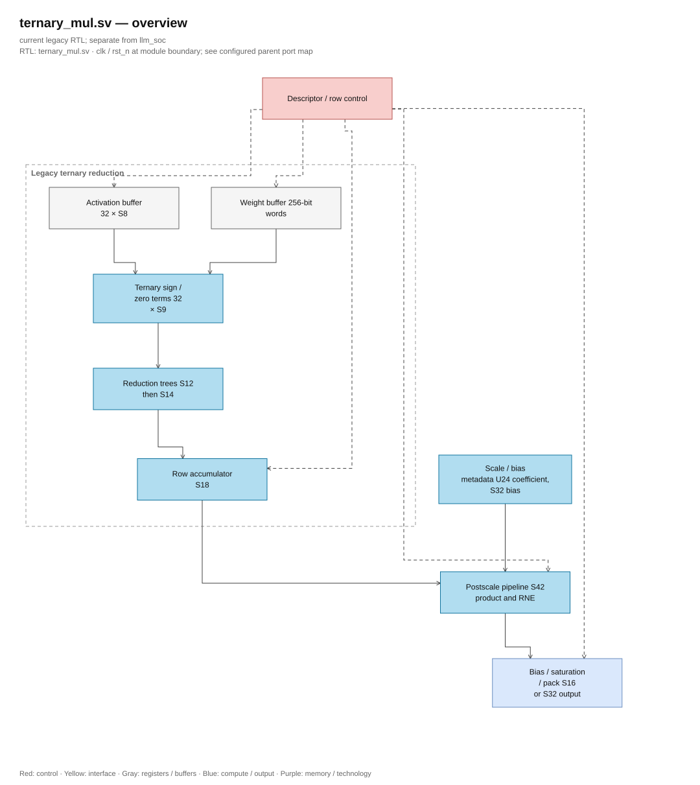
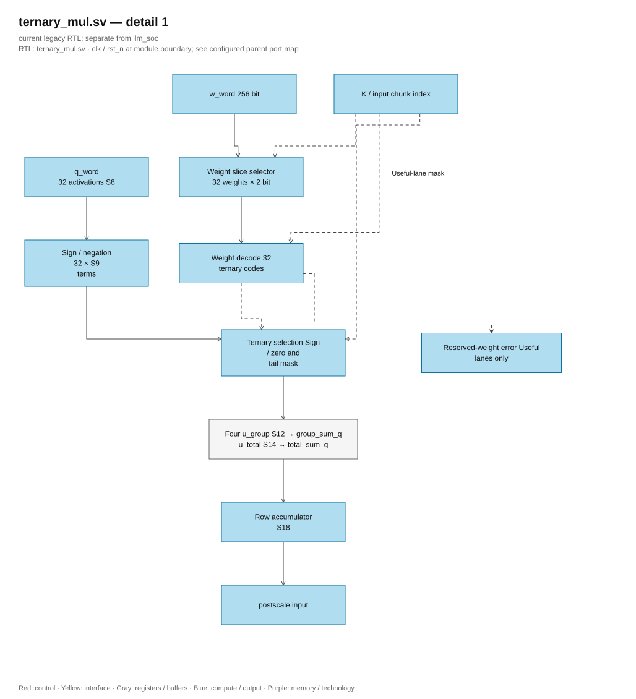

# ternary_mul.sv — 32 PE ternary and dot product loop

> **Category: GUIDE. Scope: LEGACY.** RTL is authoritative; diagrams use the [shared visual style](../../diagrams/diagram_style.md).
[Documentation](../../README.md) → [RTL Hierarchy](<../legacy/README.md>) → [Per-file Index](README.md)

**Status:** In use — TMATMUL.

**Source:** [ternary_mul.sv](<../../../Verilog%20Source%20code/ternary_mul.sv>).

## At a glance

| Item | Description |
|---|---|
| Responsibility | Each instruction computes n_rows dot products, each dot product of length K. 32 PEs are 32 select +q/−q/0 operations in a chunk, not 32 parallel outputs. After each row, the accumulator is rescaled, bias added, then packed into the output. |

## Overall Architecture Diagram

[Editable draw.io — ternary_mul.sv — overview](../../diagrams/architecture.drawio) · Page `68_ternary_mul.sv_1`.

## Main flow

`REQ_CHUNK → WAIT_CHUNK → ACCUM` loops through ceil(K/32) chunks. Each weight word contains 128 codes, so only fetch weights in chunks divisible by 4; q always needs a new word. At the end of a row, read bias (except no_bias), go through SCALE_PRODUCT → SCALE_ROUND → SCALE, then WRITE when the pack is full or output ends. Tail is masked, code 10 causes errors.

1. Start by finalizing three descriptors and then check format, K, number of rows, shift, bounds, and overlap.
2. Each chunk reads 32 S8 activations. A word contains 128 weights, so weights are only reread every four chunks; the remaining chunks use the old buffer.
3. Each PE decodes weights: 01 retains q, 11 flips the sign, 00 generates zero. Code 10 in the useful K part causes a format error; tails outside K are always masked.
4. `acc_mul` sums 32 terms into a partial. S18 accumulator sums the partial of `ceil(K/32)` chunk to create an output.
5. After the last chunk, the core reads bias or uses zero. SCALE_PRODUCT finalizes S42 product; SCALE_ROUND finalizes RNE S42; SCALE adds bias S43/saturation then packs. Adds two clocks per output row compared to the previous version to optimize timing.
6. Output rows are processed sequentially; 32 PEs accelerate the K dimension rather than producing 32 outputs simultaneously.

**Optimize address 01/10.** `weight_words_per_row` U3 contains stride 1..4. Pointer `weight_row_addr_q` U10 starts at weight_base and increments stride whenever changing row, including the flush output path. Weight address is pointer + (chunk >> 2), instead of multiplying row × stride. Bounds use shift/add for extent n_rows × stride with intermediary U12, before accepting descriptor; no wrap if extent exceeds SRAM. Refactor address to keep K ≤ 512, tail mask and number of chunk cycles. Tests cover K = 257/384/385, stride 1..4, base not zero, ending region exactly 1024, and configuration exceeding one word.

**Optimize timing.** Postscale latches product and rounded result with two S42 registers without async reset, separating multiplier/RNE from bias/saturation. FSM only goes to SCALE after two captures of the current row. Reset cancels control; new payload is written before being consumed. `postscale_finish` is shared with the combinational wrapper for regression, keeping output/error bit-exact. [Timing report](../../verification/timing/README.md) records Fmax and the model cycle impact.

## Important state / datapath groups

### [Lines 1–77: Interface and registers](<../../../Verilog%20Source%20code/ternary_mul.sv#L1>)

**Purpose.** Descriptor is latched at start. Accumulator S18, each term S9. Two S42 registers latch product/RNE; postscale_finish only adds bias S43 and saturation.

**How the code section works.** There is a submodule instance; the named-port in this group precisely defines the control/data path between two hierarchy levels.

**Main signals and data.** `start`: request to start transaction; `q_desc`: source activation S8 metadata; `out_desc`: output TMATMUL metadata; `mat_desc`: matrix and postscale metadata; `ws_rd_en`: request to read workspace; `ws_rd_addr`: workspace read address; and 43 other auxiliary signals in the code section.

### [Lines 78–137: Ternary PE and adder tree](<../../../Verilog%20Source%20code/ternary_mul.sv#L78>)

**Purpose.** The weight offset is 64×(chunk mod 4). Each lane separates q S8 and 2-bit weight code; sign-extend before changing the sign.

**How the code section works.** There is combinational logic: output/intermediate is calculated from the current input; default block values help to avoid inferring latches. There are submodule instances; named-port in this group precisely identifies the control/data path between two hierarchy levels.

**Key signals and data.** `weight_bit_base`: offset bit of the 32-weight group in w_word; `input_chunk_q`: 32 activation chunk in the current row; `reserved_weight`: encountered weightcode10 in the useful lane; `a`: operand A; `w`: 2-bit code of a weight; `q_word`: buffer32 activation S8; and 7 other auxiliary signals in the code section.

**Points to read carefully.** Sign change must occur after extending S8 to S9. If a sign change occurs directly in S8, the case q = −128 (raw 0x80) and weight = −1 will wrap instead of giving +128 (S9 raw 0x080).

#### Hardware block diagram of the group

[Editable draw.io — ternary_mul.sv — detail 1](../../diagrams/architecture.drawio) · Page `69_ternary_mul.sv_2`.

### [Lines 138–162: SRAM addresses](<../../../Verilog%20Source%20code/ternary_mul.sv#L138>)

**Purpose.** Weight row stride = ceil(K/128); q stride one word/chunk; bias index = row/8; output writes each word.

**How the code works.** There is combinational logic: output/intermediate values are calculated from the current input; default values at the start of the block help avoid inferring latches.

**Main signals and data.** `ws_rd_en`: workspace read request; `ws_rd_addr`: workspace read address; `ws_wr_en`: workspace write enable; `ws_wr_addr`: workspace write address; `ws_wr_data`: workspace write 256-word; `pack_buf`: buffer pack output before writing SRAM; and 13 other auxiliary signals in the code segment.

### [Lines 163–189: Reset](<../../../Verilog%20Source%20code/ternary_mul.sv#L163>)

**Purpose.** Clear local control and buffer, do not clear SRAM.

**How the code works.** There is sequential logic: registers/FSM only update on clock edge; nonblocking assignment reads the old value on the right-hand side and then simultaneously latches.

**Main signals and data.** `state`: FSM status of the block; `busy`: block being processed; `done`: completion pulse; `overflow`: over-range result flag; `format_error`: invalid format/metadata flag; `input_desc_q`: q descriptor locked; and 15 other auxiliary signals in the code section.

### [Lines 190–220: Latch commands and validate](<../../../Verilog%20Source%20code/ternary_mul.sv#L190>)

**Purpose.** Check format, length, r, memory bounds, and q/output overlap before computation.

**How this code works.** The statements belong to the same processing branch/phase and must be read consecutively; separating individual lines will break conditional and data relationships.

**Main signals and data.** `start`: request to start transaction; `busy`: block being processed; `overflow`: overflow result flag; `format_error`: invalid format/metadata flag; `input_desc_q`: q descriptor locked; `q_desc`: activation S8 source metadata; and 24 other auxiliary signals in the code segment.

### [Lines 221–238: Receiving q and weight](<../../../Verilog%20Source%20code/ternary_mul.sv#L221>)

**Purpose.** got_q/got_w remembers the arrived data to accept two return ports at different times.

**Main signals and data.** `got_q`: word activation received; `got_w`: word weight available for chunk; `input_chunk_q`: chunk 32 activation in current row; `state`: FSM status of the block; `ws_rd_valid`: workspace returns valid data; `q_word`: buffer32 activation S8; and 4 other auxiliary signals in the code segment.

### [Lines 239–262: Accumulate and bias](<../../../Verilog%20Source%20code/ternary_mul.sv#L239>)

**Purpose.** Add partials to the accumulator. The last chunk transfers to bias or scale; reserved weight causes format_error.

**Main signals and data.** `input_chunk_q`: chunk 32 activation in the current row; `chunks_per_row`: ceil(K/32), number of accumulate steps per row; `accumulator_q`: total S18 accumulation of the row; `partial`: total 32 terms of the chunk; `matrix_desc_q`: finalized matrix descriptor; `reserved`: reserved bit or extended flag depending on descriptor type; and 7 other auxiliary signals in the code segment.

### [Lines 263–288: Rescale and pack](<../../../Verilog%20Source%20code/ternary_mul.sv#L263>)

**Purpose.** Write y16 or y32 into pack_buf. When not full, increment output_row and reuse the same core.

**Main signals and data.** `overflow`: cross-domain result flag; `scale_ov`: overflow of postscale_finish; `matrix_desc_q`: finalized matrix descriptor; `output_s32`: select S32 output format instead of S16; `pack_buf`: buffer pack output before writing to SRAM; `pack_count`: number/position of elements being packed; and 6 other auxiliary signals in the code snippet.

### [Lines 289–309: Write and finish](<../../../Verilog%20Source%20code/ternary_mul.sv#L289>)

**Purpose.** Clear pack buffer after writing, move to the next row, or trigger done.

**Main signals and data.** `pack_buf`: buffer pack output before writing to SRAM; `pack_count`: number/position of the element being packed; `out_word`: index of TMATMUL output word; `output_row_q`: output row being computed; `matrix_desc_q`: matrix descriptor finalized; `n_rows`: number of matrix outputs; and 4 other auxiliary signals in the code segment.
