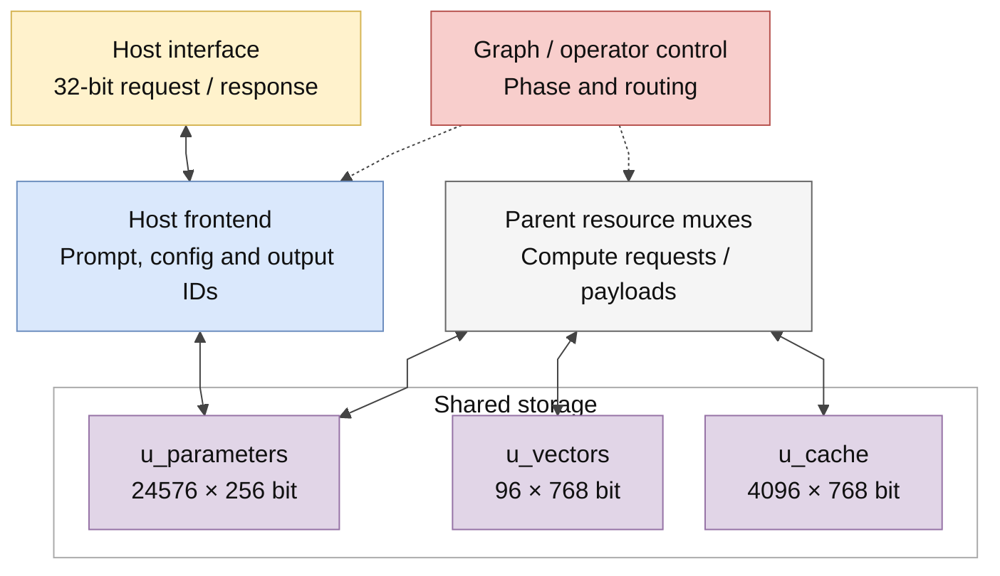
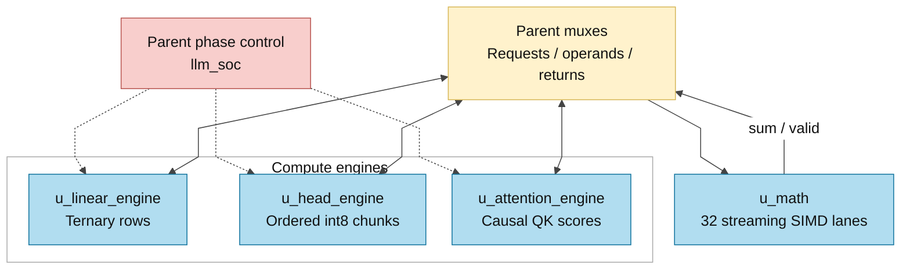
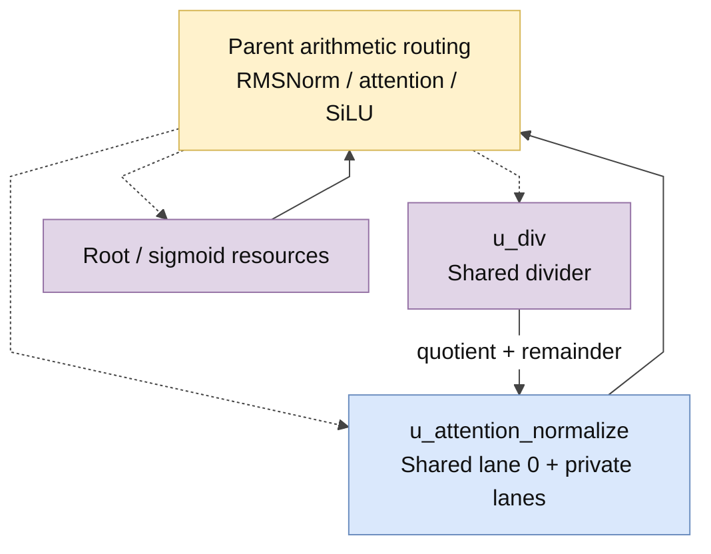

# Các khối RTL của full graph

> **Category: GUIDE.**

[Tài liệu](../README.md) → [Source guide](README.md) → **Full graph**

## Top và cấu hình

File chính là [llm_soc.sv](<../../Verilog Source code/llm_soc.sv>).
Nó quản lý host, graph và tài nguyên dùng chung. [matmulfree.sv](<../../Verilog Source code/matmulfree.sv>)
là top legacy, dùng ISA/descriptor và memory map khác.

`llm_soc` có 32 SIMD lane, mỗi lane tạo một term của dot product; reduction tạo
một output. Số lane không đồng nghĩa với 32 output hoàn chỉnh cùng lúc. Bốn
sigmoid lane và bốn divider lane mặc định tăng throughput cho các batch tương ứng.

## Sơ đồ tài nguyên và đường dữ liệu

Đây là functional overview. Các đường qua **Parent request and operand muxes**
được thực hiện trong llm_soc, không phải dây nối trực tiếp giữa hai engine. Xem
[hierarchy và port-map manifest](../diagrams/README.md) để tra instance, generate
scope và kết nối chính xác.

## Đọc source theo luồng

| Thứ tự | Source | Nên tìm gì? |
|---|---|---|
| 1 | [llm_pkg](<../../Verilog Source code/llm_pkg.sv>) | Constants, layout và helper nhỏ |
| 2 | [llm_soc](<../../Verilog Source code/llm_soc.sv>) | Host FSM, graph FSM, operator states và register owners |
| 3 | [linear engine](<../../Verilog Source code/llm_linear_engine.sv>) | Prefetch, operand chunk, reduction và format fault |
| 4 | [attention engine](<../../Verilog Source code/llm_attention_engine.sv>) | Causal requests, Q/K score pipeline và score memory |
| 5 | [attention normalizer](<../../Verilog Source code/llm_attention_normalize.sv>) | Quotient/remainder, RNE, dấu và clamp |
| 6 | [head engine](<../../Verilog Source code/llm_head_engine.sv>) | Vocabulary row, ordered chunks và shared SIMD |
| 7 | [memory adapters](<../../Verilog Source code/llm_parameter_ram.sv>) | Accepted requests, response-valid, write commitment |

## Control và các engine

| Module | Input/output hoặc state cần theo dõi |
|---|---|
| llm_soc | graph, op, layer_q, position_q, generated_q, error, overflow_out và host FSM |
| llm_linear_engine | Hai-word FIFO, credits, chunk index, operand capture, accumulator, fault và response drain |
| llm_head_engine | Bốn parameter chunks của một row, request/response counts và S39 accumulator |
| llm_attention_engine | position bound, KV request tags, sum_valid, score pipeline và maximum |
| llm_attention_normalize | Batch/lane progress, shared divider lane zero, rounding metadata và result-valid |

Parent có thể overlap một next linear row với scalar/store tail hiện tại; completion
được giữ lại để bảo đảm thứ tự tiêu thụ.

Graph chọn một phase tại một thời điểm. Engine có thể giữ nhiều request hoặc
arithmetic transaction trong pipeline của phase đó. Parent chỉ đổi quyền dùng
tài nguyên sau khi các response của pass đã được drain.

`llm_soc` giữ một operand cache 12 × 768 bit. Q/K/V và Gate/Up chỉ reuse khi
source, shape và family hợp lệ; head reload input khi vào pass. Parent còn giữ
scale word cho tám vocabulary row và table RoPE có position tag. Các điều kiện
invalidate ở [hợp đồng cache](../design/exact_throughput_optimization.md).

## Số học chung

| Module | Hợp đồng |
|---|---|
| [ternary_dot32](<../../Verilog Source code/ternary_dot32.sv>) | Mã 00/01/11 → zero/positive/negative; term mở rộng S25, reduction S30; code 10 gây fault |
| [llm_math](<../../Verilog Source code/llm_math.sv>) | STREAMING=1 accept theo start && in_ready; product E3, sum E8, done E9 tính từ E0 |
| [logic_mul](<../../Verilog Source code/logic_mul.sv>) | Cây nhân bằng bit products và cộng; không runtime multiplication operator |
| [div](<../../Verilog Source code/div.sv>) | Unsigned divide bằng shift/subtract; caller xử lý rounding/sign |
| [isqrt_u64](<../../Verilog Source code/isqrt_u64.sv>) | Integer square root dùng chung; file đã tách khỏi norm legacy |
| [sigmoid](<../../Verilog Source code/sigmoid.sv>) | ROM/interpolation; các lane dùng cùng quy tắc số học |

Tín hiệu product_valid, sum_valid và done thuộc các stage khác nhau. Không dùng
product của một transaction với sum của transaction khác. Reset hủy validity;
payload register không reset vẫn phải được bảo vệ bởi protocol hợp lệ.

## Memory và reset

| Module | Vai trò |
|---|---|
| [llm_parameter_ram](<../../Verilog Source code/llm_parameter_ram.sv>) | Parameter window, host lane selection và ACK sau commit |
| [llm_bank_ram](<../../Verilog Source code/llm_bank_ram.sv>) | Các bank S24 của vectors/KV; lane mask và wr_busy |
| [pipelined_word_ram](<../../Verilog Source code/pipelined_word_ram.sv>) | Tiled request/response adapter |
| [quartus_word_ram](<../../Verilog Source code/quartus_word_ram.sv>) | Technology leaf duy nhất chứa altsyncram |
| [sram_word_tile](<../../Verilog Source code/sram_word_tile.sv>) | Portable behavioral leaf |
| [reset_release](<../../Verilog Source code/reset_release.sv>) | Assert reset ngay; nhả sau hai rising edge |

[Host interface](../design/host_interface.md) ghi cách software điều khiển top.
[SRAM binding](../design/asic_memory_binding.md) ghi latency/collision/reset cần
bảo toàn khi thay technology leaf.

## Chú giải và sơ đồ đã lưu

[Mục lục từng file](blocks/README.md) có hai đường đọc: source hiện tại và trang
chú giải snapshot. Cột trạng thái hash cho biết code trong snapshot có khớp với
file đang compile hay không. Những trang có hash cũ cần được đọc cùng RTL hiện tại;
sơ đồ/code excerpt sẽ được refresh trong đợt riêng. [Hierarchy legacy](<legacy/README.md>)
lưu sơ đồ matmulfree.
