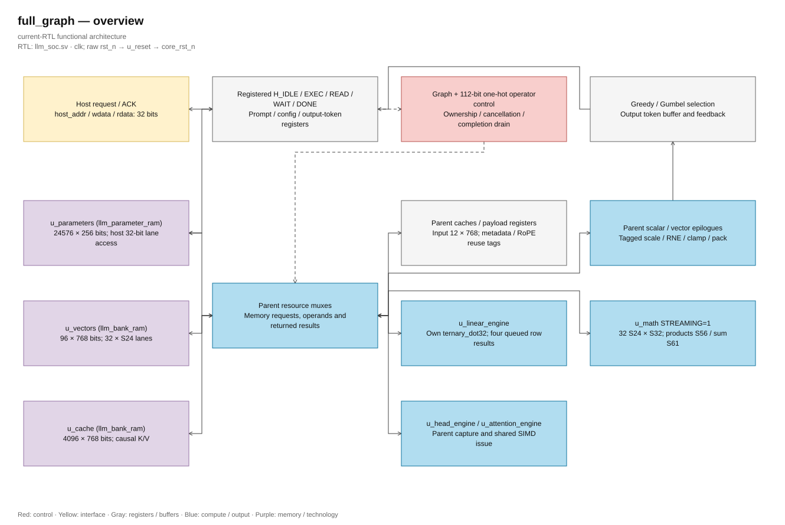
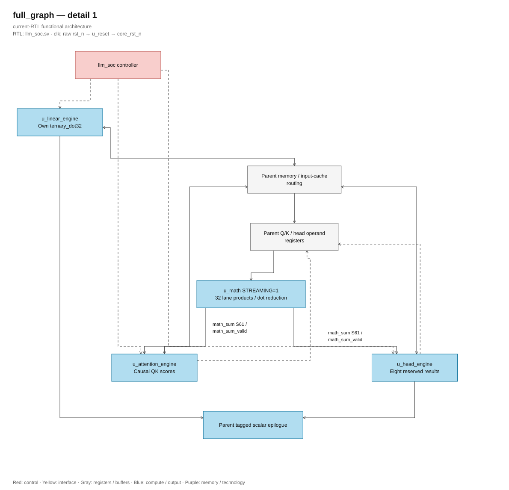
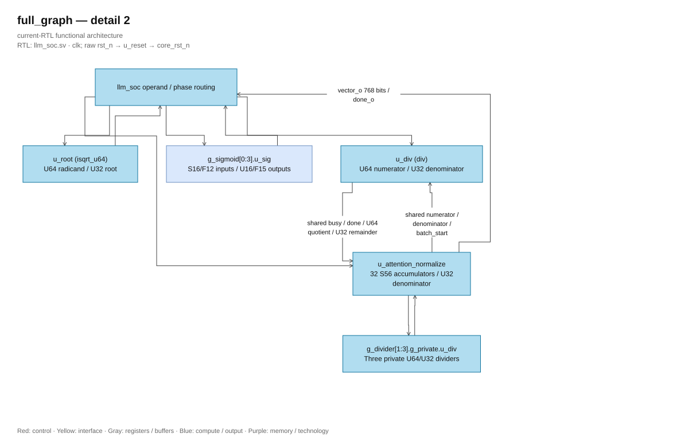

# RTL blocks of the full graph

<!-- reading-navigation:start -->
[Documentation](../README.md) → [02 · Architecture](../02-architecture/README.md) → This page

| Reading guide | Document |
|---|---|
| Read first | [System architecture](../design/full_rtl_language.md) |
| Continue / related lookup | [Module catalog](blocks/README.md) |
<!-- reading-navigation:end -->

> **Category: GUIDE.**

## Top and configuration

The main file is [llm_soc.sv](<../../Verilog Source code/llm_soc.sv>).
It manages the host, graph, and shared resources. [matmulfree.sv](<../../Verilog Source code/matmulfree.sv>)
is the legacy top, using a different ISA/descriptor and memory map.

`llm_soc` has 32 SIMD lanes, each lane generating a term of the dot product; reduction creates
a single output. The number of lanes does not mean 32 complete outputs simultaneously. Four
sigmoid lanes and four divider lanes by default increase throughput for the respective batches.

## Resource and Data Path Diagram

This is a functional overview. The paths through **Parent request and operand muxes**
are implemented in llm_soc, not direct wiring between two engines. See
[hierarchy and port-map manifest](../diagrams/README.md) to look up instances, generate
scope and correct connections.

[Editable draw.io — full_graph — overview](../diagrams/architecture.drawio) · Page `70_full_graph_1`.

[Editable draw.io — full_graph — detail 1](../diagrams/architecture.drawio) · Page `71_full_graph_2`.

[Editable draw.io — full_graph — detail 2](../diagrams/architecture.drawio) · Page `72_full_graph_3`.

## Read source by flow

| Order | Source | What to look for? |
|---|---|---|
| 1 | [llm_pkg](<../../Verilog Source code/llm_pkg.sv>) | Constants, layout and small helpers |
| 2 | [llm_soc](<../../Verilog Source code/llm_soc.sv>) | Host FSM, graph FSM, operator states and register owners |
| 3 | [linear engine](<../../Verilog Source code/llm_linear_engine.sv>) | Prefetch, operand chunk, reduction and format fault |
| 4 | [attention engine](<../../Verilog Source code/llm_attention_engine.sv>) | Causal requests, Q/K score pipeline and score memory |
| 5 | [attention normalizer](<../../Verilog Source code/llm_attention_normalize.sv>) | Quotient/remainder, RNE, sign and clamp |
| 6 | [head engine](<../../Verilog Source code/llm_head_engine.sv>) | Vocabulary row, ordered chunks and shared SIMD |
| 7 | [memory adapters](<../../Verilog Source code/llm_parameter_ram.sv>) | Accepted requests, response-valid, write commitment |

## Control and the engines

| Module | Input/output or state to monitor |
|---|---|
| llm_soc | graph, op, layer_q, position_q, generated_q, error, overflow_out and host FSM |
| llm_linear_engine | Two-word FIFO, credits, chunk index, operand capture, accumulator, fault and response drain |
| llm_head_engine | Four parameter chunks of a row, request/response counts and S39 accumulator |
| llm_attention_engine | position bound, KV request tags, sum_valid, score pipeline and maximum |
| llm_attention_normalize | Batch/lane progress, shared divider lane zero, rounding metadata and result-valid |

Parent can overlap a next linear row with the current scalar/store tail; completion
is retained to ensure consumption order.

Graph selects one phase at a time. Engine can hold multiple requests or
arithmetic transaction in the pipeline of that phase. Parent only changes resource usage rights
after the responses of the pass have been drained.

`llm_soc` holds a 12 × 768 bit operand cache. Q/K/V and Gate/Up only reuse when
source, shape, and family are valid; head reloads input when entering the pass. Parent also holds
the scale word for eight vocabulary rows and RoPE table with position tag. The invalidation conditions
are in the [cache contract](../design/exact_throughput_optimization.md).

## Common Arithmetic

| Module | Contract |
|---|---|
| [ternary_dot32](<../../Verilog Source code/ternary_dot32.sv>) | Code 00/01/11 → zero/positive/negative; term extends S25, reduction S30; code 10 causes fault |
| [llm_math](<../../Verilog Source code/llm_math.sv>) | STREAMING=1 accept according to start && in_ready; product E3, sum E8, done E9 calculated from E0 |
| [logic_mul](<../../Verilog Source code/logic_mul.sv>) | Bit-product multiplication tree and addition; no runtime multiplication operator |
| [div](<../../Verilog Source code/div.sv>) | Unsigned divide by shift/subtract; caller handles rounding/sign |
| [isqrt_u64](<../../Verilog Source code/isqrt_u64.sv>) | Shared integer square root; file has been separated from norm legacy |
| [sigmoid](<../../Verilog Source code/sigmoid.sv>) | ROM/interpolation; lanes use the same arithmetic rules |

Signals product_valid, sum_valid, and done belong to different stages. Do not use
The product of one transaction with the sum of another transaction. Reset cancels validity;
The payload register, if not reset, still must be protected by a valid protocol.

## Memory and reset

| Module | Role |
|---|---|
| [llm_parameter_ram](<../../Verilog Source code/llm_parameter_ram.sv>) | Parameter window, host lane selection, and ACK after commit |
| [llm_bank_ram](<../../Verilog Source code/llm_bank_ram.sv>) | S24 banks of vectors/KV; lane mask and wr_busy |
| [pipelined_word_ram](<../../Verilog Source code/pipelined_word_ram.sv>) | Tiled request/response adapter |
| [quartus_word_ram](<../../Verilog Source code/quartus_word_ram.sv>) | Only technology leaf containing altsyncram |
| [sram_word_tile](<../../Verilog Source code/sram_word_tile.sv>) | Portable behavioral leaf |
| [reset_release](<../../Verilog Source code/reset_release.sv>) | Assert reset immediately; release after two rising edges |

[Host interface](../design/host_interface.md) records how software controls the top.
[SRAM binding](../design/asic_memory_binding.md) records latency/collision/reset that need
to be preserved when changing leaf technology.

## Saved annotations and diagrams

[Table of contents for each file](blocks/README.md) has two read paths: current source and snapshot
annotation page. The hash status column indicates whether the code in the snapshot matches
whether the file is being compiled or not. Pages with the old hash need to be read along with the current RTL;
the diagram/code excerpt will be refreshed in a separate batch. [Hierarchy legacy](<legacy/README.md>)
save the matmulfree diagram.
