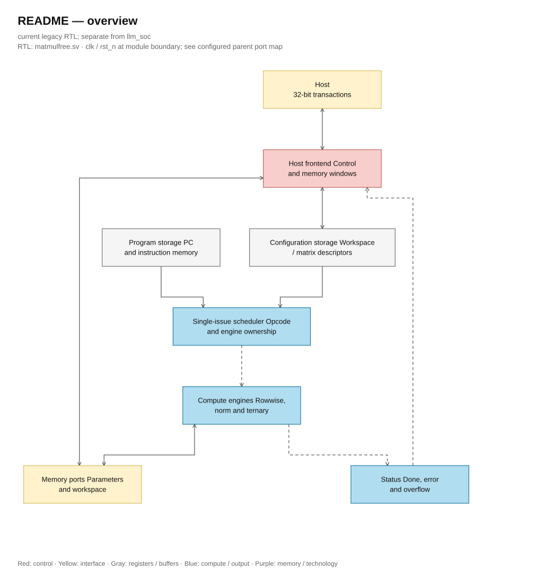

# Hierarchy matmulfree: chú giải legacy

> **Category: LEGACY.**

[Project](<../../../README.md>) → [Tài liệu](<../../README.md>) → **Hierarchy và luồng dữ liệu**

<details>
<summary>Mục lục trang</summary>

- [Cách đọc](#cách-đọc)
- [1. Ba điều cần nắm trước](#1-ba-điều-cần-nắm-trước)
- [2. Sơ đồ kiến trúc tổng quan đang chạy](#2-sơ-đồ-kiến-trúc-tổng-quan-đang-chạy)
- [3. Format số và ý nghĩa từng độ rộng](#3-format-số-và-ý-nghĩa-từng-độ-rộng)
- [4. Từ host start đến HALT](#4-từ-host-start-đến-halt)
- [5. NORM + QUANT: tại sao phải đi qua vector ba lượt?](#5-norm--quant-tại-sao-phải-đi-qua-vector-ba-lượt)
- [6. TMATMUL: 32 PE cùng làm một dot product](#6-tmatmul-32-pe-cùng-làm-một-dot-product)
- [7. Rowwise, sigmoid và state của model](#7-rowwise-sigmoid-và-state-của-model)
- [8. Khác gì so với thesis của bạn?](#8-khác-gì-so-với-thesis-của-bạn)
- [9. Tín hiệu nên xem trên waveform](#9-tín-hiệu-nên-xem-trên-waveform)
- [10. Đọc cú pháp RTL mà không nhầm với code phần mềm](#10-đọc-cú-pháp-rtl-mà-không-nhầm-với-code-phần-mềm)
- [11. Phạm vi kiểm chứng của tài liệu](#11-phạm-vi-kiểm-chứng-của-tài-liệu)

</details>

Trang này mô tả **hierarchy legacy matmulfree** và có các sơ đồ/chú giải khớp source ngày 06/10/2026.
Thiết kế full graph hiện tại được mô tả tại [full graph overview](<../full_graph.md>)
và [kiến trúc llm_soc](<../../design/full_rtl_language.md>). Danh mục hiện tại có
[41 source/LUT assets](<../blocks/README.md>), với trạng thái hash của từng snapshot.

Các code excerpts, số dòng và source hashes bên dưới thuộc snapshot ghi trong
[source_manifest.json](<../source_manifest.json>). Sơ đồ và code excerpts đã được đối chiếu lại với source hiện tại. Đọc [trạng thái kiểm chứng](<../../verification/optimization_status.md>) cho
PASS/fail của source/config hiện tại.

## Cách đọc

1. Đọc phần 1–4 để hiểu kiến trúc, format số và luồng thực thi.
2. Đọc phần 5–7 để hiểu NORM + QUANT, ternary core và rowwise unit.
3. Đọc phần 8 để so sánh với thesis.
4. Mở [mục lục giải thích RTL](<../blocks/README.md>) khi cần đọc từng file. Mỗi trang có tổng quan, sơ đồ kiến trúc phần cứng và các đoạn source được gom theo **nhóm logic**. Mỗi nhóm giữ nguyên phạm vi dòng để đối chiếu, rồi giải thích mục đích, cách dữ liệu đi qua code và các tín hiệu chính. Các nhóm logic phức tạp có thêm sơ đồ khối phần cứng ngay cạnh phần giải thích.

Phần chú giải là bản chụp tại thời điểm viết. [Manifest nguồn](<../source_manifest.json>) lưu SHA-256 và số dòng để nhận biết khi RTL thay đổi. Chú giải không được chèn vào source đang tổng hợp.

## 1. Ba điều cần nắm trước

**Một instruction làm việc trên cả vector.** ADD không chỉ cộng hai số; nó yêu cầu NPU đi qua các phần tử của hai tensor được mô tả bằng descriptor. Một lệnh có thể mất nhiều chu kỳ.

**32 PE chỉ nói về ternary core.** Mỗi đợt tính, core tạo 32 tích ternary rồi cộng lại cho **một output**. Nó không đồng thời tạo 32 output hoàn chỉnh. Rowwise unit có mức song song riêng: ADD/SUB/MUL/RELU tạo hai phần tử mỗi batch năm clock; REC một phần tử với hai tích qua năm clock; SIG xử lý từng phần tử.

**Integer-only vẫn có thể biểu diễn số lẻ.** Ví dụ raw S16 `0x0180` bằng 384; với `F_t=8`, giá trị thực là `0x0180/0x0100=1,5`. Phần cứng lưu số nguyên và dùng shift, multiply, rounding để xử lý scale. Đây là fixed-point, không phải floating-point. Inference bỏ backpropagation, nhưng vẫn cần biểu diễn activation, gate và state có phần lẻ.

### Quy ước viết số

Tài liệu và RTL dùng hexadecimal cho giá trị gắn trực tiếp với bit pattern, thanh ghi, địa chỉ, mask và biên fixed-point. Ví dụ: S8 lớn nhất là `8'h7F`, S8 nhỏ nhất có raw `8'h80`, S16 lớn nhất là `16'h7FFF`, còn U16/F15 biểu diễn 1,0 bằng `16'h8000`. Decimal vẫn được giữ cho số phần tử, số lane, độ rộng bus, số chu kỳ và chỉ số vòng lặp vì các đại lượng này dễ đọc hơn theo hệ 10. Khi một raw hexadecimal có thể gây nhầm về dấu, tài liệu ghi thêm giá trị signed trong ngoặc.

## 2. Sơ đồ kiến trúc tổng quan đang chạy



[Editable draw.io — README — overview](../../diagrams/architecture.drawio) · Page `73_README_1`.

Các hộp biểu diễn khối phần cứng hoặc giao diện; nét liền là đường dữ liệu, nét đứt là điều khiển/cấu hình. Mũi tên hồi tiếp biểu diễn kết nối phần cứng. Sơ đồ không biểu diễn thứ tự chu kỳ, trạng thái FSM hoặc các tầng pipeline CPU.

Các đường đến workspace đi qua mux trong `matmulfree`. `active_unit` chọn rowwise, NORM hoặc TMATMUL. Scheduler chỉ cho một instruction hoạt động tại một thời điểm; sơ đồ không hàm ý ba unit cùng truy cập SRAM.

`matmul_wrap` chỉ nối core với clock, reset, LED và host port của wrapper hiện có. Tên `CLOCK_50` không phải kết quả xác nhận timing ASIC.

### Bộ nhớ chứa những gì?

| Vùng | Dung lượng logic | Nội dung |
|---|---:|---|
| Parameter SRAM | 1024 × 256 bit = 32 KiB | Ternary weight và bias S32 |
| Workspace SRAM | 256 × 256 bit = 8 KiB | Input, output, state, gate và scratch của NORM |
| Instruction memory | 512 × 13 bit = 832 byte | Chương trình do host nạp |
| Descriptor file | 8 × 32 bit + 8 × 96 bit = 128 byte | Metadata địa chỉ, kích thước, format và scale |

Các con số trên là số bit dữ liệu logic; không bao gồm control register, buffer, decoder, ECC, padding của macro hay diện tích vật lý. Tổng SRAM dữ liệu là 40 KiB. Một word 256 bit chứa 32 phần tử S8, 16 phần tử S16/U16, 8 phần tử S32 hoặc 128 ternary weight 2 bit.

`sram_256_wrapper` dùng tám bank 32 bit và một cổng đọc đồng bộ chung cho host/compute. RAM và register dữ liệu đọc không asynchronous reset; reset chỉ xóa control/tag. Simulation và synthesis dùng cùng implementation, không có define hoặc thuộc tính của hãng FPGA. Binding SRAM ASIC cần adapter PDK giữ hợp đồng đọc/valid và mask ghi; cấu trúc bank logic không quy định macro vật lý.

**Hợp đồng đọc host.** Top chốt request + response có tag: control/descriptor cần hai cạnh lên, SRAM/imem cần bốn cạnh lên từ lần sample request đầu. Giữ enable/read/address đến ready và chỉ lấy data khi ready. Held request giữ response đầu; poll status mới cùng địa chỉ cần idle qua một cạnh clock. Đổi address/drop enable/write hủy read cũ; write vẫn trực tiếp. Backend [SRAM adapter](<../blocks/sram_256_wrapper.sv.md>) và [instruction memory](<../blocks/ins_mem.sv.md>) vẫn read/tag/valid hai cạnh lên; latency tăng nằm tại frontend top. [Interface host](<../../design/legacy/interfaces.md#host-32-bit>) ghi quy tắc đầy đủ.

## 3. Format số và ý nghĩa từng độ rộng

| Dữ liệu/khối | Format trong RTL | Lý do |
|---|---|---|
| Activation đưa vào TMATMUL | S8 | Giảm lưu trữ và độ rộng phép cộng ternary |
| Weight | 2 bit: `00=0`, `01=+1`, `11=−1` | `10` là mã không hợp lệ trong phần tử hữu ích |
| Một tích ternary | S9 | `−(−128 [0x80])=+128 [S9 0x080]` không vừa S8 |
| Tổng dot product | S18 | Đủ cho K ≤ 512, kể cả biên `512×0x80=0x1_0000` |
| State, residual, candidate | S16; giá trị thực = raw × 2^(−F_t) | F_t theo tensor, từ 0 đến 24; không cố định Q4.12 |
| Gate sigmoid | U16/F15; raw `0x0000…0x8000` | Biểu diễn 0…1, gồm chính xác 1 |
| Bias | S32 theo đơn vị output | Cộng sau khi rescale accumulator |
| Hệ số scale | M U24, r U6; hệ số ≈ M/2^r | Không dùng floating-point; miền r thực dùng 0…47 |
| Tích postscale | RNE S42, cộng bias S43 | Giữ độ rộng trước khi saturation về S16/S32 |
| Bình phương trong NORM | Tín hiệu S32, giá trị luôn không âm | Bình phương input S16 |
| Tổng bình phương | U40 | Tối đa `512×0x8000²=2^39` |
| Mean-square và epsilon đã quy đổi | U64; phép cộng kiểm tra bằng U65 | Tránh mất phần lẻ sớm và phát hiện tràn |
| Căn mean-square | U32; remainder U34, trial subtract U35 | Căn nguyên của U64, 32 bước lấy từng cặp bit |
| Scratch z | S24/F16, sign-extend trong ô S32 | Có phần lẻ cho bước QUANT; mỗi SRAM word chứa 8 z |
| Tích z × hệ số QUANT | S48 | Rounding trước khi clamp về S8 |
| Nội suy sigmoid | Tọa độ S45, fraction U24, slope U10, tích U34 | Giữ đủ miền S16/F_t=0…24 và slope lớn nhất 512 của LUT |

**RNE** là round-to-nearest-even: làm tròn đến số nguyên gần nhất; nếu nằm chính giữa thì chọn số chẵn. Ví dụ 2,5 → 2; 3,5 → 4; −2,5 → −2. **Saturation** giới hạn kết quả tại biên format, thay vì để số dương lớn bị wrap thành số âm.

Không nên hiểu “S64 xuất hiện trong code” là toàn bộ datapath rộng 64 bit, hoặc “ternary” là chip không có multiplier. Multiplier vẫn phục vụ NORM, scale, gate và nội suy; riêng phép nhân activation với ternary weight được thay bằng chọn dấu/zero.

## 4. Từ host start đến HALT

### 4.1 Descriptor thay cho việc đoán bố trí tensor

Workspace descriptor 32 bit:

| Bit | Trường | Cách hiểu |
|---|---|---|
| 31:24 | base_word | Địa chỉ word 256 bit đầu tiên trong workspace |
| 23:14 | length | Số **phần tử**, không phải số word |
| 13:12 | fmt | 0=S8, 1=S16, 2=U16, 3=S32 |
| 11:7 | frac_bits | F_t của tensor; S8 sau NORM dùng metadata scale động riêng |
| 6:0 | reserved | Chưa dùng trong workspace descriptor |

Matrix descriptor 96 bit:

| Bit | Trường | Cách hiểu |
|---|---|---|
| 95:86 | weight_base | Word đầu của ma trận weight |
| 85:76 | bias_base | Word đầu của bias S32 |
| 75:66 | k_len | Số phần tử input cho một dot product |
| 65:56 | n_rows | Số output |
| 55:32 | scale_m | M của scale |
| 31:26 | scale_r | r của scale |
| 25 | output_s32 | 0 ghi S16; 1 ghi S32 |
| 24:2 | reserved | Chưa dùng |
| 1 | no_bias | 1: dùng bias=0 và bỏ lần đọc bias |
| 0 | dynamic_q | 1: ghép scale input do NORM tạo vào postscale |

K và số output của một lệnh tối đa 512, nhưng còn phải vừa memory. Hai giới hạn này không bảo đảm mọi ma trận 512×512 đều nằm được trong parameter SRAM.

### 4.2 Trình tự thực thi

1. **Host nạp** weight, bias, input, initial state, descriptor và chương trình có HALT. Memory không tự chứa dữ liệu hợp lệ sau reset.
2. **Host start** bằng write bit 0 tại `0x00040000`. Core xóa trạng thái lỗi của lần chạy trước và đưa PC về 0.
3. **S_FETCH** chờ `instr_fetch_valid` rồi chốt instruction 13 bit vào `instr_q`. Instruction memory đọc đồng bộ và dùng cùng latency trong mọi build.
4. **S_START** giải mã opcode và chọn unit. Với TMATMUL dùng scale động, core kiểm tra metadata q rồi chạy `scale_compose` trước.
5. **S_WAIT** giữ instruction hiện tại và chờ unit báo `done`. Unit tự đọc SRAM, tính toán và ghi output.
6. **S_ADVANCE** tăng PC. Không có instruction kế tiếp chạy chồng lên instruction đang tính.
7. **S_HALT** đưa `running=0`, `ready=1`. Host kiểm tra error/overflow rồi đọc output.

`ready=1` nghĩa core đã dừng và sẵn sàng cho host; không tự bảo đảm kết quả đúng. Cần đọc cả `error` và `overflow_out`. Lỗi format làm dừng chương trình; saturation thông thường ghi kết quả đã clamp và giữ cờ overflow. NORM overflow làm dừng. Nếu lỗi xuất hiện sau khi đã ghi một phần output, RTL không rollback các word đã ghi.

Khi đang chạy, host chỉ được chấp nhận các giao dịch đọc control/status. Không được sửa tensor đang dùng. PC=`9'h1FF` (511) mà instruction cần đi tiếp sẽ gây lỗi, tránh quay vòng về đầu chương trình.

### 4.3 Các instruction thực sự được hỗ trợ

| Opcode | Lệnh | Dữ liệu và hành vi |
|---|---|---|
| `0x0` | NOP | Đi tiếp |
| `0x1`, `0x2` | ADD, SUB | Cộng/trừ hai vector cùng scale nguồn, rồi đổi về scale đích |
| `0x3` | MUL | S16×S16 hoặc S16×gate; RNE và saturation |
| `0x6` | SIG | S16 → gate U16/F15 |
| `0x7` | NORM | RMSNorm không affine + QUANT: S16 → S8 |
| `0x8` | TMATMUL | S8×ternary → accumulator → scale+bias → S16/S32 |
| `0xB` | REC | Cập nhật state bằng gate và candidate |
| `0xC` | RELU | Đưa phần âm về 0, rescale về đích |
| `0xF` | HALT | Dừng chương trình |

DIV, EXP, LDV, STV không chạy trong scheduler hiện tại. `div.sv` vẫn tồn tại vì NORM và scale_compose cần chia số nguyên nội bộ. Host thay vai trò nạp/đọc dữ liệu của LDV/STV ở mức hệ thống hiện tại. SiLU có thể ghép từ SIG và MUL, với descriptor/scale đúng.

## 5. NORM + QUANT: tại sao phải đi qua vector ba lượt?

Mục đích là đưa input S16 về một dải đã chuẩn hóa, sau đó lượng tử hóa thành S8 cho ternary core. Không có gamma/beta học được trong khối norm này; nếu model có affine normalization, quy trình export phải xử lý phần đó phù hợp hoặc bổ sung operator.

Gọi raw input là x_i, số phần tử là K. Với scale input `s_x=2^(−F_t)`, host cần quy đổi epsilon thực thành `epsilon_raw32 ≈ epsilon_real × 2^(2F_t+32)`. Core NORM nhận epsilon đã quy đổi, không tự đọc F_t để thực hiện phép chuyển đổi này.

### Lượt 1 — Tính mẫu số chung của cả vector

```text
S = Σ x_i²
Q = floor(S/K), rem = S mod K
V = (Q << 32) + floor((rem << 32)/K) + epsilon_raw32
R = floor(sqrt(V))
```

P1_CAPTURE chốt operand, P1_MUL chốt bình phương, P1_PROC cộng hai bình phương vào sum_sq. P2/P3 còn chốt kết quả tại ROUND trước PROC; tổng overhead mới 8×ceil(K/2) clock/NORM. Phần tử padding ngoài K không tham gia tổng. Divider chung U55/U32 tính thương/phần dư trong 55 bước cho mỗi phép chia. Tử số lớn nhất là bit 54 của `2^(32+r_norm)` với r_norm≤22; mọi phép chia mean-square, phần lẻ và QUANT đều vừa miền này. `isqrt_u64` lấy hai bit radicand mỗi bước, dùng remainder U34 và một phép trừ U35 để vừa so sánh trial vừa cập nhật remainder; sau 32 bước trả root U32.

V giữ 32 bit phần lẻ so với mean-square tính theo raw input; vì vậy R xấp xỉ RMS raw nhân 65536. Khối tiếp theo chọn M_norm/r_norm sao cho `M_norm/2^r_norm ≈ 2^32/R`.

### Lượt 2 — Tạo z và tìm biên độ lớn nhất

```text
z_raw[i] = RNE(x_i × M_norm / 2^r_norm)
z_real[i] ≈ z_raw[i] / 65536
A = max(abs(z_raw[i]))
D = max(A, delta_raw)
```

z có format S24/F16 nhưng chiếm ô S32 để việc pack/unpack đơn giản. Cùng lúc ghi scratch, core tìm A. Không thể quyết định scale quantization trước khi biết phần tử lớn nhất của toàn vector, nên cần giữ scratch.

Input toàn 0 được xử lý riêng bằng hệ số norm bằng 0. `delta_raw` phải khác 0 để D không bằng 0. Scratch không được overlap input hoặc output q. q được phép dùng lại vùng X vì X đã được đọc hết trước lượt 3.

### Lượt 3 — Lượng tử hóa z thành q

```text
M_quant / 2^r_quant ≈ 0x7F / D
q[i] = clamp_S8(RNE(z_raw[i] × M_quant / 2^r_quant))
scale_q = D / (0x7F × 0x1_0000)
```

Một word output chứa 32 q. Việc giữ D là bắt buộc: q=64 có thể mang giá trị thực khác nhau giữa hai vector nếu D khác nhau. Chỉ truyền 8 bit q rồi bỏ D sẽ làm TMATMUL sai scale.

`matmulfree` lưu D theo descriptor output, kèm base/length. Tám tuple D/base/length có tổng 336 bit payload không async reset; chỉ tám bit `q_valid` reset về 0. Mọi nơi đọc tuple đều được guard bằng valid, và NORM hoàn tất thành công ghi đủ tuple cùng lúc đặt valid. Ghi đè vùng q làm mất hiệu lực metadata. Host viết descriptor sẽ xóa cache scale, nên cần nạp descriptor trước khi chạy chuỗi NORM → TMATMUL.

Epsilon là control register dùng chung. Nếu các NORM cần epsilon đã quy đổi khác nhau, host phải chia thành các lượt chạy và cập nhật giữa các lượt, hoặc kiến trúc cần mở rộng metadata. Không nên mô tả bản hiện tại là tự cấu hình epsilon riêng cho mọi layer.

## 6. TMATMUL: 32 PE cùng làm một dot product

Với một output j:

```text
acc[j] = Σ q[i] × w[j,i]
y_raw[j] = saturate(RNE(acc[j] × M / 2^r) + bias_raw[j])
```

Mỗi PE đọc một q S8 và một weight 2 bit. Weight +1 giữ nguyên q, −1 đổi dấu q, 0 đưa về zero. S9 giữ được cả +128 (`9'h080`). Cây cộng `acc_mul` gộp 32 term thành `partial`; accumulator S18 cộng partial qua các chunk.

**Ví dụ K=65:** cần `ceil(65/32)=3` chunk. Chunk đầu dùng q[0…31], chunk hai q[32…63], chunk cuối chỉ q[64] hữu ích. 31 lane còn lại bị mask về 0. Một hàng weight cần `ceil(65/128)=1` word 256 bit; core dùng các đoạn 64 bit tại offset 0, 64, 128 của word đó. Mỗi hàng output mới vẫn bắt đầu tại ranh giới word mới.

Sau chunk cuối, core đọc bias nếu cần, chạy postscale và pack output. S16 pack 16 output/word; S32 pack 8 output/word. Hàng kế tiếp tái sử dụng cùng 32 PE. Output không được overlap q vì q còn cần cho các hàng sau.

### Scale động được ghép ở đâu?

Nếu q do host nạp với scale đã biết, descriptor có thể chứa sẵn toàn bộ hệ số `s_input × s_weight / s_output` và đặt dynamic_q=0.

Nếu q do NORM tạo, dynamic_q=1 và M/r trong descriptor biểu diễn `s_weight/s_output`. `scale_compose` ghép thêm D:

```text
C_effective ≈ (M_descriptor / 2^r_descriptor) × D/(0x7F×0x1_0000)
```

Khối chọn r từ 47 xuống bằng threshold RNE chính xác trước khi chia, rồi chạy tối đa một phép chia U48/U25 trong 48 bước để tạo M_effective U24/r_effective. Hệ số vượt miền, D=0 hoặc underflow về M=0 báo lỗi. Đây là phép chuẩn bị hệ số theo tensor, không phải phép chia cho từng PE. Có một divider riêng trong scale_compose và divider U55/U32 trong norm; hai khối chưa dùng chung một instance vật lý.

TMATMUL tĩnh bị từ chối nếu extent input overlap bất kỳ vùng q nào còn metadata NORM hợp lệ, kể cả khi dùng descriptor ID khác hoặc chỉ một phần vùng đó. TMATMUL động phải chọn đúng ID đã lưu metadata và khớp chính xác base/length. Guard nằm trước khi start ternary, nên các lỗi metadata này không ghi output.

### 32 PE có nghĩa 32 MAC mỗi clock không?

Có 32 term ternary song song ở bước ACCUM, nhưng FSM còn các bước request, wait, bias, scale và write. Vì thế không thể lấy `32 × tần số` làm throughput duy trì của RTL này. Số chu kỳ còn phụ thuộc K, số output, memory latency và các operator khác. Nó cũng không phải mảng systolic hai chiều. Không cần mảng systolic để đúng chức năng với model nhỏ; tăng throughput cần cân nhắc cả bandwidth và buffer.

## 7. Rowwise, sigmoid và state của model

`rowwise_dispatch` chia vector thành các word chứa tối đa 16 phần tử, đọc A rồi B khi cần, gọi `rowwise_op`, đợi done và ghi kết quả. Datapath đã tách LOAD/MULTIPLY/RAW/ROUND/PACK bằng register; handshake và descriptor contract giữ nguyên. SIG và RELU chỉ cần A. REC còn đọc destination hiện tại làm state cũ H.

ADD/SUB giữ một bit mở rộng trước khi đổi scale. MUL dùng hai phép nhân 16×16 cho hai phần tử. REC dùng chính hai phép nhân đó cho **một** phần tử:

```text
new_H = sat_S16(RNE((F_raw × old_H + (0x8000−F_raw) × C) / 0x8000))
```

F là gate U16/F15; H và C phải cùng scale. Hai tích được cộng ở S33 rồi đưa vào lane 0 của hai đường scale/RNE dùng chung với ADD/SUB/MUL/RELU, shift cố định 15; lane 1 không ghi state REC. Chỉ làm tròn tổng một lần. Ví dụ H=C=`0x0001` raw và F_raw=`0x4000`: kết quả đúng là `0x0001` raw. Nếu làm tròn riêng hai tích 0,5 theo RNE rồi cộng, kết quả sẽ thành 0; đó không phải hành vi REC hiện tại.

### Sigmoid dùng LUT như thế nào?

ROM có 257 mẫu, tại `x_i=−8+i/16`, i=0…256. Mẫu được lượng tử hóa theo:

```text
LUT[i] = RNE(0x8000 / (1 + exp(−x_i)))
```

Đây là công thức **tạo bảng trước khi chạy**, không phải phần cứng tính exp khi inference. ROM ở `sigmoid_lut.svh` là bảng case hằng. `sigmoid_257.mem` chứa cùng mẫu dạng hex để kiểm tra simulation. LUT `sigContent.mif` của thiết kế cũ đã được loại khỏi source chính; chỉ còn trong tài liệu lịch sử.

Với x nằm giữa hai mẫu, core đọc y0 và y1 qua một địa chỉ ROM dùng lần lượt, rồi nội suy. Tọa độ S45 giữ toàn miền input; slope `y1−y0` là U10 vì bảng đơn điệu và chênh mẫu lớn nhất 512, tích slope×fraction U24 vừa U34. RNE vẫn áp dụng vào toàn tổng nội suy để giữ parity đúng khi tie. x=0 cho raw=`0x4000`, tức gate=0,5. Ngoài miền [−8,8], core dùng mẫu biên `0x000B` và `0x7FF5`; không trả chính xác `0x0000`/`0x8000` ở hai biên này.

RTL dùng case table hằng cho cả simulation và synthesis, không có file loader, parameter đường dẫn LUT hoặc nhánh theo tool. Generator/test đối chiếu hai asset LUT và báo lỗi nếu thiếu/hỏng. ROM logic vẫn cần flow synthesis đích để biết mapping vật lý; nó chưa phải một ROM macro đã được binding.

### Một lượt inference theo kiểu MLGRU nhỏ

Một chương trình phù hợp có thể chuẩn hóa input, tính các projection ternary cho gate/candidate, dùng SIG/SiLU, chạy REC cập nhật state, rồi tính projection output. Host lấy logits và chọn token tiếp theo. Đây là mô tả cách ánh xạ, không phải khẳng định mọi model MLGRU đã được export hoặc kiểm thử end-to-end.

Muốn thành demo sinh câu, còn cần model đã train phù hợp, tokenizer hoặc bảng ký tự, exporter pack weight/scale, chương trình instruction và kiểm tra output với reference model. Ternary weight không tự bảo đảm mọi operator còn lại đều được NPU hỗ trợ. Chatbot có chất lượng còn phụ thuộc model và dữ liệu train, không chỉ số PE.

## 8. Khác gì so với thesis của bạn?

Nguồn so sánh là [DTUT-242-13.pdf](<../../history/references/DTUT-242-13.pdf>), chương 4 và phần testcase chương 5. “Trang thesis” dưới đây là số in ở chân trang; số trang PDF lớn hơn 11. Ví dụ Figure 4 ở trang thesis 31, tương ứng trang PDF 42. Bảng phân biệt **mô tả trong thesis** với **hành vi RTL hiện tại**, không lấy kết quả đo của thiết kế cũ gán cho thiết kế mới.

| Nội dung | Thiết kế mô tả trong thesis | RTL ASIC hiện tại | Hệ quả |
|---|---|---|---|
| Điều khiển | Pipeline Fetch → Decode → Execute → Memory → Write Back; Figure 4, trang 30–32 | FSM single-issue trong matmulfree | Điều khiển gọn hơn; không overlap nhiều instruction |
| Xử lý hazard | Stall/flow control theo dependency, TMATMUL, FIFO; trang 49 | Chờ done trước lệnh kế tiếp; kiểm tra descriptor và overlap memory | Không dùng hazard_detect hay pipeline register cũ trong top hiện tại |
| Instruction | 13 bit, vector thường 512 phần tử; trang 32–34 | Giữ 13 bit; ID trỏ descriptor; K=1…512 | Tensor có độ dài thay đổi, xử lý tail |
| Payload memory | Word 512 bit; trang 36, 45 | Word 256 bit | Nửa độ rộng mỗi word; sức chứa phần tử phụ thuộc format |
| Activation | 16-bit fixed-point trong ALU; trang 43–44 | S8 cho TMATMUL, S16 cho state/rowwise, U16/F15 cho gate | Format tùy vai trò; không áp một Q-format cho toàn chip |
| Rowwise parallelism | 32 phép theo phần tử mỗi clock theo mô tả trang 44 | Hai phần tử mỗi bước ADD/SUB/MUL/RELU; REC một; SIG tuần tự | Ưu tiên tài nguyên nhỏ; throughput thực phải đo |
| Weight ternary | Đã dùng ternary và cộng/trừ thay nhân; chương 3 và 4.4 | Vẫn ternary; mã 2 bit rõ ràng, reserved code báo lỗi | Ternary không phải tính năng mới của v2 |
| NORM | Bình phương → reduction → sqrt/div; trang 44–45 | Ba lượt trên toàn K, sinh q S8 và D để giữ scale | Đường NORM + QUANT và scale được nối tường minh |
| Sigmoid | LUT sigContent.mif trong các lane; trang 44 | Một ROM 257 mẫu dùng tuần tự và nội suy | Giảm lặp bảng; đổi latency và sai số xấp xỉ |
| EXP/DIV vector | Có trong ISA thesis, trang 32–33 và 43 | Opcode bị từ chối; scalar divider còn dùng nội bộ | Chương trình cũ không chạy nguyên trạng |
| REC, RELU | Không có trong bảng ISA trang 32–33 | Opcode B và C | REC gộp hai tích và làm tròn một lần |
| Memory model | Mapping vector/matrix, FIFO-style, DDR3; trang 45–49 | Parameter 32 KiB + workspace 8 KiB; host nạp khi idle | Chưa có DMA/DDR streaming trong đường chạy hiện tại |
| Write-back | Wb mux và pipeline register; trang 32 | Mỗi unit ghi workspace qua mux | Không có stage WB riêng trong scheduler |
| Target triển khai | FPGA; phần kết quả của thesis | RTL hướng đến ASIC nhỏ | Cần SRAM macro, synthesis, timing, DFT và physical design để thành ASIC |

Thesis nêu 16-bit fixed-point trong phần ALU; bảng trên không tự gán tên Q4.12 cho mọi khối nếu đoạn thesis tương ứng không xác định vị trí dấu chấm. Cần phân biệt format trong source lịch sử với phát biểu trong luận văn.

### Những kết quả không được chuyển nguyên từ thesis sang v2

Trang thesis 61 (PDF 72) báo 70.383 cycle cho testcase ternary và 790.934 cycle cho baseline normal multiplication. Đó là số liệu testcase **trong thesis**, không phải benchmark của source hiện tại. V2 thay memory width, số lane, normalization, scheduler và LUT; muốn so sánh tốc độ cần cùng workload, cùng precision, cùng clock và đo lại.

Thesis mô tả con trỏ memory 19 bit ở trang 48. Độ rộng địa chỉ logic không đủ để kết luận một ASIC mới đã có từng ấy SRAM vật lý. Tương tự, thông số tài nguyên FPGA hoặc công suất trong thesis không dùng để suy ra diện tích/công suất ASIC của v2.

### Định hướng đã thay đổi thế nào?

Thesis ưu tiên cấu trúc processor có pipeline và song song cho testcase vector lớn. Bản hiện tại ưu tiên một đường inference nhỏ, số học được quy định rõ, memory hữu hạn và xử lý từng instruction dễ kiểm chứng. Cách làm mới đánh đổi độ song song lấy tài nguyên và độ đơn giản. Nó chưa chứng minh nhanh hơn, nhỏ hơn bao nhiêu hoặc chạy được model hội thoại hoàn chỉnh.

## 9. Tín hiệu nên xem trên waveform

| Khi muốn biết… | Xem tín hiệu |
|---|---|
| Core đang ở lệnh nào | pc_debug, instr_debug, sched, active_unit |
| Lệnh đã kết thúc chưa | running, ready, row_done/norm_done/tm_done |
| SRAM có dữ liệu hợp lệ chưa | ws_rd_en, ws_rd_addr, ws_rd_valid, ws_rd_data |
| TMATMUL đang tính phần nào | output_row_q, input_chunk_q, partial, accumulator_q |
| NORM sai ở lượt nào | state, sum_sq, v_raw, rms_r, absmax, quant_d |
| Scale có đi theo q không | q_valid, q_d, input_has_runtime_scale, selected_quant_d, composed_m, composed_r |
| Gate/state có bị sai format không | format_error, gate, recurrent_sum, recurrent_value |
| Kết quả bị clamp hay chương trình bị lỗi | overflow_out và error, đọc riêng từng cờ |

Đọc FSM theo các cặp REQ/WAIT: REQ phát yêu cầu; WAIT đợi valid; PROC/ACCUM mới dùng dữ liệu đã chốt. Dấu `<=` là nonblocking assignment: mọi thanh ghi trong cùng cạnh clock dùng giá trị cũ ở vế phải. Vì vậy không đọc một chuỗi `<=` như các lệnh phần mềm chạy tuần tự.

## 10. Đọc cú pháp RTL mà không nhầm với code phần mềm

| Cú pháp | Cách đọc trong thiết kế này |
|---|---|
| `logic [255:0] word` | Một vector 256 bit; không phải 256 số nguyên độc lập |
| `logic signed [15:0] x` | Một số signed 16 bit theo two's complement; vị trí dấu chấm do scale quy định riêng |
| `word[i*16 +: 16]` | Lấy 16 bit liên tiếp, bắt đầu tại bit i×16; i=0 là phần tử ở các bit thấp nhất |
| `{a,b}` | Ghép bit a ở phía cao và b ở phía thấp |
| `{{8{z[23]}},z}` | Lặp sign bit của z tám lần để mở rộng S24 thành S32 mà giữ giá trị |
| `$signed(x)` | Diễn giải bit của x như signed; bản thân cast không tự thêm bit để chống overflow |
| `a ? b : c` | Mux: chọn b khi a đúng, ngược lại chọn c |
| `always_comb` | Logic tổ hợp; thay input có thể làm output đổi mà không đợi cạnh clock |
| `always_ff @(posedge clk ...)` | Thanh ghi cập nhật tại cạnh lên clock; reset trong sensitivity list có thể là asynchronous |
| `x <= y` | Trong clocked process, chốt y vào x bằng nonblocking assignment; trong điều kiện so sánh, cùng ký hiệu có nghĩa “nhỏ hơn hoặc bằng” |
| `for (...)` | Tùy vị trí có thể mô tả nhiều logic song song; không tự mang nghĩa mỗi vòng tốn một cycle |
| `.port(signal)` | Nối cổng có tên của module con với tín hiệu ở module cha |
| `parameter` / `localparam` | Cấu hình hoặc hằng số lúc elaboration, không phải control register host có thể ghi |

Ví dụ hai dòng `q_word <= ws_rd_data; state <= ACCUM;` cùng chạy tại một cạnh clock: buffer nhận word mới và FSM chuyển bước cùng lúc. Logic ở bước ACCUM sau đó mới tính trên word đã chốt. Đây là lý do các khối chia riêng WAIT và PROC/ACCUM.

## 11. Phạm vi kiểm chứng của tài liệu

Tài liệu đối chiếu 37 file `.sv/.v` và bốn asset LUT (`sigmoid_lut.svh`, `sigmoid_257.mem`, `llm_exp_lut.svh`, `llm_gumbel_lut.svh`). Mỗi trang RTL trích nguyên văn source theo nhóm logic, lưu số dòng và SHA-256. Các module legacy vẫn dùng bởi regression có trang riêng; có file không có nghĩa khối được instantiate trong top hiện tại. Các PDF/PPT thesis/paper gốc giữ làm tài liệu lịch sử.

Manifest hiện bao phủ 41 RTL/LUT assets, 157 nhóm logic và 5.262 dòng source RTL. Số liệu render và link checks hiện hành nằm trong [validation.json](<../validation.json>) và [diagram_validation.json](<../diagram_validation.json>). Packages có sơ đồ giải thích nhưng không phải module instance trong hierarchy. Chạy lại `python docs/source_guide/validate.py` sau khi sửa source hoặc sơ đồ.

Regression RTL thống nhất ngày 01/10/2026 lúc 14:31:18 pass **10 mục**, compile **0 error, 0 warning**: kiểm tra asset ROM; **168 ca host/23.827 commands** (NORM 43, ternary 65, rowwise 57, host/PC 3); 106 division, **4.301 sqrt**, 37.189 RNE, **900 coefficient cases** với tối đa 99 clock quan sát; 5 divider profiles; **12.720 postscale checks**; 1.027 instruction memory checks; **1.638.400 sigmoid inputs trên toàn bộ 25 F_t=0…24**; 3.242 addsub, 4.452 mul, 5 accumulator profiles; 47 SRAM checks; **1.800 ca rowwise / 13.260 phần tử**, reference S128, 42.843 thay đổi input khi busy và reset sáu pha. Host frontend thêm **30 protocol reads, 11 cancellations, 4 blocked regions**. Các ca mới kiểm tra rejected NORM sau overflow không reset, static TM qua descriptor alias/subrange, reset metadata và restart, divider có NUM_W=1 hoặc DEN_W>NUM_W, busy/start protocol và reset giữa giao dịch. Testbench kiểm tra arbitration và generator/test từ chối hai asset thiếu, hai asset hỏng. RTL không có assertion hoặc file I/O; các kiểm tra này nằm trong verification. Hash/result ở [tests/results.json](<../../../tests/results.json>); chạy lại bằng `./tests/run.ps1 -Block All`, không cần macro hoặc chế độ build riêng.

Quartus Analysis & Synthesis demo ngày 01/10/2026 lúc 11:24:04 pass **0 error, 0 warning**: **6.497 registers**, **11.798 ALUT**, **8.005 ALM ước tính**, 334.336 bit block RAM, 7 DSP. So với snapshot portable trước lượt review này: 6.712→6.497 registers và 8.441→8.005 ALM ước tính; RAM/DSP không đổi. Đây là compile minh họa khả năng tổng hợp RTL; số liệu FPGA không phải ràng buộc kiến trúc hoặc PPA ASIC. Đây là snapshot A&S trước tối ưu timing. [Timing hub](<../../verification/timing/README.md>) ghi Fitter/STA FPGA, constraint và critical path; chưa có STA ASIC. Xem [report và warnings](<../../verification/README.md>), [rà soát toàn design](<../../history/reviews/design_review.md>).

RTL và verification dùng cùng hành vi bộ nhớ/ROM. [Demo checkpoint Binary-MNIST160](<../../demos/legacy/mnist.md>) đã chạy end-to-end trên 10 ảnh mẫu, đối chiếu 40 lượt tầng và hai lần chương trình toàn graph; không thay RTL. Chưa có binding SRAM PDK, PPA ASIC hoặc accuracy toàn MNIST/model ngôn ngữ. Sharing multiplier toàn chip và exporter cho các graph khác vẫn cần triển khai.


[Demo MNIST](<../../demos/legacy/mnist.md>) chạy graph trên RTL; [NanoFable hybrid legacy](<../../demos/legacy/nanofable_hybrid.md>) chạy generation trên CPU và replay 168 linear ternary thực trên RTL. Mỗi báo cáo ghi reference, source/asset hashes và giới hạn riêng.

---

[Đọc tiếp: từng module RTL](<../blocks/README.md>) · [Verification](<../../verification/README.md>) · [Về mục lục tài liệu](<../../README.md>)
